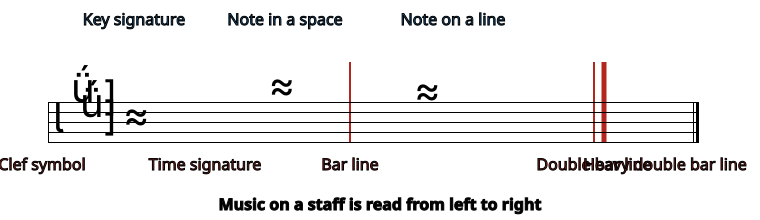
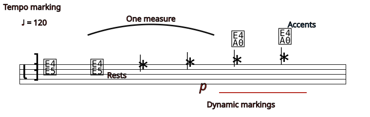
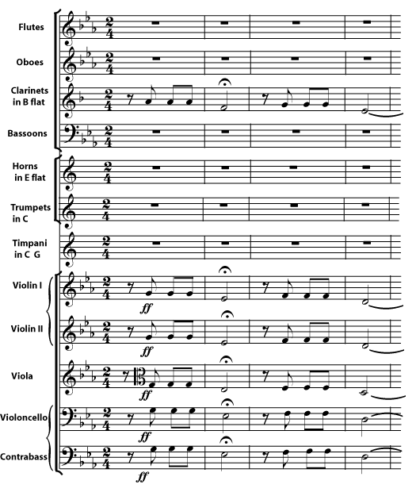

*Western music is usually written on a staff.*

People were talking long before they invented writing. People were also making music long before anyone wrote any music down. Some musicians still play \"by ear\" (without written music), and some music traditions rely more on improvisation and/or \"by ear\" learning. But written music is very useful, for many of the same reasons that written words are useful. Music is easier to study and share if it is written down. [Western music](ch-24-classifying-music.md) specializes in long, complex pieces for large groups of musicians singing or playing parts exactly as a composer intended. Without written music, this would be too difficult. Many different types of music notation have been invented, and some, such as [tablature](https://cnx.org/content/m11905), are still in use. By far the most widespread way to write music, however, is on a *staff*. In fact, this type of written music is so ubiquitous that it is called *common notation*.

## The Staff

The *staff* (plural *staves*) is written as five horizontal parallel lines. Most of the [notes](ch-06-duration-note-lengths-in-written-music.md) of the music are placed on one of these lines or in a space in between lines. Extra *ledger lines* may be added to show a note that is too high or too low to be on the staff. Vertical *bar lines* divide the staff into short sections called *measures* or *bars*. A *double bar line*, either heavy or light, is used to mark the ends of larger sections of music, including the very end of a piece, which is marked by a heavy double bar.

The five horizontal lines are the lines of the staff. In between the lines are the spaces. If a note is above or below the staff, ledger lines are added to show how far above or below. Shorter vertical lines are bar lines. The most important symbols on the staff, the clef symbol, key signature and time signature, appear at the beginning of the staff.

Many different kinds of symbols can appear on, above, and below the staff. The [notes](ch-06-duration-note-lengths-in-written-music.md) and [rests](ch-07-duration-rest-length.md) are the actual written music. A note stands for a sound; a rest stands for a silence. Other symbols on the staff, like the [clef](ch-02-clef.md) symbol, the [key signature](ch-04-key-signature.md), and the [time signature](ch-08-time-signature.md), tell you important information about the notes and measures. Symbols that appear above and below the music may tell you how fast it goes ([tempo](ch-13-tempo.md) markings), how loud it should be ([dynamic](ch-15-dynamics-and-accents.md) markings), where to go next ([repeats](ch-14-repeats-and-other-musical-road-map-signs.md), for example) and even give directions for how to perform particular notes ([accents](ch-15-dynamics-and-accents.md), for example).

The bar lines divide the staff into short sections called bars or measures. The notes (sounds) and rests (silences) are the written music. Many other symbols may appear on, above, or below the staff, giving directions for how to play the music.

## Systems of staves

The staff is read from left to right. Staffs (some musicians prefer the plural *staves*) are read, beginning at the top of the page, one staff at a time unless they are connected. If staves should be played at the same time (by the same person or by different people), they will be connected by a long vertical line at the left hand side, to create a *system*. They may also be connected by their bar lines. Staves played by similar instruments or voices, or staves that should be played by the same person (for example, the right hand and left hand of a piano part) may be grouped together by braces or brackets at the beginning of each line.

When many staves are to be played at the same time, as in this orchestral score, the lines for similar instruments - all the violins, for example, or all the strings - may be marked with braces or brackets.
