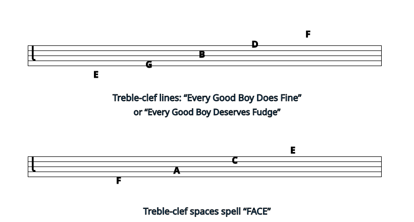
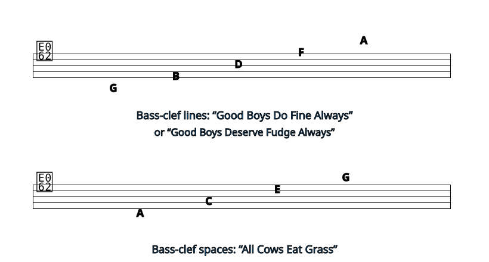
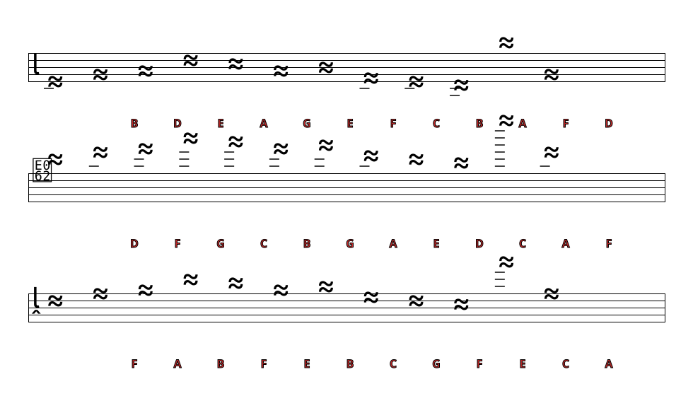
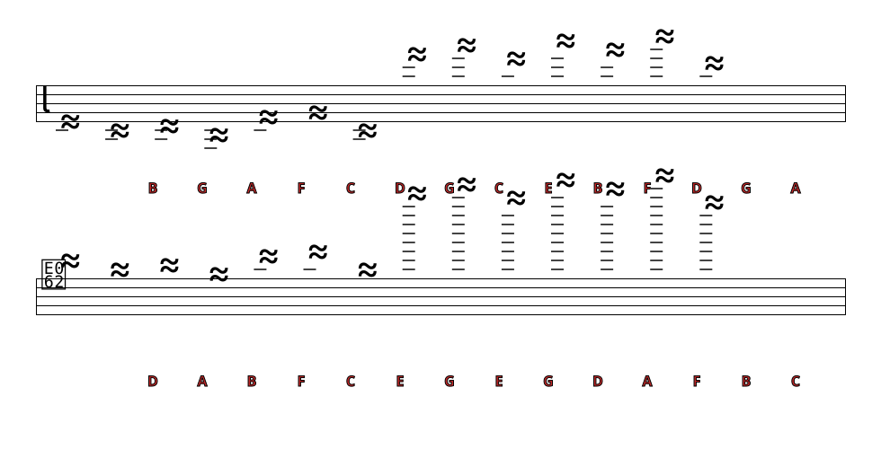
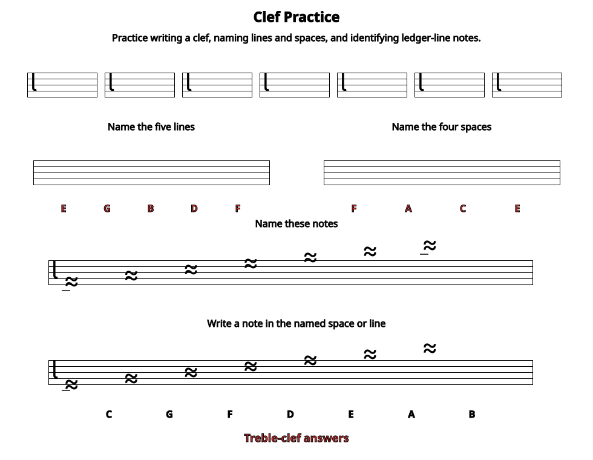
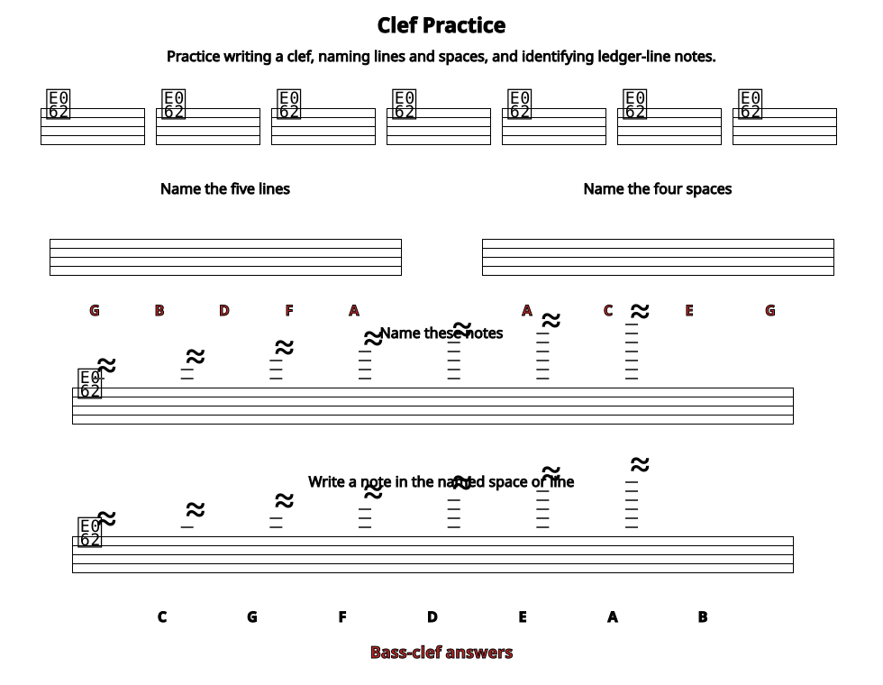

*The clef symbol on a musical staff tells you which pitches belong on the lines and spaces of that staff.*

## Treble Clef and Bass Clef

The first symbol that appears at the beginning of every music [staff](ch-01-the-staff.md) is a *clef symbol*. It is very important because it tells you which [note](ch-06-duration-note-lengths-in-written-music.md) (A, B, C, D, E, F, or G) is found on each line or space. For example, a *treble clef* symbol tells you that the second line from the bottom (the line that the symbol curls around) is \"G\". On any staff, the notes are always arranged so that the next letter is always on the next higher line or space. The last note letter, G, is always followed by another A.

A *bass clef* symbol tells you that the second line from the top (the one bracketed by the symbol\'s dots) is F. The notes are still arranged in ascending order, but they are all in different places than they were in treble clef.

## Memorizing the Notes in Bass and Treble Clef

One of the first steps in learning to read music in a particular clef is memorizing where the notes are. Many students prefer to memorize the notes and spaces separately. Here are some of the most popular mnemonics used.

You can use a word or silly sentence to help you memorize which notes belong on the lines or spaces of a clef. If you don't like these ones, you can make up your own.

## Moveable Clefs

Most music these days is written in either bass clef or treble clef, but some music is written in a *C clef*. The C clef is moveable: whatever line it centers on is a [middle C](ch-28-octaves-and-the-major-minor-tonal-system.md).

All of the notes on this staff are middle C.

The bass and treble clefs were also once moveable, but it is now very rare to see them anywhere but in their standard positions. If you do see a treble or bass clef symbol in an unusual place, remember: treble clef is a *G clef*; its spiral curls around a G. Bass clef is an *F clef*; its two dots center around an F.

It is rare these days to see the G and F clefs in these nonstandard positions.

Much more common is the use of a treble clef that is meant to be read one octave below the written pitch. Since many people are uncomfortable reading bass clef, someone writing music that is meant to sound in the region of the bass clef may decide to write it in the treble clef so that it is easy to read. A very small \"8\" at the bottom of the treble clef symbol means that the notes should sound one octave lower than they are written.

A small "8" at the bottom of a treble clef means that the notes should sound one octave lower than written.

## Why use different clefs?

Music is easier to read and write if most of the notes fall on the staff and few [ledger lines](ch-01-the-staff.md) have to be used.

These scores show the same notes written in treble and in bass clef. The staff with fewer ledger lines is easier to read and write.

The G indicated by the treble clef is the G above [middle C](ch-28-octaves-and-the-major-minor-tonal-system.md), while the F indicated by the bass clef is the F below middle C. (C clef indicates middle C.) So treble clef and bass clef together cover many of the notes that are in the [range](ch-23-range.md) of human voices and of most instruments. Voices and instruments with higher ranges usually learn to read treble clef, while voices and instruments with lower ranges usually learn to read bass clef. Instruments with ranges that do not fall comfortably into either bass or treble clef may use a C clef or may be [transposing instruments](https://cnx.org/content/m10672).

Middle C is above the bass clef and below the treble clef; so together these two clefs cover much of the range of most voices and instruments.

> **Practice**
>
> > **Question**
> >
> > Write the name of each note below the note on each staff in the referenced item.
> >
> > 
> >
>
> > **Solution**
> >
> > 
> >

> **Practice**
>
> > **Question**
> >
> > Choose a clef in which you need to practice recognizing notes above and below the staff in the referenced item. Write the clef sign at the beginning of the staff, and then write the correct note names below each note.
> >
> > 
> >
>
> > **Solution**
> >
> > the referenced item shows the answers for treble and bass clef. If you have done another clef, have your teacher check your answers.
> >
> > 
> >

> **Practice**
>
> > **Question**
> >
> > the referenced item gives more exercises to help you memorize whichever clef you are learning. You may print these exercises as a [PDF worksheet](../images/cnx/bdd5045fa86b7fe90f70e73d15617d7ba5f96548.pdf) if you like.
> >
> > 
> >
>
> > **Solution**
> >
> > the referenced item shows the answers for treble clef, and the referenced item the answers for bass clef. If you are working in a more unusual clef, have your teacher check your answers.
> >
> > 
> >
> > 
> >
