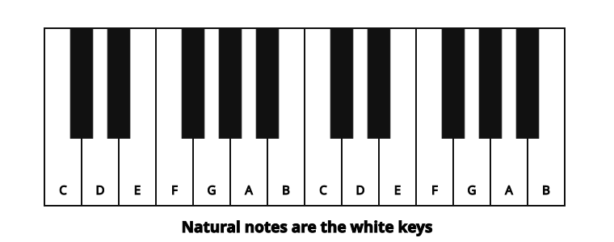
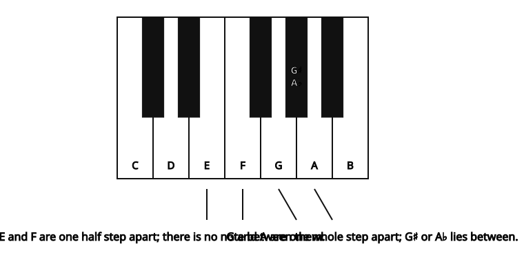
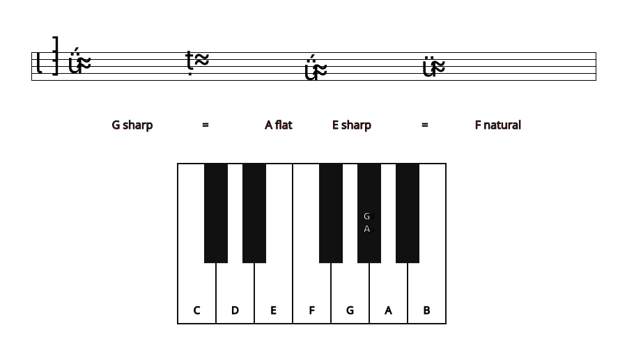
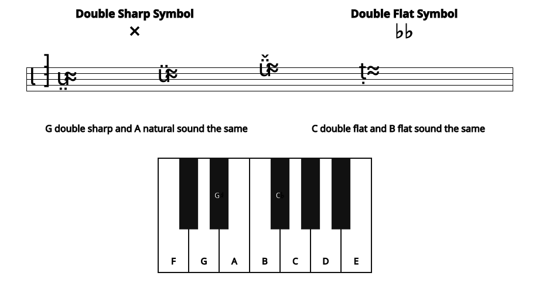

*In standard notation, a sharp symbol raises the pitch of the natural note by a half-step; a flat symbol lowers it by a half-step.*

The *pitch* of a note is how high or low it sounds. Pitch depends on the [frequency](ch-25-acoustics-for-music-theory.md) of the [fundamental](https://cnx.org/content/m11118#p1c) sound wave of the note. The higher the frequency of a sound wave, and the shorter its [wavelength](ch-25-acoustics-for-music-theory.md), the higher its pitch sounds. But musicians usually don\'t want to talk about wavelengths and frequencies. Instead, they just give the different pitches different letter names: A, B, C, D, E, F, and G. These seven letters name all the *natural* notes (on a keyboard, that\'s all the white keys) within one octave. (When you get to the eighth natural note, you start the next [octave](ch-28-octaves-and-the-major-minor-tonal-system.md) on another A.)

The natural notes name the white keys on a keyboard.

But in [Western](ch-24-classifying-music.md) music there are twelve notes in each octave that are in common use. How do you name the other five notes (on a keyboard, the black keys)?

Sharp, flat, and natural signs can appear either in the <a href="ch-04-key-signature.md">key signature</a>, or right in front of the note that they change.

A *sharp sign* means \"the note that is one [half step](ch-29-half-steps-and-whole-steps.md) higher than the natural note\". A *flat sign* means \"the note that is one half step lower than the natural note\". Some of the natural notes are only one half step apart, but most of them are a [whole step](ch-29-half-steps-and-whole-steps.md) apart. When they are a whole step apart, the note in between them can only be named using a flat or a sharp.

Notice that, using flats and sharps, any pitch can be given more than one note name. For example, the G sharp and the A flat are played on the same key on the keyboard; they sound the same. You can also name and write the F natural as \"E sharp\"; F natural is the note that is a half step higher than E natural, which is the definition of E sharp. Notes that have different names but sound the same are called [enharmonic](ch-05-enharmonic-spelling.md) notes.

G sharp and A flat sound the same. E sharp and F natural sound the same.

Sharp and flat signs can be used in two ways: they can be part of a [key signature](ch-04-key-signature.md), or they can mark accidentals. For example, if most of the C\'s in a piece of music are going to be sharp, then a sharp sign is put in the \"C\" space at the beginning of the [staff](ch-01-the-staff.md), in the key signature. If only a few of the C\'s are going to be sharp, then those C\'s are marked individually with a sharp sign right in front of them. Pitches that are not in the key signature are called *accidentals*.

When a sharp sign appears in the C space in the key signature, all C's are sharp unless marked as accidentals.

A note can also be double sharp or double flat. A *double sharp* is two half steps (one whole step) higher than the natural note; a *double flat* is two half steps (a whole step) lower. Triple, quadruple, etc. sharps and flats are rare, but follow the same pattern: every sharp or flat raises or lowers the pitch one more half step.

Using double or triple sharps or flats may seem to be making things more difficult than they need to be. Why not call the note \"A natural\" instead of \"G double sharp\"? The answer is that, although A natural and G double sharp are the same pitch, they don\'t have the same function within a particular chord or a particular key. For musicians who understand some music theory (and that includes most performers, not just composers and music teachers), calling a note \"G double sharp\" gives important and useful information about how that note functions in the [chord](ch-21-harmony.md) and in the [progression of the harmony](ch-40-beginning-harmonic-analysis.md).

Double sharps raise the pitch by two half steps (one whole step). Double flats lower the pitch by two half steps (one whole step).
