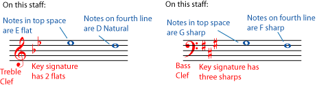
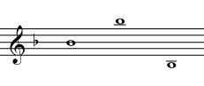
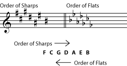
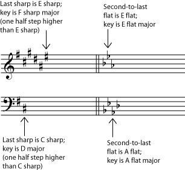
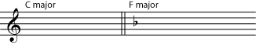
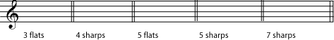
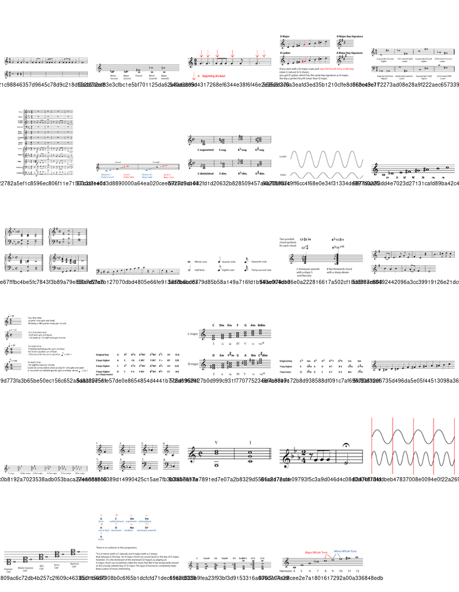

*The key signature at the beginning of a musical staff lists the sharps or flats in the key.*

The key signature appears right after the [clef](ch-02-clef.md) symbol on the [staff](ch-01-the-staff.md). In common notation, **clef and key signature are the only symbols that normally appear on every staff. They appear so often because they are such important symbols; they tell you what note is found on each line and space of the staff.** This can change from one piece of music to another, so the musician must know the clef and key signature in order to read the music correctly; in a way, the written music is a coded message, with each note standing for a sound with a particular [pitch](ch-03-pitch-sharp-flat-and-natural-notes.md), and the clef and key signature are the key that tell you how to decode this particular message. (For an explanation of why things are done this way, please see [how to read music](https://cnx.org/content/m43040#eip-216).)

The clef tells you the letter name of the note - for example, the top line on a bass clef staff is always some kind of A; but you need the key signature to tell you what kind of A. It may have either some [sharp](ch-03-pitch-sharp-flat-and-natural-notes.md) symbols on particular lines or spaces, or some [flat](ch-03-pitch-sharp-flat-and-natural-notes.md) symbols, again on particular lines or spaces. If there are no flats or sharps listed after the clef symbol, then the key signature is \"all notes are natural\".

The *key signature* is a list of all the sharps and flats in the [key](ch-30-major-keys-and-scales.md) that the music is in. **When a sharp (or flat) appears on a line or space in the key signature, all the notes on that line or space are sharp (or flat), and all other notes with the same letter names in other octaves are also sharp (or flat).**

This key signature has a flat on the "B" line, so all of these B's are flat.

The sharps or flats always appear in the same order in all key signatures. This is the same order in which they are added as keys get sharper or flatter. For example, if a key (G major or E minor) has only one sharp, it will be F sharp, so F sharp is always the first sharp listed in a sharp key signature. The keys that have two sharps (D major and B minor) have F sharp and C sharp, so C sharp is always the second sharp in a key signature, and so on. **The order of sharps is: F sharp, C sharp, G sharp, D sharp, A sharp, E sharp, B sharp. The order of flats is the reverse of the order of sharps: B flat, E flat, A flat, D flat, G flat, C flat, F flat.** So the keys with only one flat (F major and D minor) have a B flat; the keys with two flats (B flat major and G minor) have B flat and E flat; and so on. The order of flats and sharps, like the order of the keys themselves, follows a [circle of fifths](ch-34-the-circle-of-fifths.md).

If you do not know the name of the key of a piece of music, the key signature can help you find out. Assume for a moment that you are in a [major key](ch-30-major-keys-and-scales.md). If the key contains sharps, the name of the key is one [half step](ch-29-half-steps-and-whole-steps.md) higher than the last sharp in the key signature. If the key contains flats, the name of the key signature is the name of the second-to-last flat in the key signature.

> **Example**
>
> the referenced item demonstrates quick ways to name the (major) key simply by looking at the key signature. In flat keys, the second-to-last flat names the key. In sharp keys, the note that names the key is one half step above the final sharp.
>
> 
>

The only major keys that these rules do not work for are C major (no flats or sharps) and F major (one flat). It is easiest just to memorize the key signatures for these two very common keys. If you want a rule that also works for the key of F major, remember that the second-to-last flat is always a [perfect fourth](ch-32-interval.md) higher than (or a perfect fifth lower than) the final flat. So you can also say that the name of the key signature is a perfect fourth lower than the name of the final flat.

The key of C major has no sharps or flats. F major has one flat.

If the music is in a minor key, it will be in the [relative minor](ch-31-minor-keys-and-scales.md) of the major key for that key signature. You may be able to tell just from listening (see [Major Keys and Scales](ch-30-major-keys-and-scales.md)) whether the music is in a major or minor key. If not, the best clue is to look at the final [chord](ch-21-harmony.md). That chord (and often the final note of the melody, also) will usually name the key.

> **Practice**
>
> > **Question**
> >
> > Write the key signatures asked for in the referenced item and name the major keys that they represent.
> >
> > 
> >
>
> > **Solution**
> >
> > 
> >
