*An explanation of notes, chords, keys, and scales that are written differently but sound the same.*

::: {#m11641-s0 .section}
## Enharmonic Notes

[]{#m11641-p0a}

In [common notation](ch-01-the-staff.md), any note can be [sharp, flat, or natural](ch-03-pitch-sharp-flat-and-natural-notes.md). A sharp symbol raises the [pitch](ch-03-pitch-sharp-flat-and-natural-notes.md) (of a natural note) by one [half step](ch-29-half-steps-and-whole-steps.md); a flat symbol lowers it by one half step.

[]{#m11641-fig0a}
<figure>
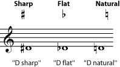
</figure>

[]{#m11641-p0b}

Why do we bother with these symbols? There are twelve pitches available within any [octave](ch-28-octaves-and-the-major-minor-tonal-system.md). We could give each of those twelve pitches its own name (A, B, C, D, E, F, G, H, I, J, K, and L) and its own line or space on a staff. But that would actually be fairly inefficient, because most music is in a particular [key](ch-30-major-keys-and-scales.md). And music that is in a [major](ch-30-major-keys-and-scales.md) or [minor](ch-31-minor-keys-and-scales.md) key will tend to use only seven of those twelve notes. So music is easier to read if it has only lines, spaces, and notes for the seven pitches it is (mostly) going to use, plus a way to write the occasional notes that are not in the key.

[]{#m11641-p0c}

This is basically what common notation does. There are only seven note names (A, B, C, D, E, F, G), and each line or space on a [staff](ch-01-the-staff.md) will correspond with one of those note names. To get all twelve pitches using only the seven note names, we allow any of these notes to be sharp, flat, or natural. Look at the notes on a keyboard.

[]{#m11641-fig0b}
<figure>
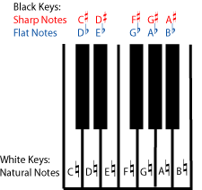
<figcaption>Seven of the twelve possible notes in each <a href="ch-28-octaves-and-the-major-minor-tonal-system.md">octave</a> are "natural" notes.</figcaption>
</figure>

[]{#m11641-p0d}

Because most of the natural notes are two half steps apart, there are plenty of pitches that you can only get by naming them with either a flat or a sharp (on the keyboard, the \"black key\" notes). For example, the note in between D natural and E natural can be named either D sharp or E flat. These two names look very different on the staff, but they are going to sound exactly the same, since you play both of them by pressing the same black key on the piano.

[]{#m11641-fig0c}
<figure>
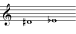
<figcaption>D sharp and E flat look very different when written in common notation, but they sound exactly the same when played on a piano.</figcaption>
</figure>

[]{#m11641-p0e}

This is an example of *enharmonic spelling*. Two notes are *enharmonic* if they sound the same on a piano but are named and written differently.

::: {#m11641-exer0a .exercise}
**Practice**

::: {#m11641-id2144520 .problem}
**Question**

[]{#m11641-prob0a}

Name the other enharmonic notes that are listed above the black keys on the keyboard in the referenced item. Write them on a treble clef staff. If you need staff paper, you can print out this [PDF file](../images/cnx/e5b6335c0813bd7797983b645d24962d8ad96e93.pdf)
:::

::: {#m11641-id8077331 .solution}
**Solution**

[]{#m11641-solv0a}

- C sharp and D flat
- F sharp and G flat
- G sharp and A flat
- A sharp and B flat

[]{#m11641-figsolv0b}
<figure>
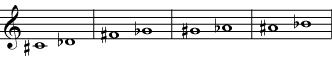
</figure>
:::
:::

[]{#m11641-p0f}

But these are not the only possible enharmonic notes. Any note can be flat or sharp, so you can have, for example, an E sharp. Looking at the keyboard and remembering that the definition of sharp is \"one half step higher than natural\", you can see that an E sharp must sound the same as an F natural. Why would you choose to call the note E sharp instead of F natural? Even though they sound the same, E sharp and F natural, as they are actually used in music, are different notes. (They may, in some circumstances, also sound different; see below.) Not only will they look different when written on a staff, but they will have different functions within a key and different relationships with the other notes of a piece of music. So a composer may very well prefer to write an E sharp, because that makes the note\'s place in the harmonies of a piece more clear to the performer. (Please see [Triads](ch-36-triads.md), [Beyond Triads](ch-39-beyond-triads-naming-other-chords.md), and [Harmonic Analysis](ch-40-beginning-harmonic-analysis.md) for more on how individual notes fit into chords and harmonic progressions.)

[]{#m11641-p0g}

In fact, this need (to make each note\'s place in the harmony very clear) is so important that double sharps and double flats have been invented to help do it. A double sharp is two half steps (one [whole step](ch-29-half-steps-and-whole-steps.md)) higher than the natural note. A double flat is two half steps lower than the natural note. Double sharps and flats are fairly rare, and triple and quadruple flats even rarer, but all are allowed.

[]{#m11641-fig0d}
<figure>
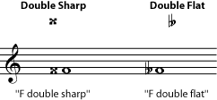
</figure>

::: {#m11641-exer0b .exercise}
**Practice**

::: {#m11641-id1170956803481 .problem}
**Question**

[]{#m11641-prob2}

Give at least one enharmonic spelling for the following notes. Try to give more than one. (Look at the keyboard again if you need to.)

[]{#m11641-prob0b}

1.  E natural
2.  B natural
3.  C natural
4.  G natural
5.  A natural
:::

::: {#m11641-id1170960083562 .solution}
**Solution**

[]{#m11641-solv0b}

1.  F flat; D double sharp
2.  C flat; A double sharp
3.  B sharp; D double flat
4.  F double sharp; A double flat
5.  G double sharp; B double flat
:::
:::
:::

::: {#m11641-s1 .section}
## Enharmonic Keys and Scales

[]{#m11641-p1a}

Keys and scales can also be enharmonic. Major keys, for example, always follow the same pattern of half steps and whole steps. (See [Major Keys and Scales](ch-30-major-keys-and-scales.md). Minor keys also all follow the same pattern, different from the major scale pattern; see [Minor Keys](ch-31-minor-keys-and-scales.md).) So whether you start a major scale on an E flat, or start it on a D sharp, you will be following the same pattern, playing the same piano keys as you go up the scale. But the notes of the two scales will have different names, the scales will look very different when written, and musicians may think of them as being different. For example, most instrumentalists would find it easier to play in E flat than in D sharp. In some cases, an E flat major scale may even sound slightly different from a D sharp major scale. (See below.)

[]{#m11641-fig1a}
<figure>
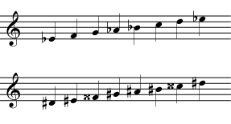
<figcaption>The E flat major and D sharp major scales sound the same on the piano, although they look very different. If this surprises you, look again at the piano keyboard and find the notes that you would play for each scale.</figcaption>
</figure>

[]{#m11641-p1b}

Since the scales are the same, D sharp major and E flat major are also *enharmonic keys*. Again, their key signatures will look very different, but music in D sharp will not be any higher or lower than music in E flat.

[]{#m11641-fig1b}
<figure>
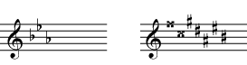
<figcaption>The key signatures for E flat and D sharp look very different, but would sound the same on a keyboard.</figcaption>
</figure>

::: {#m11641-exer1a .exercise}
**Practice**

::: {#m11641-id1170956383463 .problem}
**Question**

[]{#m11641-prob1a}

Give an enharmonic name and key signature for the keys given in the referenced item. (If you are not well-versed in [key signatures](ch-04-key-signature.md) yet, pick the easiest enharmonic spelling for the key name, and the easiest enharmonic spelling for every note in the key signature. Writing out the scales may help, too.)

[]{#m11641-figprob1a}
<figure>
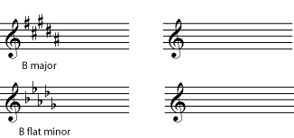
</figure>
:::

::: {#m11641-id1170956378392 .solution}
**Solution**

[]{#m11641-solv1a}
<figure>
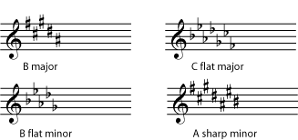
</figure>
:::
:::
:::

::: {#m11641-s2 .section}
## Enharmonic Intervals and Chords

[]{#m11641-fig2b}
<figure>
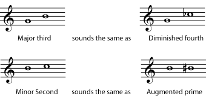
</figure>

[]{#m11641-p2a}

[Chords](ch-21-harmony.md) and [intervals](ch-32-interval.md) also can have enharmonic spellings. Again, it is important to name a chord or interval as it has been spelled, in order to understand how it fits into the rest of the music. A C sharp major chord means something different in the key of D than a D flat major chord does. And an interval of a diminished fourth means something different than an interval of a major third, even though they would be played using the same keys on a piano. (For practice naming intervals, see [Interval](ch-32-interval.md). For practice naming chords, see [Naming Triads](ch-37-naming-triads.md) and [Beyond Triads](ch-39-beyond-triads-naming-other-chords.md). For an introduction to how chords function in a harmony, see [Beginning Harmonic Analysis](ch-40-beginning-harmonic-analysis.md).)

[]{#m11641-fig2a}
<figure>
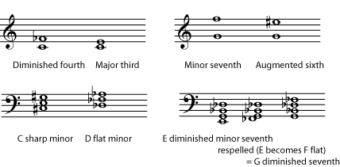
</figure>
:::

::: {#m11641-s3 .section}
## Enharmonic Spellings and Equal Temperament

[]{#m11641-p3a}

All of the above discussion assumes that all notes are tuned in [equal temperament](ch-44-tuning-systems.md). Equal temperament has become the \"official\" tuning system for [Western music](ch-24-classifying-music.md). It is easy to use in pianos and other instruments that are difficult to retune (organ, harp, and xylophone, to name just a few), precisely because enharmonic notes sound exactly the same. But voices and instruments that can fine-tune quickly (for example violins, clarinets, and trombones) often move away from equal temperament. They sometimes drift, consciously or unconsciously, towards [just intonation](ch-44-tuning-systems.md), which is more closely based on the [harmonic series](ch-27-harmonic-series-i-timbre-and-octaves.md). When this happens, enharmonically spelled notes, scales, intervals, and chords, may not only be theoretically different. They may also actually be slightly different pitches. The differences between, say, a D sharp and an E flat, when this happens, are very small, but may be large enough to be noticeable. Many [Non-western music traditions](ch-24-classifying-music.md) also do not use equal temperament. **Sharps and flats used to notate music in these traditions should not be assumed to mean a change in pitch equal to an equal-temperament half-step**. For definitions and discussions of equal temperament, just intonation, and other tuning systems, please see [Tuning Systems](ch-44-tuning-systems.md).
:::
