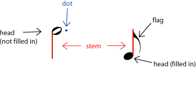
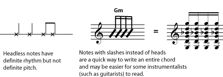
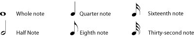
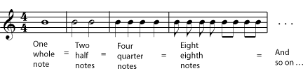
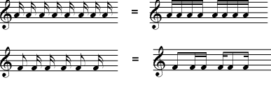
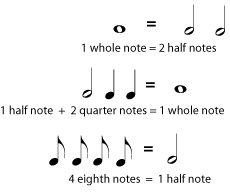
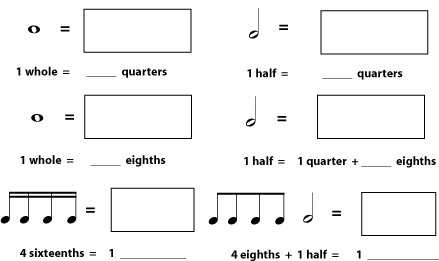
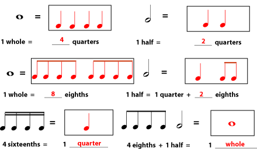
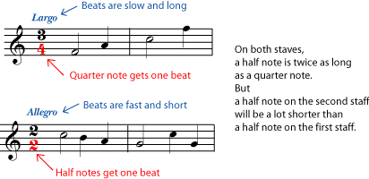
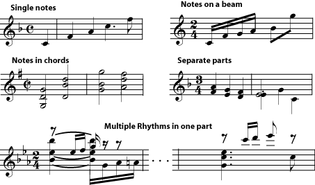

*In standard music notation, the duration (time length) of a particular note is defined by how long it lasts compared to a whole note.*

::: {#m10945-s1 .section}
## The Shape of a Note

In standard notation, a single musical sound is written as a *note*. The two most important things a written piece of music needs to tell you about a note are its pitch - how high or low it is - and its *duration* - how long it lasts.

To find out the [pitch](ch-03-pitch-sharp-flat-and-natural-notes.md) of a written note, you look at the [clef](ch-02-clef.md) and the [key signature](ch-04-key-signature.md), then see what line or space the note is on. The higher a note sits on the [staff](ch-01-the-staff.md), the higher it sounds. To find out the duration of the written note, you look at the [tempo](ch-13-tempo.md) and the [time signature](ch-08-time-signature.md) and then see what the note looks like.

All of the parts of a written note affect how long it lasts.

The pitch of the note depends only on what line or space the *head* of the note is on. (Please see [pitch](ch-03-pitch-sharp-flat-and-natural-notes.md) , [clef](ch-02-clef.md) and [key signature](ch-04-key-signature.md) for more information.) If the note does not have a head (see the referenced item), that means that it does not have one definite pitch.

If a note does not have head, it does not have one definite pitch. Such a note may be a pitchless sound, like a drum beat or a hand clap, or it may be an entire chord rather than a single note.

The head of the note may be filled in (black), or not. The note may also have (or not) a stem, one or more flags, beams connecting it to other notes, or one or more dots following the head of the note. All of these things affect how much time the note is given in the music.

::: {#m10945-id12339747 .note}
**Note**

A dot that is someplace other than next to the head of the note **does not affect the rhythm**. Other dots are [articulation](ch-16-articulation.md) marks. They may affect the actual length of the note (the amount of time it sounds), but do not affect the amount of time it must be given. (The extra time when the note could be sounding, but isn\'t, becomes an unwritten [rest](ch-07-duration-rest-length.md).) If this is confusing, please see the explanation in [articulation](ch-16-articulation.md).
:::
:::

::: {#m10945-s2 .section}
## The Length of a Note

The simplest-looking note, with no stems or flags, is a *whole note*. All other note lengths are defined by how long they last compared to a whole note. A note that lasts half as long as a whole note is a *half note*. A note that lasts a quarter as long as a whole note is a *quarter note*. The pattern continues with *eighth notes*, *sixteenth notes*, *thirty-second notes*, *sixty-fourth notes*, and so on, each type of note being half the length of the previous type. (There are no such thing as third notes, sixth notes, tenth notes, etc.; see [Dots, Ties, and Borrowed Divisions](ch-11-dots-ties-and-borrowed-divisions.md) to find out how notes of unusual lengths are written.)

Note lengths work just like fractions in arithmetic: two half notes or four quarter notes last the same amount of time as one whole note. Flags are often replaced by beams that connect the notes into easy-to-read groups.

You may have noticed that some of the eighth notes in the referenced item don\'t have flags; instead they have a *beam* connecting them to another eighth note. If flagged notes are next to each other, their flags can be replaced by beams that connect the notes into easy-to-read groups. The beams may connect notes that are all in the same beat, or, in some vocal music, they may connect notes that are sung on the same text syllable. Each note will have the same number of beams as it would have flags.

The notes connected with beams are easier to read quickly than the flagged notes. Notice that each note has the same number of beams as it would have flags, even if it is connected to a different type of note. The notes are often (but not always) connected so that each beamed group gets one beat. This makes the notes easier to read quickly.

You may have also noticed that the note lengths sound like fractions in arithmetic. In fact they work very much like fractions: two half notes will be equal to (last as long as) one whole note; four eighth notes will be the same length as one half note; and so on. (For classroom activities relating music to fractions, see [Fractions, Multiples, Beats, and Measures](https://cnx.org/content/m11807).)

::: {#m10945-ex1a .example}
**Example**

:::

::: {#m10945-exer1a .exercise}
**Practice**

::: {#m10945-id21497376 .problem}
**Question**

Draw the missing notes and fill in the blanks to make each side the same duration (length of time).

:::

::: {#m10945-id13537995 .solution}
**Solution**

:::
:::

So how long does each of these notes actually last? That depends on a couple of things. A written note lasts for a certain amount of time measured in [beats](ch-08-time-signature.md). To find out exactly how many beats it takes, you must know the [time signature](ch-08-time-signature.md). And to find out how long a beat is, you need to know the [tempo](ch-13-tempo.md).

::: {#m10945-examp2 .example}
**Example**

In any particular section of a piece of music, a half note is always twice as long as a quarter note. But how long each note actually lasts depends on the time signature and the tempo.

:::
:::

::: {#m10945-s4 .section}
## More about Stems

Whether a stem points up or down does not affect the note length at all. There are two basic ideas that lead to the rules for stem direction. One is that the music should be as easy as possible to read and understand. The other is that the notes should tend to be \"in the staff\" as much as reasonably possible.

::: {#m10945-l4a}
1.  **Single Notes** - Notes below the middle line of the staff should be stem up. Notes on or above the middle line should be stem down.
2.  **Notes sharing a stem (block chords)** - Generally, the stem direction will be the direction for the note that is furthest away from the middle line of the staff
3.  **Notes sharing a beam** - Again, generally you will want to use the stem direction of the note farthest from the center of the staff, to keep the beam near the staff.
4.  **Different rhythms being played at the same time by the same player** - Clarity requires that you write one rhythm with stems up and the other stems down.
5.  **Two parts for different performers written on the same staff** - If the parts have the same rhythm, they may be written as block chords. If they do not, the stems for one part (the \"high\" part or \"first\" part) will point up and the stems for the other part will point down. This rule is especially important when the two parts cross; otherwise there is no way for the performers to know that the \"low\" part should be reading the high note at that spot.
:::

Keep stems and beams in or near the staff, but also use stem direction to clarify rhythms and parts when necessary.

:::
