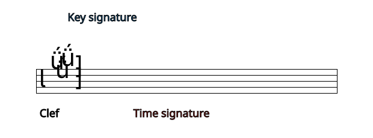
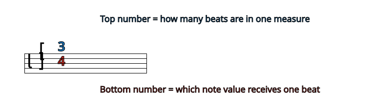
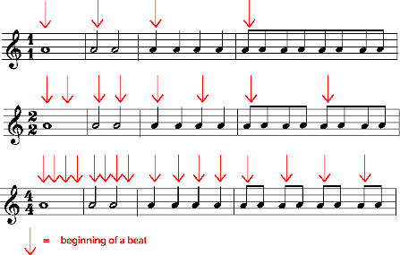
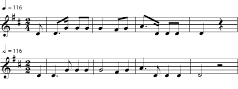
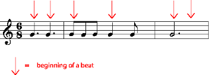

*The time signature on a musical staff tells you the meter of the music by defining both the number of beats in a measure and the type of note that fills one beat.*

In [common notation](ch-01-the-staff.md), the *time signature* appears at the beginning of a piece of music, right after the [key signature](ch-04-key-signature.md). Unlike the key signature, which is on every [staff](ch-01-the-staff.md), the time signature will not appear again in the music unless the meter changes. The [meter](ch-09-meter.md) of a piece is a repetitive rhythmic pulse that underlies the music. The time signature is the symbol that tells you what meter is being used in a piece of music and what [types of note](ch-06-duration-note-lengths-in-written-music.md)) are being used to write it out.

The time signature appears at the beginning of the piece of music, right after the clef symbol and key signature.

## Beats and Measures

Music happens over a period of time, so a very common way to organize music is to divide that time into short periods of the same length, using audible pulses called *beats*. Each pulse is *a beat*, and the regular, predictable pulse of a piece of music is *the beat*. The beat is created when the musicians do things (like hit a drum, strum a guitar, or start singing a word) at very regular intervals. This creates an audible, predictable pulse that helps the musicians to coordinate what they are doing so that they sound good together. The predictability and audibility of the beat also allows others to join in. As soon as listeners can \"feel the beat,\" they can clap hands, snap fingers, tap their feet, nod their heads, march, dance, or sing along \"in time\" with the music (in other words, coordinated with the musicians). Anything that happens during the audible pulse (a clap or drum hit, for example), as well as anything that starts during a pulse (such as a sung word, or a note on a flute or violin) is said to be *on the beat*. Of course, things can happen in between the beats, too, but the timing for those is also coordinated using the beats; for example, a note might begin at exactly the halfway point between two beats.

> **Note**
>
> Not all music has beats and a time signature. In music with a *free* rhythm or meter, there is no time signature, and no regular pulse to the music; the musicians are free to play or sing a note at whatever time they feel is best. Other pieces may have a written time signature, to help the musicians keep track of time, but the musical events in the piece do not give it an audible beat.

> **Example**
>
> Listen to excerpts A, B, C and D. Can you clap your hands, tap your feet, or otherwise move \"to the beat\"? Is there a piece in which it is easier or harder to feel the beat?
>
> - [A](../images/cnx/ae21b6f6350d2c7675e1a7991841379f5a3f17af.mp3)
> - [B](../images/cnx/9e4dd822e981d8d4a65b89dd467ee9e6c9fc5b5e.midi)
> - [C](../images/cnx/1a0c6bd1ce917a9c878c57bd083930972c8a89b2.midi)
> - [D](../images/cnx/52451aaca88619c8192b24d0834c0c45e0b55b0c.mp3)

When music is organized into beats, it makes sense to write it down that way. In [common notation](ch-01-the-staff.md), the composer assigns a particular kind of note to be one beat long. For example, if \"a quarter note gets a beat,\" then playing many quarter notes in a row would mean playing a new note on every beat. The quarter note is most likely to play this role, but any [type of note](ch-06-duration-note-lengths-in-written-music.md) can get the \"this is one beat\" designation.

In most metered music, some of the beats are stronger (louder, more powerful, more noticeable, or busier), than others, and there is a regular pattern of stronger and weaker beats, for example, strong-weak-weak-strong-weak-weak, or strong-weak-strong-weak. So the beats are organized even further by grouping them into *bars*, or *measures*. (The two words mean the same thing.) For example, for music with a beat pattern of strong-weak-weak-strong-weak-weak, or 1-2-3-1-2-3, a measure would have three beats in it. The *time signature* tells you two things: how many beats there are in each measure, and what [type of note](ch-06-duration-note-lengths-in-written-music.md) gets a beat.

This time signature means that there are three quarter notes (or any combination of notes that equals three quarter notes) in every measure. A piece with this time signature would be "in three four time" or just "in three four".

> **Practice**
>
> > **Question**
> >
> > Listen again to the music in the referenced item. Instead of clapping, count each beat. Decide whether the music has 2, 3, or 4 beats per measure. In other words, does it feel more natural to count 1-2-1-2, 1-2-3-1-2-3, or 1-2-3-4-1-2-3-4?
>
> > **Solution**
> >
> > - A has a very strong, quick 1-2-3 beat.
> > - B is in a slow (easy) 2. You may feel it in a fast 4.
> > - C is in a stately 4.
> > - D is in 3, but the beat may be harder to feel than in A because the rhythms are more complex and the performer is taking some liberties with the [tempo](ch-13-tempo.md).

## Reading Time Signatures

Most time signatures contain two numbers. The top number tells you how many beats there are in a measure. The bottom number tells you what kind of note gets a beat.

In "four four" time, there are four beats in a measure and a quarter note gets a beat. In order to keep the meter going steadily, every measure must have a combination of notes and rests that is equivalent to four quarter notes.

You may have noticed that the time signature looks a little like a fraction in arithmetic. Filling up measures feels a little like finding equivalent [fractions](https://cnx.org/content/m11807), too. In \"four four time\", for example, there are four beats in a measure and a quarter note gets one beat. So four quarter notes would fill up one measure. But so would any other combination of notes and [rests](ch-07-duration-rest-length.md) that equals four quarters: one whole, two halves, one half plus two quarters, a half note and a half rest, and so on.

> **Example**
>
> If the time signature is three eight, any combination of notes that adds up to three eighths will fill a measure. Remember that a [dot](ch-11-dots-ties-and-borrowed-divisions.md) is worth an extra half of the note it follows. [Listen](../images/cnx/6a05eaba6ecc38fff408bcc960038e4c70d21cb0.midi) to the rhythms in the referenced item.
>
> 
>
> If the time signature is three eight, a measure may be filled with any combination of notes and rests that adds up to three eight.
>

> **Practice**
>
> > **Question**
> >
> > Write each of the time signatures below (with a clef symbol) at the beginning of a staff. Write at least four measures of music in each time signature. Fill each measure with a different combination of note lengths. Use at least one dotted note on each staff. If you need some staff paper, you can download this [PDF file](../images/cnx/e5b6335c0813bd7797983b645d24962d8ad96e93.pdf).
> >
> > 1.  Two four time
> > 2.  Three eight time
> > 3.  Six four time
>
> > **Solution**
> >
> > There are an enormous number of possible note combinations for any time signature. That\'s one of the things that makes music interesting. Here are some possibilities. If you are not sure that yours are correct, check with your music instructor.
> >
> > 
> >
> > These are only a few of the many, many possible note combinations that could be used in these time signatures.
> >

A few time signatures don\'t have to be written as numbers. Four four time is used so much that it is often called *common time*, written as a bold \"C\". When both fours are \"cut\" in half to twos, you have *cut time*, written as a \"C\" cut by a vertical slash.

## Counting and Conducting

You may have already noticed that a measure in four four time looks the same as a measure in two two. After all, in arithmetic, four quarters adds up to the same thing as two halves. For that matter, why not call the time signature \"one one\" or \"eight eight\"?

Measures in all of these meters look the same, but feel different. The difference is how many downbeats there are in a measure.

Or why not write two two as two four, giving quarter notes the beat instead of half notes? The music would look very different, but it would sound the same, as long as you made the beats the same speed. The music in each of the staves in the referenced item would sound like [this](../images/cnx/c250450e723c4b0be58fe0fa098187e5d9fd3cfd.midi).

The music in each of these staves should sound exactly alike.

So why is one time signature chosen rather than another? The composer will normally choose a time signature that makes the music easy to read and also easy to count and [conduct](https://cnx.org/content/m12404). Does the music feel like it has four beats in every measure, or does it go by so quickly that you only have time to tap your foot twice in a measure?

A common exception to this rule of thumb is six eight time, and the other time signatures (for example nine eight and twelve eight) that are used to write compound [meters](ch-09-meter.md). A piece in six eight might have six beats in every measure, with an eighth note getting a beat. But it is more likely that the conductor (or a tapping foot) will give only two beats per measure, with a dotted quarter (or three eighth notes) getting one beat. In the same way, three eight may only have one beat per measure; nine eight, three beats per measure; and twelve eight, four beats per measure. Why the exceptions? Since beats normally get divided into halves and quarters, this is the easiest way for composers to write beats that are divided into thirds.

In six eight time, a dotted quarter usually gets one beat. This is the easiest way to write beats that are evenly divided into three rather than two.
