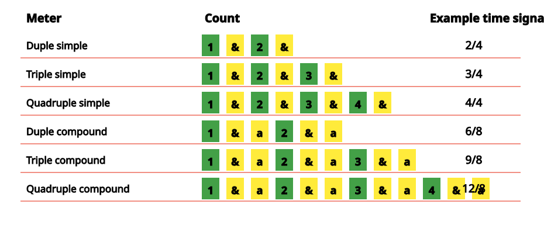

*The meter of a piece of music is the repetitive arrangement of strong and weak pulses in the rhythm. Young children can be encouraged to recognize and classify meters even before they learn about time signatures and reading music.*

## What is Meter?

The *meter* of a piece of music is the arrangment of its rhythms in a repetitive pattern of strong and weak beats. This does not necessarily mean that the rhythms themselves are repetitive, but they do strongly suggest a repeated pattern of pulses. It is on these pulses, the [beat](ch-08-time-signature.md) of the music, that you tap your foot, clap your hands, dance, etc.

Some music does not have a meter. Ancient music, such as Gregorian chants; new music, such as some experimental twentieth-century art music; and Non-Western music, such as some native American flute music, may not have a strong, repetitive pattern of beats. Other types of music, such as traditional Western African drumming, may have very complex meters that can be difficult for the beginner to identify.

But most [Western](ch-24-classifying-music.md) music has simple, repetitive patterns of beats. This makes *meter* a very useful way to organize the music. [Common notation](ch-01-the-staff.md), for example, divides the written music into small groups of beats called [measures, or bars](ch-08-time-signature.md). The lines dividing each measure from the next help the musician reading the music to keep track of the [rhythms](ch-17-rhythm.md). A piece (or section of the piece) is assigned a [time signature](ch-08-time-signature.md) that tells the performer how many beats to expect in each measure, and what [type of note](ch-06-duration-note-lengths-in-written-music.md) should get one beat. (For more on reading time signatures, please see [Time Signature](ch-08-time-signature.md).)

[Conducting](https://cnx.org/content/m12404) also depends on the meter of the piece; conductors use different conducting patterns for the different meters. These patterns emphasize the differences between the stronger and weaker beats to help the performers keep track of where they are in the music.

But the conducting patterns depend only on the pattern of strong and weak beats. In other words, they only depend on \"how many beats there are in a measure\", not \"what type of note gets a beat\". So even though the time signature is often called the \"meter\" of a piece, one can talk about meter without worrying about the time signature or even being able to read music. (Teachers, note that this means that children can be introduced to the concept of meter long before they are reading music. See [Meter Activities](https://cnx.org/content/m13616) for some suggestions.)

## Classifying Meters

Meters can be classified by counting the number of beats from one strong beat to the next. For example, if the meter of the music feels like \"strong-weak-strong-weak\", it is in *duple* meter. \"strong-weak-weak-strong-weak-weak\" is *triple* meter, and \"strong-weak-weak-weak\" is *quadruple*. (Most people don\'t bother classifying the more unusual meters, such as those with five beats in a measure.)

Meters can also be classified as either simple or compound. In a *simple* meter, each beat is basically divided into halves. In *compound* meters, each beat is divided into thirds.

A *borrowed division* occurs whenever the basic meter of a piece is interrupted by some beats that sound like they are \"borrowed\" from a different meter. One of the most common examples of this is the use of [triplets](ch-11-dots-ties-and-borrowed-divisions.md) to add some compound meter to a piece that is mostly in a simple meter. (See [Dots, Ties, and Borrowed Divisions](ch-11-dots-ties-and-borrowed-divisions.md) to see what borrowed divisions look like in common notation.)

## Recognizing Meters

To learn to recognize meter, remember that (in most [Western](ch-24-classifying-music.md) music) the beats and the subdivisions of beats are all equal and even. So you are basically listening for a running, even pulse underlying the rhythms of the music. For example, if it makes sense to count along with the music \"ONE-and-Two-and-ONE-and-Two-and\" (with all the syllables very evenly spaced) then you probably have a simple duple meter. But if it\'s more comfortable to count \"ONE-and-a-Two-and-a-ONE-and-a-Two-and-a\", it\'s probably compound duple meter. (Make sure numbers always come on a pulse, and \"one\" always on the strongest pulse.)

This may take some practice if you\'re not used to it, but it can be useful practice for anyone who is learning about music. To help you get started, the figure below sums up the most-used meters. To help give you an idea of what each meter should feel like, here are some animations (with sound) of [duple simple](../images/cnx/40d8571002a882f04b5053a1d045ae1b56e74d82.swf), [duple compound](../images/cnx/9c07e088cae0c1cb78c269f1960295ed7e3c9524.swf), [triple simple](../images/cnx/0b100998214171b77a3323afffe121ba4a87ca64.swf), [triple compound](../images/cnx/710440c271d9a7ea2a11835ebe61f896299bfb01.swf), [quadruple simple](../images/cnx/61cdabfd6f850fdf6c21c3a08def1022bf2f64f9.swf), and [quadruple compound](../images/cnx/71731145db1beffcf2f7ddb02bd5affb86c1fd77.swf) meters. You may also want to listen to some examples of music that is in [simple duple](../images/cnx/7dcd708bc227699d6146a5a1a27bd8d2302dfc3d.mpg), [simple triple](../images/cnx/244662c8a81dc193ebdf8c3e7bb5fca3b0b5e99d.mpg), [simple quadruple](../images/cnx/31b0975590f54794d3a2785f5f378c326ffc597a.mpg), [compound duple](../images/cnx/da8c5e59cda3ece05d0384521d0ca5e7d175b744.mpg), and [compound triple](../images/cnx/25b7273c7ce0ca438d6201277eca506f61e15ba3.mpg) meters.

Remember that meter is not the same as time signature; the time signatures given here are just examples. For example, 2/2 and 2/8 are also simple duple meters.
