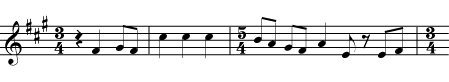
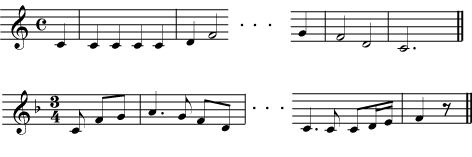
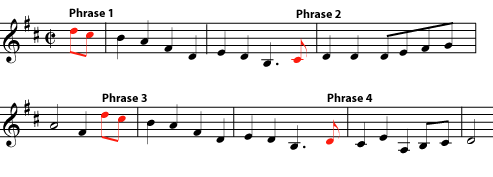
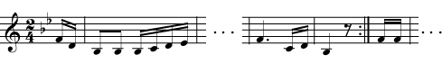

*A shortened first measure of a piece of music is called a pickup measure. Notes that begin a phrase shortly before a strong downbeat are also called pickup notes.*

::: {#m12717-s1 .section}
## Pickup Measures

Normally, all the [measures](ch-01-the-staff.md) of a piece of music must have exactly the number of [beats](ch-08-time-signature.md) indicated in the [time signature](ch-08-time-signature.md). The beats may be filled with any combination of notes or rests (with [duration](ch-06-duration-note-lengths-in-written-music.md) values also dictated by the time signature), but they must combine to make exactly the right number of beats. If a measure or group of measures has more or fewer beats, the time signature must change.

Normally, a composer who wants to put more or fewer beats in a measure must change the time signature, as in this example from Mussorgsky's Boris Godunov.

There is one common exception to this rule. (There are also some less common exceptions not discussed here.) Often, a piece of music does not begin on the [strongest downbeat](ch-08-time-signature.md). Instead, the strong beat that people like to count as \"one\" (the beginning of a measure), happens on the second or third note, or even later. In this case, the first measure may be a full measure that begins with some rests. But often the first measure is simply not a full measure. This shortened first measure is called a *pickup measure*.

If there is a pickup measure, the final measure of the piece should be shortened by the length of the pickup measure (although this rule is sometimes ignored in less formal written music). For example, if the [meter](ch-09-meter.md) of the piece has four beats, and the pickup measure has one beat, then the final measure should have only three beats. (Of course, any combination of notes and rests can be used, as long as the total in the first and final measures equals one full measure.

If a piece begins with a pickup measure, the final measure of the piece is shortened by the length of the pickup measure.

:::

::: {#m12717-s2 .section}
## Pickup Notes

Any [phrase](ch-19-melody.md) of music (not just the first one) may begin someplace other than on a strong downbeat. All the notes before the first strong downbeat of any phrase are the *pickup notes* to that phrase.

Any phrase may begin with pickup notes. Each of these four phrases begins with one or two pickup notes. (You may listen to the tune <a href="../images/cnx/64ddd1a13c185bd4a2cba065e29064ac94be0bf1.midi">here</a>; can you hear that the pickup notes lead to the stronger downbeat?)

A piece that is using pickup measures or pickup notes may also sometimes place a [double bar](ch-01-the-staff.md) (with or without repeat signs) inside a measure, in order to make it clear which phrase and which section of the music the pickup notes belong to. If this happens (which is a bit rare, because it can be confusing to read), there is still a single bar line where it should be, at the end of the measure.
:::

At the ends of sections of the music, a measure may be interrupted by a double bar that places the pickup notes in the correct section and assures that repeats have the correct number of beats. When this happens, the bar line will still appear at the end of the completed measure. This notation can be confusing, though, and in some music the pickups and repeats are written in a way that avoids these broken-up measures.
