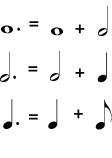
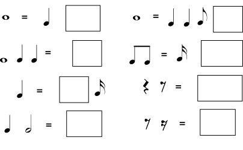
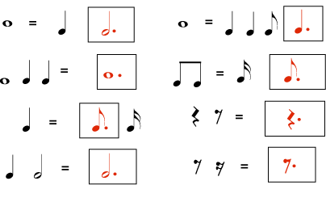
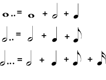
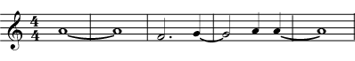
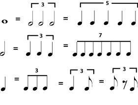
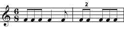
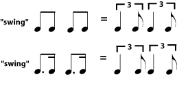

*In written music, standard note lengths are always halves (or halves of halves, and so on) of other note lengths. To get any other note length, dots, ties, or borrowed divisions must be used.*

A half note is half the length of a whole note; a quarter note is half the length of a half note; an eighth note is half the length of a quarter note, and so on. (See [Duration:Note Length](ch-06-duration-note-lengths-in-written-music.md).) The same goes for rests. (See [Duration: Rest Length](ch-07-duration-rest-length.md).) But what if you want a note (or rest) length that isn\'t half of another note (or rest) length?

## Dotted Notes

One way to get a different length is by dotting the note or rest. A *dotted note* is one-and-a-half times the length of the same note without the dot. In other words, the note keeps its original length and adds another half of that original length because of the dot. So a dotted half note, for example, would last as long as a half note plus a quarter note, or three quarters of a whole note.

The dot acts as if it is adding another note half the length of the original note. A dotted quarter note, for example, would be the length of a quarter plus an eighth, because an eighth note is half the length of a quarter note.

> **Practice**
>
> > **Question**
> >
> > Make groups of equal length on each side, by putting a dotted note or rest in the box.
> >
> > 
> >
>
> > **Solution**
> >
> > 
> >

A note may have more than one dot. Each dot adds half the length that the dot before it added. For example, the first dot after a half note adds a quarter note length; the second dot would add an eighth note length.

When a note has more than one dot, each dot is worth half of the dot before it.

## Tied Notes

A dotted half lasts as long as a half note plus a quarter note. The same length may be written as a half note and a quarter note tied together. *Tied notes* are written with a curved line connecting two notes that are on the same line or the same space in the staff. Notes of any length may be tied together, and more than two notes may be tied together. **The sound they stand for will be a single note that is the length of all the tied notes added together.** This is another way to make a great variety of note lengths. Tied notes are also the only way to write a sound that starts in one [measure](ch-08-time-signature.md) and ends in a different measure.

> **Note**
>
> Ties may look like [slurs](ch-16-articulation.md), but they are not the same; a slur connects to notes with different [pitches](ch-03-pitch-sharp-flat-and-natural-notes.md) and is a type of [articulation](ch-16-articulation.md).

When these eight notes are played as written, only five distinct notes are heard: one note the length of two whole notes; then a dotted half note; then another note the same length as the dotted half note; then a quarter note; then a note the same length as a whole note plus a quarter note.

## Borrowed Divisions

Dots and ties give you much freedom to write notes of varying lengths, but so far you must build your notes from halves of other notes. If you want to divide a note length into anything other than halves or halves of halves - if you want to divide a beat into thirds or fifths, for example - you must write the number of the division over the notes. These unusual subdivisions are called *borrowed divisions* because they sound as if they have been borrowed from a completely different [meter](ch-09-meter.md). They can be difficult to perform correctly and are avoided in music for beginners. The only one that is commonly used is *triplets*, which divide a note length into equal thirds.

Any common note length can be divided into an unusual number of equal-length notes and rests, for example by dividing a whole note into three instead of two "half" notes. The notes are labeled with the appropriate number. If there might be any question as to which notes are involved in the borrowed division, a bracket is placed above them. Triplets are by far the most common borrowed division.

In a compound <a href="ch-09-meter.md">meter</a>, which normally divides a beat into three, the borrowed division may divide the beat into two, as in a simple meter. You may also see duplets in swing music.

Notes in jazzy-sounding music that has a \"swing\" beat are often assumed to be triplet rhythms, even when they look like regular divisions; for example, two written eighth notes (or a dotted quarter-sixteenth) might sound like a triplet quarter-eighth rhythm. In jazz and other popular music styles, a [tempo](ch-13-tempo.md) notation that says *swing* usually means that all rhythms should be played as triplets. *Straight* means to play the rhythms as written.

> **Note**
>
> Some jazz musicians prefer to think of a swing rhythm as more of a heavy accent on the second eighth, rather than as a triplet rhythm, particularly when the [tempo](ch-13-tempo.md) is fast. This distinction is not important for students of music theory, but jazz students will want to work hard on using both [rhythm](ch-17-rhythm.md) and [articulation](ch-16-articulation.md) to produce a convincing \"swing\".

Jazz or blues with a <em>"swing" rhythm</em> often assumes that all divisions are triplets. The swung triplets may be written as triplets, or they may simply be written as "straight" eighth notes or dotted eighth-sixteenths. If rhythms are not written as triplets, the tempo marking usually includes an indication to "swing", or it may simply be implied by the style and genre of the music.
