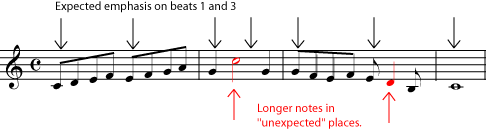
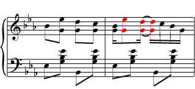
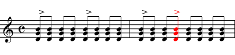

*An explanation with examples of the musical rhythm concept called syncopation.*

A *syncopation* or *syncopated rhythm* is any [rhythm](ch-17-rhythm.md) that puts an emphasis on a [beat](ch-08-time-signature.md), or a subdivision of a beat, that is not usually emphasized. One of the most obvious features of [Western](ch-24-classifying-music.md) music, to be heard in most everything from Bach to blues, is a strong, steady beat that can easily be grouped evenly into [measures](ch-08-time-signature.md). (In other words, each measure has the same number of beats, and you can hear the measures in the music because the first beat of the measure is the strongest. See [Time Signature](ch-08-time-signature.md) and [Meter](ch-09-meter.md) for more on this.) This makes it easy for you to dance or clap your hands to the music. But music that follows the same rhythmic pattern all the time can get pretty boring. Syncopation is one way to liven things up. The music can suddenly emphasize the weaker beats of the measure, or it can even emphasize notes that are not on the beat at all. For example, [listen](../images/cnx/0f79ccfabf160936e8db7de8eb5cd8b212875d37.midi) to the melody in the referenced item.

A syncopation may involve putting an "important" note on a weak beat, or off the beat altogether.

The first measure clearly establishes a simple quadruple [meter](ch-09-meter.md) (\"ONE and two and THREE and four and\"), in which important things, like changes in the melody, happen on beat one or three. But then, in the second measure, a syncopation happens; the longest and highest note is on beat two, normally a weak beat. In the syncopation in the third measure, the longest note doesn\'t even begin on a beat; it begins half-way through the third beat. (Some musicians would say \"on the *up-beat*\" or \"on the \'and\' of three\".) Now listen to another example from a [Boccherini minuet](../images/cnx/e75460c090d289fbb199832c7bc53aa424e47318.mpg). Again, some of the long notes begin half-way between the beats, or \"on the up-beat\". Notice, however, that in other places in the music, the melody establishes the meter very strongly, so that the syncopations are easily heard to be syncopations.

Syncopation is one of the most important elements in <a href="https://cnx.org/content/m10878">ragtime</a> music, as illustrated in this example from Scott Joplin's Peacherine Rag. Notice that the syncopated notes in the melody come on the second and fourth quarters of the beat, essentially alternating with the strong eighth-note pattern laid down in the accompaniment.

Another way to strongly establish the meter is to have the syncopated rhythm playing in one part of the music while another part plays a more regular rhythm, as in this [passage](../images/cnx/1786313e4f2acdbba2d845b70844bb8e37a69d68.midi) from Scott Joplin (see the referenced item). Syncopations can happen anywhere: in the [melody](ch-19-melody.md), the [bass line](ch-21-harmony.md), the rhythm section, the chordal [accompaniment](ch-21-harmony.md). Any spot in the rhythm that is normally weak (a weak beat, an upbeat, a sixteenth of a beat, a part of a triplet) can be given emphasis by a syncopation. It can suddenly be made important by a long or high note in the melody, a change in direction of the melody, a chord change, or a written [accent](ch-15-dynamics-and-accents.md). Depending on the [tempo](ch-13-tempo.md) of the music and the type of syncopation, a syncopated rhythm can make the music sound jaunty, jazzy, unsteady, surprising, uncertain, exciting, or just more interesting.

Syncopation can be added just by putting <a href="ch-15-dynamics-and-accents.md">accents</a> in unexpected places.

Other musical traditions tend to be more rhythmically complex than Western music, and much of the syncopation in modern American music is due to the influence of [Non-Western](ch-24-classifying-music.md) traditions, particularly the African roots of the African-American tradition. Syncopation is such an important aspect of much American music, in fact, that the type of syncopation used in a piece is one of the most important clues to the style and genre of the music. [Ragtime](https://cnx.org/content/m10878), for example, would hardly be ragtime without the jaunty syncopations in the melody set against the steady unsyncopated bass. The \"swing\" rhythm in big-band jazz and the \"back-beat\" of many types of rock are also specific types of syncopation. If you want practice hearing syncopations, listen to some ragtime or jazz. Tap your foot to find the beat, and then notice how often important musical \"events\" are happening \"in between\" your foot-taps.
