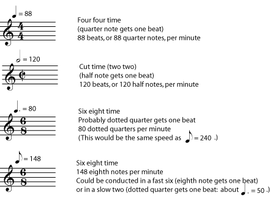

*An introduction to the basic element of music called tempo, with some useful terms.*

The *tempo* of a piece of music is its speed. There are two ways to specify a tempo. Metronome markings are absolute and specific. Other tempo markings are verbal descriptions which are more relative and subjective. Both types of markings usually appear above the staff, at the beginning of the piece, and then at any spot where the tempo changes. Markings that ask the player to deviate slightly from the main tempo, such as ritardando may appear either above or below the staff.

::: {#m11648-s1 .section}
## Metronome Markings

Metronome markings are given in beats per minute. They can be estimated using a clock with a second hand, but the easiest way to find them is with a *metronome*, which is a tool that can give a beat-per-minute tempo as a clicking sound or a pulse of light. the referenced item shows some examples of metronome markings.

Metronomes often come with other tempo indications written on them, but this is misleading. For example, a metronome may have allegro marked at 120 beats per minute and andante marked at 80 beats per minute. Allegro should certainly be quite a bit faster than andante, but it may not be exactly 120 beats per minute.
:::

::: {#m11648-s2 .section}
## Tempo Terms

A tempo marking that is a word or phrase gives you the composer\'s idea of **how fast the music should feel**. How fast a piece of music feels depends on several different things, including the texture and complexity of the music, how often the beat gets divided into faster notes, and how fast the beats themselves are (the metronome marking). Also, the same tempo marking can mean quite different things to different composers; if a metronome marking is not available, the performer should use a knowledge of the music\'s style and genre, and musical common sense, to decide on the proper tempo. When possible, listening to a professional play the piece can help with tempo decisions, but it is also reasonable for different performers to prefer slightly different tempos for the same piece.

Traditionally, tempo instructions are given in Italian.

::: {#m11648-l0a}
- **Grave** - very slow and solemn (pronounced \"GRAH-vay\")
- **Largo** - slow and broad (\"LAR-go\")
- **Larghetto** - not quite as slow as largo (\"lar-GET-oh\")
- **Adagio** - slow (\"uh-DAH-jee-oh\")
- **Lento** - slow (\"LEN-toe\")
- **Andante** - literally \"walking\", a medium slow tempo (\"on-DON-tay\")
- **Moderato** - moderate, or medium (\"MOD-er-AH-toe\")
- **Allegretto** - Not as fast as allegro (\"AL-luh-GRET-oh\")
- **Allegro** - fast (\"uh-LAY-grow\")
- **Vivo, or Vivace** - lively and brisk (\"VEE-voh\")
- **Presto** - very fast (\"PRESS-toe\")
- **Prestissimo** - very, very fast (\"press-TEE-see-moe\")
:::

These terms, along with a little more Italian, will help you decipher most tempo instructions.

::: {#m11648-l1b}
- **(un) poco** - a little (\"oon POH-koe\")
- **molto** - a lot (\"MOLE-toe\")
- **piu** - more (\"pew\")
- **meno** - less (\"MAY-no\")
- **mosso** - literally \"moved\"; motion or movement (\"MOE-so\")
:::

::: {#m11648-exer1a .exercise}
**Practice**

::: {#m11648-id1168604494850 .problem}
**Question**

Check to see how comfortable you are with Italian tempo markings by translating the following.

1.  un poco allegro
2.  molto meno mosso
3.  piu vivo
4.  molto adagio
5.  poco piu mosso
:::

::: {#m11648-id1168612736701 .solution}
**Solution**

1.  a little fast
2.  much less motion = much slower
3.  more lively = faster
4.  very slow
5.  a little more motion = a little faster
:::
:::

Of course, tempo instructions don\'t have to be given in Italian. Much folk, popular, and modern music, gives instructions in English or in the composer\'s language. Tempo indications such as \"Not too fast\", \"With energy\", \"Calmly\", or \"March tempo\" give a good idea of how fast the music should feel.
:::

::: {#m11648-s3 .section}
## Gradual Tempo Changes

If the tempo of a piece of music suddenly changes into a completely different tempo, there will be a new tempo given, usually marked in the same way (metronome tempo, Italian term, etc.) as the original tempo. Gradual changes in the basic tempo are also common in music, though, and these have their own set of terms. These terms often appear below the staff, although writing them above the staff is also allowed. These terms can also appear with modifiers like molto or un poco. You may notice that there are quite a few terms for slowing down. Again, the use of these terms will vary from one composer to the next; unless beginning and ending tempo markings are included, the performer must simply use good musical judgement to decide how much to slow down in a particular ritardando or rallentando.

::: {#m11648-l3a}
- **accelerando** - (abbreviated accel.) accelerating; getting faster
- **ritardando** - (abbrev. rit.) slowing down
- **ritenuto** - (abbrev. riten.) slower
- **rallentando** - (abbrev. rall.) gradually slower
- **rubato** - don\'t be too strict with the rhythm; while keeping the basic tempo, allow the music to gently speed up and relax in ways that emphasize the phrasing
- **poco a poco** - little by little; gradually
- **Tempo I** - (\"tempo one\" or \"tempo primo\") back to the original tempo (this instruction usually appears above the staff)
:::
:::
