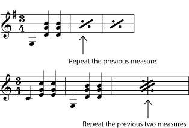
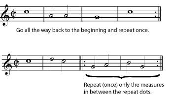
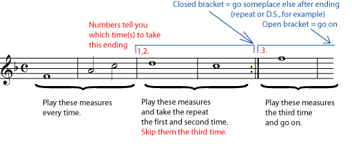
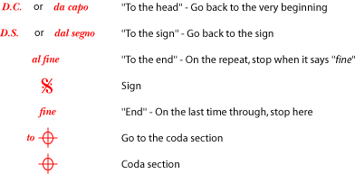
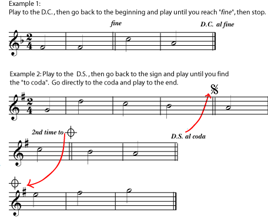

*Here are the symbols used in common music notation that tell you to do something other than go on to the next written measure.*

[]{#m12805-p0a}

Repetition, either exact or with small or large variations, is one of the basic organizing principles of music. Repeated [notes](ch-06-duration-note-lengths-in-written-music.md), [motifs](ch-19-melody.md), [phrases](ch-19-melody.md), [melodies](ch-19-melody.md), [rhythms](ch-17-rhythm.md), [chord progressions](ch-21-harmony.md), and even entire repeated sections in the overall [form](ch-42-form.md), are all very crucial in helping the listener make sense of the music. So good music is surprisingly repetitive!

[]{#m12805-p0b}

So, in order to save time, ink, and page turns, common notation has many ways to show that a part of the music should be repeated exactly.

[]{#m12805-p0c}

If the repeated part is very small - only one or two measures, for example - the repeat sign will probably look something like those in the referenced item. If you have very many such repeated measures in a row, you may want to number them (in pencil) to help you keep track of where you are in the music.

[]{#m12805-fig0d}
<figure>

</figure>

[]{#m12805-p0d}

For repeated sections of medium length - usually four to thirty-two measures - *repeat dots* with or without endings are the most common markings. Dots to the right of a [double bar line](ch-01-the-staff.md) begin the repeated section; dots to the left of a double bar line end it. If there are no beginning repeat dots, you should go all the way back to the beginning of the music and repeat from there.

[]{#m12805-fig0a}
<figure>

<figcaption>If there are no extra instructions, a repeated section should be played twice. Occasionally you will see extra instructions over the repeat dots, for example to play the section "3x" (three times).</figcaption>
</figure>

[]{#m12805-p0e}

It is very common for longer repeated sections of music to be repeated exactly until the last few measures. When this happens, the repeat dots will be put in an *ending*. The bracket over the music shows you which measures to play each time you arrive at that point in the music. For example, the second time you reach a set of endings, you will **skip the music in all the other endings; play only the measures in the second ending, and then do whatever the second ending directs you to do** (repeat, go on, skip to somewhere else, etc.).

[]{#m12805-fig0e}
<figure>

<figcaption>Some "endings" of a section of music may include a repeat, while others do not. Play only one ending each time (skipping over other, previously played endings when necessary), and then follow the "instructions" at the end of the ending (to repeat, go on, go someplace else, etc.).</figcaption>
</figure>

[]{#m12805-p0f}

When you are repeating large sections in more informally written music, you may simply find instructions in the music such as \"to refrain\", \"to bridge\", \"to verses\", etc. Or you may find extra instructions to play certain parts \"only on the repeat\". Usually these instructions are reasonably clear, although you may need to study the music for a minute to get the \"road map\" clear in your mind. Pencilled-in markings can be a big help if it\'s difficult to spot the place you need to skip to. In order to help clarify things, repeat dots and other repeat instructions are almost always marked by a [double bar line](ch-01-the-staff.md).

[]{#m12805-p0fa}

In [Western classical music](ch-24-classifying-music.md), the most common instructions for repeating large sections are traditionally written (or abbreviated) in Italian. The most common instructions from that tradition are in the referenced item.

[]{#m12805-fig0c}
<figure>

</figure>

[]{#m12805-p0g}

Again, instructions can easily get quite complicated, and these large-section markings may require you to study your part for a minute to see how it is laid out, and even to mark (in pencil) circles and arrows that help you find the way quickly while you are playing. the referenced item contains a few very simplistic examples of how these \"road map signs\" will work.

[]{#m12805-fig0b}
<figure>

<figcaption>Here are some (shortened) examples of how these types of repeat instructions may be arranged. These types of signs usually mark longer repeated sections. In many styles of music, a short repeated section (usually marked with repeat dots) is often <strong>not</strong> repeated after a da capo or dal segno.</figcaption>
</figure>
