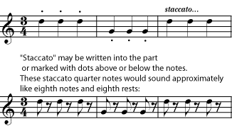
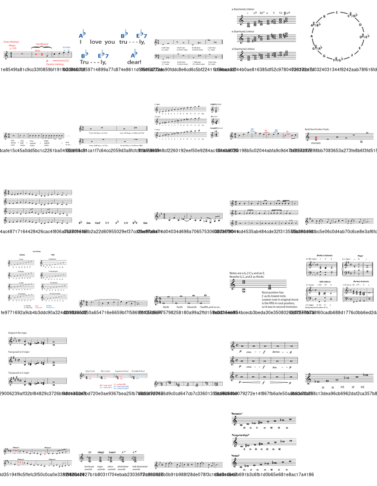
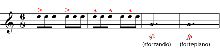
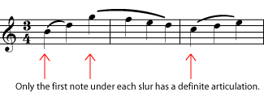
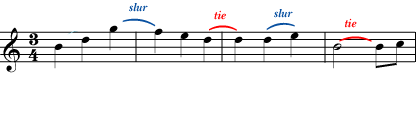
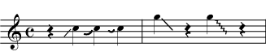

*An introduction to the most common musical articulation markings.*

## What is Articulation?

The word *articulation* generally refers to how the pieces of something are joined together; for example, how bones are connected to make a skeleton or syllables are connected to make a word. Articulation depends on what is happening at the beginning and end of each segment, as well as in between the segments.

In music, the segments are the individual notes of a *line* in the music. This could be the [melodic](ch-19-melody.md) line, the [bass](ch-21-harmony.md) line, or a part of the [harmony](ch-21-harmony.md). The line might be performed by any musician or group of musicians: a singer, for example, or a bassoonist, a violin section, or a trumpet and saxophone together. In any case, it is a string of notes that follow one after the other and that belong together in the music.The *articulation* is what happens in between the notes. The *attack* - the beginning of a note - and the amount of *space* in between the notes are particularly important.

## Performing Articulations

Descriptions of how each articulation is done cannot be given here, because they depend too much on the particular instrument that is making the music. In other words, the technique that a [violin](https://cnx.org/content/m13437) player uses to slur notes will be completely different from the technique used by a [trumpet](https://cnx.org/content/m12606) player, and a pianist and a vocalist will do different things to make a melody sound legato. In fact, the violinist will have some articulations available (such as *pizzicato*, or \"plucked\") that a trumpet player will never see.

So if you are wondering how to play slurs on your guitar or staccato on your clarinet, ask your music teacher or director. What you will find here is a short list of the most common articulations: their names, what they look like when notated, and a vague description of how they sound. The descriptions have to be vague, because articulation, besides depending on the instrument, also depends on the style of the music. Exactly how much space there should be between staccato eighth notes, for example, depends on [tempo](ch-13-tempo.md) as well as on whether you\'re playing Rossini or Sousa. To give you some idea of the difference that articulation makes, though, here are audio examples of a violin playing a [legato](../images/cnx/661118a2258b5de783a5575ac67359234927e3a5.mpg) and a [staccato](../images/cnx/84488168295ce456a9f77d6f0bef38abcd5386e5.mpg) passage. (For more audio examples of violin articulations, please see [Common Violin Terminology](https://cnx.org/content/m13316).)

## Common Articulations

*Staccato* notes are short, with plenty of space between them. Please note that this doesn\'t mean that the [tempo](ch-13-tempo.md) or [rhythm](ch-17-rhythm.md) goes any faster. The tempo and rhythm are not affected by articulations; the staccato notes sound shorter than written only because of the extra space between them.

*Legato* is the opposite of staccato. The notes are very connected; there is no space between the notes at all. There is, however, still some sort of articulation that causes a slight but definite break between the notes (for example, the violin player\'s bow changes direction, the guitar player plucks the string again, or the wind player uses the tongue to interrupt the stream of air).

*Accents* - An [accent](ch-15-dynamics-and-accents.md) requires that a note stand out more than the unaccented notes around it. Accents are usually performed by making the accented note, or the beginning of the accented note, louder than the rest of the music. Although this is mostly a quick change in [dynamics](ch-15-dynamics-and-accents.md), it usually affects the articulation of the note, too. The extra loudness of the note often requires a stronger, more definite attack at the beginning of the accented note, and it is emphasized by putting some space before and after the accented notes. The effect of a lot of accented notes in a row may sound marcato.

The performance of an accent depends on the style of music, but in general, sforzando and fortepiano accents involve a loud beginning to a longer note. They are usually heavier and longer than caret-type accents, which often rely more on a powerful attack to make a short note louder than the notes around it.

A *slur* is marked by a curved line joining any number of notes. When notes are slurred, only the first note under each slur marking has a definite articulation at the beginning. The rest of the notes are so seamlessly connected that there is no break between the notes. A good example of slurring occurs when a vocalist sings more than one note on the same syllable of text.

A [tie](ch-11-dots-ties-and-borrowed-divisions.md) looks like a slur, but it is between two notes that are the same pitch. **A tie is not really an articulation marking.** It is included here because it looks like one, which can cause confusion for beginners. When notes are tied together, they are played as if they are one single note that is the length of all the notes that are tied together. (Please see [Dots, Ties, and Borrowed Divisions](ch-11-dots-ties-and-borrowed-divisions.md).)

A slur marking indicates no articulation - no break in the sound - between notes of different pitches. A tie is used between two notes of the same pitch. Since there is no articulation between them, they sound like a single note. The tied quarters here would sound exactly like a half note crossing the bar line. Like a note that crosses bar lines, the two-and-a-half-beat "note" in the fourth bar would be difficult to write without using a tie.

A *portamento* is a smooth glide between the two notes, including all the [pitches](ch-03-pitch-sharp-flat-and-natural-notes.md) in between. For some instruments, like [violin](https://cnx.org/content/m13437) and [trombone](https://cnx.org/content/m12602), this includes even the pitches in between the written notes. For other instruments, such as [guitar](https://cnx.org/content/m12745), it means sliding through all of the possible notes between the two written pitches.

Although unusual in traditional [common notation](ch-01-the-staff.md), a type of portamento that includes only one written pitch can be found in some styles of music, notably jazz, blues, and rock. As the notation suggests, the proper performance of *scoops* and *fall-offs* requires that the portamento begins (in scoops) or ends (in fall-offs) with the slide itself, rather than with a specific note.

The notation for scoops and fall-offs has not been standardized, but either one will look something like a portamento or slur with a note on one end only.

Some articulations may be some combination of staccato, legato, and accent. *Marcato*, for example means \"marked\" in the sense of \"stressed\" or \"noticeable\". Notes marked marcato have enough of an accent and/or enough space between them to make each note seem stressed or set apart. They are usually longer than staccato but shorter than legato. Other notes may be marked with a combination of articulation symbols, for example legato with accents. As always, the best way to perform such notes depends on the instrument and the style of the music.

Plenty of music has no articulation marks at all, or marks on only a few notes. Often, such music calls for notes that are a little more separate or defined than legato, but still nowhere as short as staccato. Mostly, though, it is up to the performer to know what is considered proper for a particular piece. For example, most ballads are sung legato, and most marches are played fairly staccato or marcato, whether they are marked that way or not. Furthermore, singing or playing a [phrase](ch-19-melody.md) with musicianship often requires knowing which notes of the phrase should be legato, which should be more separate, where to add a little portamento, and so on. This does not mean the best players consciously decide how to play each note. Good articulation comes naturally to the musician who has mastered the instrument and the style of the music.
