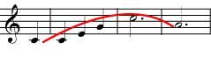
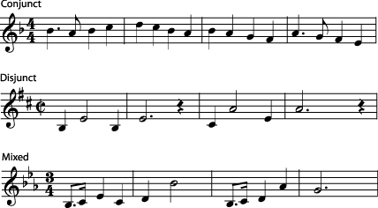
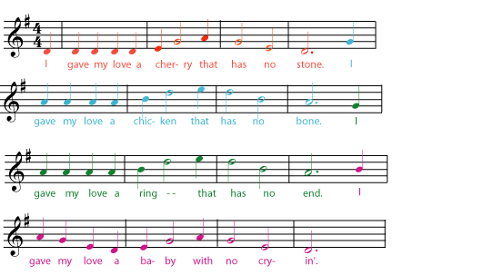
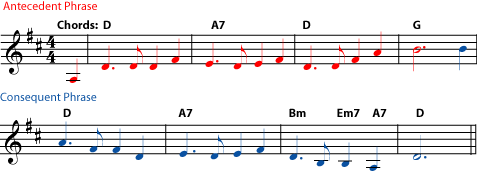
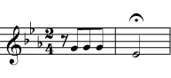
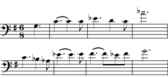
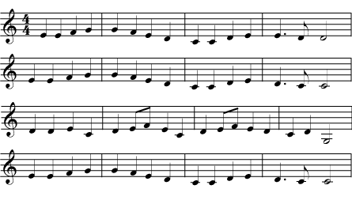

*An introduction to the basic element of music called melody, with some useful definitions.*

::: {#m11647-s0 .section}
## Introduction

[]{#m11647-p1a}

Melody is one of the most basic elements of music. A note is a sound with a particular [pitch](ch-03-pitch-sharp-flat-and-natural-notes.md) and [duration](ch-06-duration-note-lengths-in-written-music.md). String a series of notes together, one after the other, and you have a *melody*. But the melody of a piece of music isn\'t just any string of notes. It\'s the notes that catch your ear as you listen; the line that sounds most important is the melody. There are some common terms used in discussions of melody that you may find it useful to know. First of all, the *melodic line* of a piece of music is the string of notes that make up the melody. Extra notes, such as trills and slides, that are not part of the main melodic line but are added to the melody either by the composer or the performer to make the melody more complex and interesting are called *ornaments* or *embellishments*. Below are some more concepts that are associated with melody.
:::

::: {#m11647-s1 .section}
## The Shape or Contour of a Melody

[]{#m11647-p1b}

A melody that stays on the same [pitch](ch-03-pitch-sharp-flat-and-natural-notes.md) gets boring pretty quickly. As the melody progresses, the pitches may go up or down slowly or quickly. One can picture a line that goes up steeply when the melody suddenly jumps to a much higher note, or that goes down slowly when the melody gently falls. Such a line gives the *contour* or *shape* of the melodic line. You can often get a good idea of the shape of this line by looking at the melody as it is written on the staff, but you can also hear it as you listen to the music.

[]{#m11647-fig1aa}
<figure>

<figcaption>Arch shapes (in which the melody rises and then falls) are easy to find in many melodies.</figcaption>
</figure>

[]{#m11647-p1bc}

You can also describe the shape of a melody verbally. For example, you can speak of a \"rising melody\" or of an \"arch-shaped\" phrase. Please see [The Shape of a Melody](https://cnx.org/content/m11832) for children\'s activities covering melodic contour.
:::

::: {#m11647-s7 .section}
## Melodic Motion

[]{#m11647-p7a}

Another set of useful terms describe how quickly a melody goes up and down. A melody that rises and falls slowly, with only small pitch changes between one note and the next, is *conjunct*. One may also speak of such a melody in terms of *step-wise* or *scalar* motion, since most of the [intervals](ch-32-interval.md) in the melody are half or whole [steps](ch-29-half-steps-and-whole-steps.md) or are part of a [scale](ch-30-major-keys-and-scales.md).

[]{#m11647-p7b}

A melody that rises and falls quickly, with large [intervals](ch-32-interval.md) between one note and the next, is a *disjunct* melody. One may also speak of \"leaps\" in the melody. Many melodies are a mixture of conjunct and disjunct motion.

[]{#m11647-id1168747482143}
<figure>

<figcaption>A melody may show conjuct motion, with small changes in pitch from one note to the next, or disjunct motion, with large leaps. Many melodies are an interesting, fairly balanced mixture of conjunct and disjunct motion.</figcaption>
</figure>
:::

::: {#m11647-s2 .section}
## Melodic Phrases

[]{#m11647-p1ba}

Melodies are often described as being made up of phrases. A musical *phrase* is actually a lot like a grammatical phrase. A phrase in a sentence (for example, \"into the deep, dark forest\" or \"under that heavy book\") is a group of words that make sense together and express a definite idea, but the phrase is not a complete sentence by itself. A melodic phrase is a group of notes that make sense together and express a definite melodic \"idea\", but it takes more than one phrase to make a complete melody.

[]{#m11647-p1bb}

How do you spot a phrase in a melody? Just as you often pause between the different sections in a sentence (for example, when you say, \"wherever you go, there you are\"), the melody usually pauses slightly at the end of each phrase. In vocal music, the musical phrases tend to follow the phrases and sentences of the text. For example, [listen](../images/cnx/f6ed15f090a9e52d0be013d301c4bfc0ece99ebb.midi) to the phrases in the melody of \"The Riddle Song\" and see how they line up with the four sentences in the song.

[]{#m11647-fig1a}
<figure>

<figcaption>This melody has four phrases, one for each sentence of the text.</figcaption>
</figure>

[]{#m11647-p1d}

But even without text, the phrases in a melody can be very clear. Even without words, the notes are still grouped into melodic \"ideas\". [Listen](../images/cnx/9e4dd822e981d8d4a65b89dd467ee9e6c9fc5b5e.midi) to the first strain of [Scott Joplin\'s](https://cnx.org/content/m10879) \"The Easy Winners\" to see if you can hear four phrases in the melody.

[]{#m11647-element-616}

One way that a composer keeps a piece of music interesting is by varying how strongly the end of each phrase sounds like \"the end\". Usually, full-stop ends come only at the end of the main sections of the music. (See [form](ch-42-form.md) and [cadence](ch-41-cadence.md) for more on this.) By varying aspects of the melody, the [rhythm](ch-17-rhythm.md), and the [harmony](ch-21-harmony.md), the composer gives the ends of the other phrases stronger or weaker \"ending\" feelings. Often, phrases come in definite pairs, with the first phrase feeling very unfinished until it is completed by the second phrase, as if the second phrase were answering a question asked by the first phrase. When phrases come in pairs like this, the first phrase is called the *antecedent* phrase, and the second is called the *consequent* phrase. Listen to [antecedent](../images/cnx/95fb3d3825b78066b3ef51a80b3fba1a11a18343.midi) and [consequent](../images/cnx/9302b6e42e0d5d54b5aa3dc6b52dced69934e804.midi) phrases in the tune \"Auld Lang Syne\".

[]{#m11647-element-840}
<figure>

<figcaption>The rhythm of the first two phrases of "Auld Lang Syne" is the same, but both the melody and the harmony lead the first phrase to feel unfinished until it is answered by the second phrase. Note that both the melody and harmony of the second phrase end on the <a href="ch-30-major-keys-and-scales.md">tonic</a>, the "home" note and chord of the key.</figcaption>
</figure>

[]{#m11647-p1da}

Of course, melodies don\'t always divide into clear, separated phrases. Often the phrases in a melody will run into each other, cut each other short, or overlap. This is one of the things that keeps a melody interesting.
:::

::: {#m11647-s3 .section}
## Motif

[]{#m11647-p1c}

Another term that usually refers to a piece of melody (although it can also refer to a [rhythm](ch-17-rhythm.md) or a [chord progression](ch-21-harmony.md)) is \"motif\". A *motif* is a short musical idea - shorter than a phrase - that occurs often in a piece of music. A short melodic idea may also be called a *motiv*, a *motive*, a *cell*, or a *figure*. These small pieces of melody will appear again and again in a piece of music, sometimes exactly the same and sometimes changed. When a motif returns, it can be slower or faster, or in a different key. It may return \"upside down\" (with the notes going up instead of down, for example), or with the pitches or rhythms altered.

[]{#m11647-fig1b}
<figure>

<figcaption>The <a href="../images/cnx/70a43813c654b989acdfb9c83c3254d6a6984071.midi">"fate motif"</a> from the first movement of Beethoven's Symphony No. 5. This is a good example of a short melodic idea (a <em>cell</em>, <em>motive</em>, or <em>figure</em>) that is used in many different ways throughout the movement.</figcaption>
</figure>

[]{#m11647-p1e}

Most figures and motifs are shorter than phrases, but some of the leitmotifs of Wagner\'s operas are long enough to be considered phrases. A *leitmotif* (whether it is a very short cell or a long phrase) is associated with a particular character, place, thing, or idea in the opera and may be heard whenever that character is on stage or that idea is an important part of the plot. As with other motifs, leitmotifs may be changed when they return. For example, the same melody may sound quite different depending on whether the character is in love, being heroic, or dying.

[]{#m11647-fig1c}
<figure>

<figcaption>A melodic phrase based on the <a href="../images/cnx/0e9c4692a852de9fbece7964754434a1e815f987.midi">Siegfried leitmotif</a>, from Wagner's opera <strong>The Valkyrie</strong>.</figcaption>
</figure>
:::

::: {#m11647-s4 .section}
## Melodies in Counterpoint

[]{#m11647-p1ea}

[Counterpoint](ch-22-counterpoint.md) has more than one melody at the same time. This tends to change the rules for using and developing melodies, so the terms used to talk about contrapuntal melodies are different, too. For example, the melodic idea that is most important in a [fugue](ch-22-counterpoint.md) is called its *subject*. Like a motif, a subject has often changed when it reappears, sounding higher or lower, for example, or faster or slower. For more on the subject (pun intended), please see [Counterpoint](ch-22-counterpoint.md).
:::

::: {#m11647-s5 .section}
## Themes

[]{#m11647-p1f}

A longer section of melody that keeps reappearing in the music - for example, in a \"theme and variations\" - is often called a *theme*. Themes generally are at least one phrase long and often have several phrases. Many longer works of music, such as symphony movements, have more than one melodic theme.

[]{#m11647-fig1d}
<figure>

<figcaption>The <a href="../images/cnx/421279fbc084452d587ecacfbad093fbb3f26e89.midi">tune</a> of this theme will be very familiar to most people, but you may want to listen to the entire last movement of the symphony to hear the different ways that Beethoven uses the melody again and again.</figcaption>
</figure>

[]{#m11647-p1fa}

The musical scores for movies and television can also contain melodic *themes*, which can be developed as they might be in a symphony or may be used very much like operatic leitmotifs. For example, in the music John Williams composed for the **Star Wars** movies, there are melodic themes that are associated with the main characters. These themes are often complete melodies with many phrases, but a single phrase can be taken from the melody and used as a motif. A single phrase of [Ben Kenobi\'s Theme](../images/cnx/61ac530f31ee7743fc675f93571e88c754ca252b.midi), for example, can remind you of all the good things he stands for, even if he is not on the movie screen at the time.
:::

::: {#m11647-s6 .section}
## Suggestions for Presenting these Concepts to Children

[]{#m11647-p2a}

Melody is a particularly easy concept to convey to children, since attention to a piece of music is naturally drawn to the melody. If you would like to introduce some of these concepts and terms to children, please see [A Melody Activity](https://cnx.org/content/m11833), [The Shape of a Melody](https://cnx.org/content/m11832), [Melodic Phrases](https://cnx.org/content/m11879), and [Theme and Motif in Music](https://cnx.org/content/m11880).
:::
