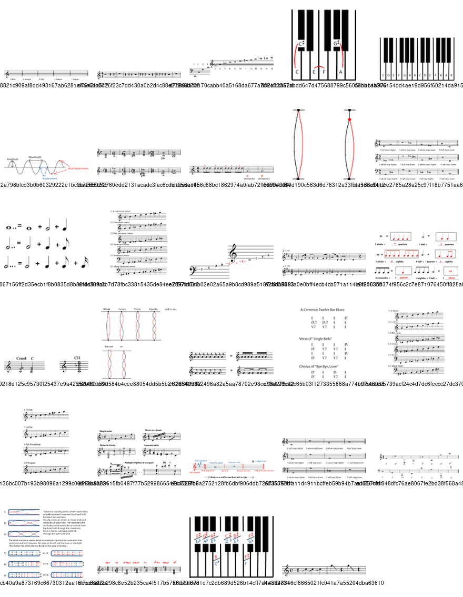

*Each type of voice and musical instrument has a characteristic pitch range.*

## Introduction

The *range* of a voice or instrument is the set of [pitches](ch-03-pitch-sharp-flat-and-natural-notes.md), from lowest to highest, that it can sing or play. A range can be described using the appropriate [octave identification](ch-28-octaves-and-the-major-minor-tonal-system.md), for example, \"from one-line c to two-line g\". But it is often easiest to write the range on a staff, as the two notes at the high and low ends of the range.

A piece of music, or one performer\'s part in that piece, may also be described as having a range, from the lowest to highest note written for the performer in that piece. There is usually a difference (sometimes a large one) between the total range of the part and a smaller range that the part stays in most of the time (heading to the extreme highs and lows only occasionally). This smaller range is called the *tessitura* of the part. One can also speak of the tessitura of a performer\'s voice, which is the range in which it sounds the best (so that matching the tessitura of the part and of the performer is a very good idea). Notice the similarity between this second definition and the term power range, sometimes used to describe the most powerful or useful part of an instrument\'s range.

A *register* is a distinctive part of a vocal or instrumental range. For example, singers may speak of the *head register*, in the upper part of their range, and the *chest register* in the lower part of their range. These two registers sound and feel very different, and the singer may have even have two distinct tessituras, one in each register. The large range of the [clarinet](https://cnx.org/content/m12604) is also divided into distinctive registers with different capabilities and very different [timbres](ch-18-timbre.md). Even when an instrument does not have a very large variation in timbre over its range, its players may speak of the difficulty of \"playing in the high register\" or a \"dull timbre in the low register\".

## Vocal Ranges

A typical choral arrangement divides women into higher and lower voices and men into higher or lower voices. Most voices can be assigned one of these four ranges, and this gives the composer four vocal lines to work with, which is usually enough. The four main vocal ranges are:

- *Soprano* -- A high female (or boy's) voice
- *Alto* -- A low female (or boy's) voice
- *Tenor* -- A high (adult) male voice
- *Bass* -- A low (adult) male voice

Arrangements for these four voices are labelled SATB (for Soprano Alto Tenor Bass). The ranges of the four voices overlap, but singers may find themselves straining or getting an unpleasant sound at the top or a weak sound at the bottom of their ranges. So although the full ranges of an alto and a soprano may look quite similar, the soprano gets a strong, clear sound on the higher notes, and the alto a strong, clear sound in the lower part of the range. But there are vocalists whose strong, best-sounding range falls in a distinctly different place from any of these four voices. The names for some of these ranges are:

- *Coloratura Soprano* -- This is not really a different range from the soprano, but a coloratura soprano has a voice that is unusually high, light, and agile, even for a soprano.
- *Mezzo-soprano* -- In between soprano and alto
- *Contralto* -- Contralto and alto originally referred to the same voice. But some people today use "contralto" to refer to a female voice that is even lower than a typical alto
- *Countertenor* -- A male voice that is unusually high, light, and agile, even for a tenor
- *Baritone* -- A male voice that falls in between tenor and bass

Voices are as individual as faces; some altos will have a narrower or wider range, or the sweetest and most powerful part of their range in a different place than other altos. These are approximate, average ranges for each voice category.

## Instrumental Ranges

The same terms used to identify vocal ranges are also often used to identify particular instruments. For example a bass [trombone](https://cnx.org/content/m12602) has a lower range than a tenor trombone, and an alto [saxophone](https://cnx.org/content/m12611) sounds higher than a tenor saxophone. Some other terms that are used to describe instrument ranges are:

- *Contra* -- Means lower: for example a contrabassoon sounds lower than a regular [bassoon](https://cnx.org/content/m12612), and a contrabass clarinet is even lower than a bass clarinet.
- *Piccolo*- Means higher (literally \"smaller\"): for example, a piccolo trumpet is higher than a regular trumpet.
- *A Note Name* -- If an instrument comes in several different sizes (and ranges), the name of a particular size of the instrument may be a note name: for example, an [F horn](https://cnx.org/content/m11617), a B flat [clarinet](https://cnx.org/content/m12604), and a C [trumpet](https://cnx.org/content/m12606). The note name is the name of the [fundamental harmonic](https://cnx.org/content/m11118#p1c) of the instrument. An instrument with a slightly higher fundamental will have a slightly higher range; an instrument with a much lower fundamental will have a much lower range. Some instruments that are identified this way are [transposing instruments](https://cnx.org/content/m10672), but others are not.

The ranges of some instruments are definite and absolute. For example, even a beginning piano player can play the highest and lowest keys; and even the best player cannot play beyond these. But the ranges of many instruments are, like vocal ranges, not so definite. For example, an experienced horn or clarinet player can play much higher and lower notes than a beginner. An exceptional trumpet player may be able to play - with good sound and technique -- high notes that the average high school trumpet player cannot play at all.

Other instruments may be a mix of absolute and indefinite ranges. For example, on any string instrument, nobody can play lower than the note that the lowest string is tuned to. But experienced players can easily play very high notes that inexperienced players have trouble playing well.

So it is sometimes useful to distinguish between a *possible range*, which includes the notes that a very experienced player can get, and a *practical range*, that includes all the notes that any competent player (including a good younger player) can get.

> **Note**
>
> Outside of the instrument's practical range, it may be a strain for even a very good player to play long or tricky passages. So if you are composing or arranging, it's a very good idea to be able to distinguish between these two ranges for the voices or instruments you include.

Some sources even list the *power range* of an instrument or voice. This is the part of the range where the instrument or voice is particularly strong. It may be in the middle of the range, or at the top or bottom, but writing in the power range should guarantee that the part is easy to play (or sing), sounds clear and strong, and can be easily heard, even when many other instruments are playing.
