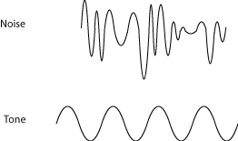
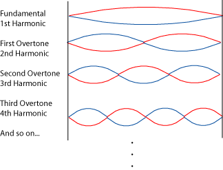
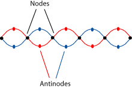
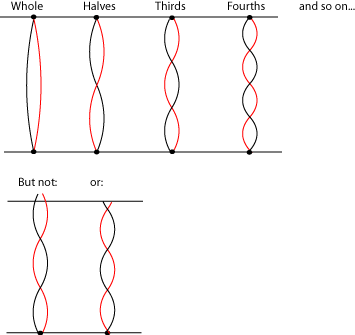
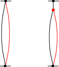
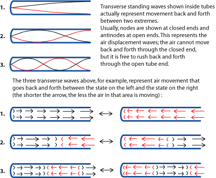
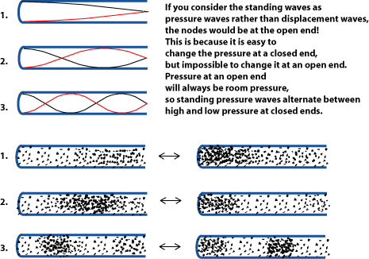

*For middle school and up, an explanation of how standing waves in musical instruments produce sounds with particular pitches and timbres.*

## What is a Standing Wave?

Musical tones are produced by musical instruments, or by the voice, which, from a physics perspective, is a very complex [wind](https://cnx.org/content/m12364) instrument. So the physics of music is the physics of the kinds of sounds these instruments can make. What kinds of sounds are these? They are tones caused by standing waves produced in or on the instrument. So the properties of these standing waves, which are always produced in very specific groups, or series, have far-reaching effects on music theory.

Most sound waves, including the musical sounds that actually reach our ears, are not standing waves. Normally, when something makes a wave, the wave travels outward, gradually spreading out and losing strength, like the waves moving away from a pebble dropped into a pond.

But when the wave encounters something, it can bounce (reflection) or be bent (refraction). In fact, you can \"trap\" waves by making them bounce back and forth between two or more surfaces. Musical instruments take advantage of this; they produce [pitches](ch-03-pitch-sharp-flat-and-natural-notes.md) by trapping sound waves.

Why are trapped waves useful for music? Any bunch of sound waves will produce some sort of noise. But to be a *tone* - a sound with a particular [pitch](ch-03-pitch-sharp-flat-and-natural-notes.md) - a group of sound waves has to be very regular, all exactly the same distance apart. That\'s why we can talk about the [frequency](ch-25-acoustics-for-music-theory.md) and [wavelength](ch-25-acoustics-for-music-theory.md) of tones.

A noise is a jumble of sound waves. A tone is a very regular set of waves, all the same size and same distance apart.

So how can you produce a tone? Let\'s say you have a sound wave trap (for now, don\'t worry about what it looks like), and you keep sending more sound waves into it. Picture a lot of pebbles being dropped into a very small pool. As the waves start reflecting off the edges of the pond, they interfere with the new waves, making a jumble of waves that partly cancel each other out and mostly just roils the pond - noise.

But what if you could arrange the waves so that reflecting waves, instead of cancelling out the new waves, would reinforce them? The high parts of the reflected waves would meet the high parts of the oncoming waves and make them even higher. The low parts of the reflected waves would meet the low parts of the oncoming waves and make them even lower. Instead of a roiled mess of waves cancelling each other out, you would have a pond of perfectly ordered waves, with high points and low points appearing regularly at the same spots again and again. To help you imagine this, here are animations of a [single wave reflecting back and forth](../images/cnx/eb86701ddb5c3639ee2209eb1f248e93c943ebcb.swf) and [standing waves](../images/cnx/50c3910dbc9afd5d8b1f0205b38f1ec59fac2875.swf).

This sort of orderliness is actually hard to get from water waves, but relatively easy to get in sound waves, so that several completely different types of sound wave \"containers\" have been developed into musical instruments. The two most common - strings and hollow tubes - will be discussed below, but first let\'s finish discussing what makes a good standing wave container, and how this affects music theory.

In order to get the necessary constant reinforcement, the container has to be the perfect size (length) for a certain wavelength, so that waves bouncing back or being produced at each end reinforce each other, instead of interfering with each other and cancelling each other out. And it really helps to keep the container very narrow, so that you don\'t have to worry about waves bouncing off the sides and complicating things. So you have a bunch of regularly-spaced waves that are trapped, bouncing back and forth in a container that fits their wavelength perfectly. If you could watch these waves, it would not even look as if they are traveling back and forth. Instead, waves would seem to be appearing and disappearing regularly at exactly the same spots, so these trapped waves are called *standing waves*.

> **Note**
>
> Although standing waves are harder to get in water, the phenomenon does apparently happen very rarely in lakes, resulting in freak disasters. You can sometimes get the same effect by pushing a tub of water back and forth, but this is a messy experiment; you\'ll know you are getting a standing wave when the water suddenly starts sloshing much higher - right out of the tub!

For any narrow \"container\" of a particular length, there are plenty of possible standing waves that don\'t fit. But there are also many standing waves that do fit. The longest wave that fits it is called the *fundamental*. It is also called the *first harmonic*. The next longest wave that fits is the *second harmonic*, or the *first overtone*. The next longest wave is the *third harmonic*, or *second overtone*, and so on.

There is a whole set of standing waves, called <em>harmonics</em>, that will fit into any "container" of a specific length. This set of waves is called a <em>harmonic series</em>.

Notice that it doesn\'t matter what the length of the fundamental is; the waves in the second harmonic must be half the length of the first harmonic; that\'s the only way they\'ll both \"fit\". The waves of the third harmonic must be a third the length of the first harmonic, and so on. This has a direct effect on the frequency and pitch of harmonics, and so it affects the basics of music tremendously. To find out more about these subjects, please see [Frequency, Wavelength, and Pitch](https://cnx.org/content/m11060), [Harmonic Series](https://cnx.org/content/m11118), or [Musical Intervals, Frequency, and Ratio](https://cnx.org/content/m11808).

## Standing Waves on Strings

You may have noticed an interesting thing in the animation of standing waves: there are spots where the \"water\" goes up and down a great deal, and other spots where the \"water level\" doesn\'t seem to move at all. All standing waves have places, called *nodes*, where there is no wave motion, and *antinodes*, where the wave is largest. It is the placement of the nodes that determines which wavelengths \"fit\" into a musical instrument \"container\".

As a standing wave waves back and forth (from the red to the blue position), there are some spots called <em>nodes</em> that do not move at all; basically there is no change, no waving up-and-down (or back-and-forth), at these spots. The spots at the biggest part of the wave - where there is the most change during each wave - are called <em>antinodes</em>.

One \"container\" that works very well to produce standing waves is a thin, very taut string that is held tightly in place at both ends. Since the string is taut, it vibrates quickly, producing sound waves, if you pluck it, or rub it with a bow. Since it is held tightly at both ends, that means there has to be a node at each end of the string. Instruments that produce sound using strings are called [chordophones](https://cnx.org/content/m11896#s21), or simply [strings](https://cnx.org/content/m11897#s11).

A string that's held very tightly at both ends can only vibrate at very particular wavelengths. The whole string can vibrate back and forth. It can vibrate in halves, with a node at the middle of the string as well as each end, or in thirds, fourths, and so on. But any wavelength that doesn't have a node at each end of the string, can't make a standing wave on the string. To get any of those other wavelengths, you need to change the length of the vibrating string. That is what happens when the player holds the string down with a finger, changing the vibrating length of the string and changing where the nodes are.

The fundamental wave is the one that gives a string its [pitch](ch-03-pitch-sharp-flat-and-natural-notes.md). But the string is making all those other possible vibrations, too, all at the same time, so that the actual vibration of the string is pretty complex. The other vibrations (the ones that basically divide the string into halves, thirds and so on) produce a whole series of *harmonics*. We don\'t hear the harmonics as separate notes, but we do hear them. They are what gives the string its rich, musical, string-like sound - its [timbre](ch-18-timbre.md). (The sound of a single frequency alone is a much more mechanical, uninteresting, and unmusical sound.) To find out more about harmonics and how they affect a musical sound, see [Harmonic Series](https://cnx.org/content/m11118).

> **Practice**
>
> > **Question**
> >
> > 1.  How has the part of the string that vibrates changed?
> > 2.  How does this change the sound waves that the string makes?
> > 3.  How does this change the sound that is heard?
>
> **Solution**
>
> 1.  The part of the string that can vibrate is shorter. The finger becomes the new \"end\" of the string.
> 2.  The new sound wave is shorter, so its frequency is higher.
> 3.  It sounds higher; it has a higher pitch.
>
> 
>
> When a finger holds the string down tightly, the finger becomes the new end of the vibrating part of the string. The vibrating part of the string is shorter, and the whole set of sound waves it makes is shorter.
>

## Standing Waves in Wind Instruments

The string disturbs the air molecules around it as it vibrates, producing sound waves in the air. But another great container for standing waves actually holds standing waves of air inside a long, narrow tube. This type of instrument is called an [aerophone](https://cnx.org/content/m11896#s22), and the most well-known of this type of instrument are often called [wind instruments](https://cnx.org/content/m11897#s1) because, although the instrument itself does vibrate a little, most of the sound is produced by standing waves in the column of air inside the instrument.

If it is possible, have a reed player and a brass player demonstrate to you the sounds that their mouthpieces make without the instrument. This will be a much \"noisier\" sound, with lots of extra frequencies in it that don\'t sound very musical. But, when you put the mouthpiece on an instrument shaped like a tube, only some of the sounds the mouthpiece makes are the right length for the tube. Because of feedback from the instrument, the only sound waves that the mouthpiece can produce now are the ones that are just the right length to become *standing waves* in the instrument, and the \"noise\" is refined into a musical tone.

Standing Waves in a wind instrument are usually shown as displacement waves, with nodes at closed ends where the air cannot move back-and-forth.

The standing waves in a wind instrument are a little different from a vibrating string. The wave on a string is a *transverse wave*, moving the string back and forth, rather than moving up and down along the string. But the wave inside a tube, since it is a sound wave already, is a *longitudinal wave*; the waves do not go from side to side in the tube. Instead, they form along the length of the tube.

The standing waves in the tubes are actually longitudinal sound waves. Here the displacement standing waves in [link] are shown instead as longitudinal air pressure waves. Each wave would be oscillating back and forth between the state on the right and the one on the left. See <a href="https://cnx.org/content/m12589">Standing Waves in Wind Instruments</a> for more explanation.

The harmonics of wind instruments are also a little more complicated, since there are two basic shapes ([cylindrical](https://cnx.org/content/m12364#p1c) and [conical](https://cnx.org/content/m12364#p1c)) that are useful for wind instruments, and they have different properties. The standing-wave tube of a wind instrument also may be open at both ends, or it may be closed at one end (for a mouthpiece, for example), and this also affects the instrument. Please see [Standing Waves in Wind Instruments](https://cnx.org/content/m12589) if you want more information on that subject. For the purposes of understanding music theory, however, the important thing about standing waves in winds is this: the harmonic series they produce is essentially the same as the harmonic series on a string. In other words, the second harmonic is still half the length of the fundamental, the third harmonic is one third the length, and so on. (Actually, for reasons explained in [Standing Waves in Wind Instruments](https://cnx.org/content/m12589), some harmonics are \"missing\" in some wind instruments, but this mainly affects the [timbre](ch-18-timbre.md) and some aspects of playing the instrument. It does not affect the basic relationships in the harmonic series.)

## Standing Waves in Other Objects

So far we have looked at two of the four main groups of musical instruments: chordophones and aerophones. That leaves [membranophones](https://cnx.org/content/m11896#s23) and [idiophones](https://cnx.org/content/m11896#s24). *Membranophones* are instruments in which the sound is produced by making a membrane vibrate; drums are the most familiar example. Most drums do not produce tones; they produce rhythmic \"noise\" (bursts of irregular waves). Some drums do have [pitch](ch-03-pitch-sharp-flat-and-natural-notes.md), due to complex-patterned standing waves on the membrane that are reinforced in the space inside the drum. This works a little bit like the waves in tubes, above, but the waves produced on membranes, though very interesting, are too complex to be discussed here.

*Idiophones* are instruments in which the body of the instrument itself, or a part of it, produces the original vibration. Some of these instruments (cymbals, for example) produce simple noise-like sounds when struck. But in some, the shape of the instrument - usually a tube, block, circle, or bell shape - allows the instrument to ring with a standing-wave vibration when you strike it. The standing waves in these carefully-shaped-and-sized idiophones - for example, the blocks on a xylophone - produce pitched tones, but again, the patterns of standing waves in these instruments are a little too complicated for this discussion. If a percussion instrument does produce pitched sounds, however, the reason, again, is that it is mainly producing harmonic-series [overtones](https://cnx.org/content/m11118).

> **Note**
>
> Although [percussion](https://cnx.org/content/m11897#s14) specializes in \"noise\"-type sounds, even instruments like snare drums follow the basic physics rule of \"bigger instrument makes longer wavelengths and lower sounds\". If you can, listen to a percussion player or section that is using snare drums, cymbals, or other percussion of the same type but different sizes. Can you hear the difference that size makes, as opposed to differences in [timbre](ch-18-timbre.md) produced by different types of drums?

> **Practice**
>
> > **Question**
> >
> > Some idiophones, like gongs, ring at many different pitches when they are struck. Like most drums, they don\'t have a particular pitch, but make more of a \"noise\"-type sound. Other idiophones, though, like xylophones, are designed to ring at more particular frequencies. Can you think of some other percussion instruments that get particular pitches? (Some can get enough different pitches to play a tune.)
>
> > **Solution**
> >
> > - Chimes
> > - All xylophone-type instruments, such as marimba, vibraphone, and glockenspiel
> > - Handbells and other tuned bells
> > - Steel pan drums
