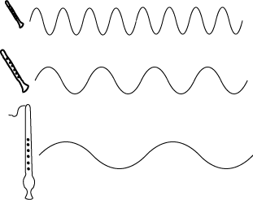
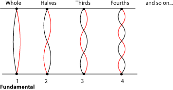
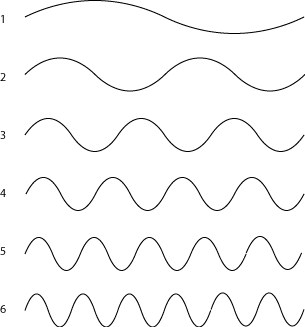

*Musical basics, like octaves and the timbre of a note, come from the harmonic series.*

## Introduction

Have you ever wondered how a [trumpet](https://cnx.org/content/m12606) plays so many different notes with only three [valves](https://cnx.org/content/m12364#p2f), or how a bugle plays different notes with no valves at all? Have you ever wondered why an [oboe](https://cnx.org/content/m12615) and a [flute](https://cnx.org/content/m12603) sound so different, even when they\'re playing the same note? What is a string player doing when she plays \"harmonics\"? Why do some notes sound good together while other notes seem to clash with each other? The answers to all of these questions have to do with the harmonic series.

## Physics, Harmonics and Color

Most musical notes are sounds that have a particular [pitch](ch-03-pitch-sharp-flat-and-natural-notes.md). The pitch depends on the main [frequency](ch-25-acoustics-for-music-theory.md) of the sound; the higher the frequency, and shorter the [wavelength](ch-25-acoustics-for-music-theory.md), of the sound waves, the higher the pitch is. But musical sounds don\'t have just one frequency. Sounds that have only one frequency are not very interesting or pretty. They have no more musical [color](ch-18-timbre.md) than the beeping of a watch alarm. On the other hand, sounds that have too many frequencies, like the sound of glass breaking or of ocean waves crashing on a beach, may be interesting and even pleasant. But they don\'t have a particular pitch, so they usually aren\'t considered musical notes.

The shorter the wavelength, and higher the frequency, the higher the note sounds.

When someone plays or sings a musical [tone](ch-26-standing-waves-and-musical-instruments.md), only a very particular set of frequencies is heard. Each note that comes out of the instrument is actually a smooth mixture of many different pitches. These different pitches are called *harmonics*, and they are blended together so well that you do not hear them as separate notes at all. Instead, the harmonics give the note its color.

What is the [color](ch-18-timbre.md) of a sound? Say an oboe plays a [middle C](ch-28-octaves-and-the-major-minor-tonal-system.md). Then a flute plays the same note at the same [dynamic](ch-15-dynamics-and-accents.md) level as the oboe. It is still easy to tell the two notes apart, because an oboe sounds different from a flute. This difference in the sounds is the *color*, or *timbre* (pronounced \"TAM-ber\") of the notes. Like a color you see, the color of a sound can be bright and bold or deep and rich. It can be heavy, light, dark, thin, smooth, murky, or clear. Some other words that musicians use to describe the timbre of a sound are: reedy, brassy, piercing, mellow, hollow, focussed, transparent, breathy (pronounced BRETH-ee) or full. Listen to recordings of a [violin](../images/cnx/22f031c6c33fed96e9244e0eccde7824054a1f4e.mpg) and a [viola](../images/cnx/4b2cf8c5a6839a2e862483e250eea039a0d52d10.mpg). Although these instruments are quite similar, the viola has a noticeably \"deeper\" and the violin a noticeably \"brighter\" sound that is not simply a matter of the violin playing higher notes. Now listen to the same phrase played by an [electric guitar](../images/cnx/ce60ce663cccd53384dcb1bdc13845f830236b85.wav), an acoustic guitar with [twelve steel strings](../images/cnx/4e69e1ef29ca8b2fc32b3f209ba5b1a07991c643.wav) and an acoustic guitar with [six nylon strings](../images/cnx/e91ef1b90a4eecd4ba1f909bbc63cadb5172b6ca.wav). The words musicians use to describe timbre are somewhat subjective, but most musicians would agree with the statement that, compared with each other, the first sound is mellow, the second bright, and the third rich.

:::{admonition} Practice
:name: m13682-exer1a
:class: exercise

::::{admonition} Question
:name: m13682-id1164329530800
:class: problem

Listen to recordings of different instruments playing alone or playing very prominently above a group. Some suggestions: an unaccompanied violin or cello sonata, a flute, oboe, trumpet, or horn concerto, Asaian or native American flute music, classical guitar, bagpipes, steel pan drums, panpipes, or organ. For each instrument, what \"color\" words would you use to describe the timbre of each instrument? Use as many words as you can that seem appropriate, and try to think of some that aren\'t listed above. Do any of the instruments actually make you think of specific shades of color, like fire-engine red or sky blue?
::::

::::{admonition} Solution
:name: m13682-id1164332135753
:class: solution

Although trained musicians will generally agree that a particular sound is reedy, thin, or full, there are no hard-and-fast, right-or-wrong answers to this exercise.
::::
:::

Where do the harmonics, and the timbre, come from? When a string vibrates, the main pitch you hear is from the vibration of the whole string back and forth. That is the *fundamental*, or first harmonic. But the string also vibrates in halves, in thirds, fourths, and so on. (Please see [Standing Waves and Musical Instruments](ch-26-standing-waves-and-musical-instruments.md) for more on the physics of how harmonics are produced.) Each of these fractions also produces a harmonic. The string vibrating in halves produces the second harmonic; vibrating in thirds produces the third harmonic, and so on.

:::{admonition} Note
:name: m13682-id1164338564928
:class: note

This method of naming and numbering harmonics is the most straightforward and least confusing, but there are other ways of naming and numbering harmonics, and this can cause confusion. Some musicians do not consider the fundamental to be a harmonic; it is just the fundamental. In that case, the string halves will give the first harmonic, the string thirds will give the second harmonic and so on. When the fundamental is included in calculations, it is called the first *partial*, and the rest of the harmonics are the second, third, fourth partials and so on. Also, some musicians use the term *overtones* as a synonym for harmonics. For others, however, an overtone is any frequency (not necessarily a harmonic) that can be heard resonating with the fundamental. The sound of a gong or cymbals will include overtones that aren\'t harmonics; that\'s why the gong\'s sound doesn\'t seem to have as definite a pitch as the vibrating string does. If you are uncertain what someone means when they refer to \"the second harmonic\" or \"overtones\", ask for clarification.
:::

The fundamental pitch is produced by the whole string vibrating back and forth. But the string is also vibrating in halves, thirds, quarters, fifths, and so on, producing <em>harmonics</em>. All of these vibrations happen at the same time, producing a rich, complex, interesting sound.

A column of air vibrating inside a tube is different from a vibrating string, but the column of air can also vibrate in halves, thirds, fourths, and so on, of the fundamental, so the harmonic series will be the same. So why do different instruments have different timbres? The difference is the relative loudness of all the different harmonics compared to each other. When a [clarinet](https://cnx.org/content/m12604) plays a note, perhaps the odd-numbered harmonics are strongest; when a [French horn](https://cnx.org/content/m11617) plays the same note, perhaps the fifth and tenth harmonics are the strongest. This is what you hear that allows you to recognize that it is a clarinet or horn that is playing. The relative strength of the harmonics changes from note to note on the same instrument, too; this is the difference you hear between the sound of a clarinet playing low notes and the same clarinet playing high notes.

:::{admonition} Note
:name: m13682-id1164336008687
:class: note

You will find some more extensive information on instruments and harmonics in [Standing Waves and Musical Instruments](ch-26-standing-waves-and-musical-instruments.md) and [Standing Waves and Wind Instruments](https://cnx.org/content/m12589).
:::

## The Harmonic Series

A harmonic series can have any note as its fundamental, so there are many different harmonic series. But the relationship between the frequencies of a harmonic series is always the same. The second harmonic always has exactly half the wavelength (and twice the frequency) of the fundamental; the third harmonic always has exactly a third of the wavelength (and so three times the frequency) of the fundamental, and so on. For more discussion of wavelengths and frequencies, see [Acoustics for Music Theory](ch-25-acoustics-for-music-theory.md).

The second harmonic has half the wavelength and twice the frequency of the first. The third harmonic has a third the wavelength and three times the frequency of the first. The fourth harmonic has a quarter the wavelength and four times the frequency of the first, and so on. Notice that the fourth harmonic is also twice the frequency of the second harmonic, and the sixth harmonic is also twice the frequency of the third harmonic.

Say someone plays a note, a [middle C](ch-28-octaves-and-the-major-minor-tonal-system.md). Now someone else plays the note that is twice the frequency of the middle C. Since this second note was already a harmonic of the first note, the sound waves of the two notes reinforce each other and sound good together. If the second person played instead the note that was just a litle bit more than twice the frequency of the first note, the harmonic series of the two notes would not fit together at all, and the two notes would not sound as good together. There are many combinations of notes that share some harmonics and make a pleasant sound together. They are considered [consonant](ch-38-consonance-and-dissonance.md). Other combinations share fewer or no harmonics and are considered [dissonant](ch-38-consonance-and-dissonance.md) or, when they really clash, simply \"out of tune\" with each other. The [scales](ch-35-scales-that-are-not-major-or-minor.md) and [harmonies](ch-21-harmony.md) of most of the world\'s musics are based on these physical facts.

:::{admonition} Note
:name: m13682-id1164338174514
:class: note

In real music, consonance and dissonance also depend on the standard practices of a musical tradition, especially its harmony and [tuning](ch-44-tuning-systems.md) practices, but these are also often related to the harmonic series.
:::

For example, a note that is twice the frequency of another note is one [octave](ch-28-octaves-and-the-major-minor-tonal-system.md) higher than the first note. So in the figure above, the second harmonic is one octave higher than the first; the fourth harmonic is one octave higher than the second; and the sixth harmonic is one octave higher than the third.

:::{admonition} Practice
:name: m13682-exer2a
:class: exercise

::::{admonition} Question
:name: m13682-id1164353226684
:class: problem

1.  Which harmonic will be one octave higher than the fourth harmonic?
2.  Predict the next four sets of octaves in a harmonic series.
3.  What is the pattern that predicts which notes of a harmonic series will be one octave apart?
4.  Notes one octave apart are given the same name. So if the first harmonic is a \"A\", the second and fourth will also be A\'s. Name three other harmonics that will also be A\'s.
::::

::::{admonition} Solution
:name: m13682-id1164350211294
:class: solution

1.  The eighth harmonic
2.  The fifth and tenth harmonics; the sixth and twelfth harmonics; the seventh and fourteenth harmonics; and the eighth and sixteenth harmonics
3.  The note that is one octave higher than a harmonic is also a harmonic, and its number in the harmonic series is twice (2 X) the number of the first note.
4.  The eighth, sixteenth, and thirty-second harmonics will also be A\'s.
::::
:::

A mathematical way to say this is \"if two notes are an octave apart, the [ratio](https://cnx.org/content/m11808) of their frequencies is two to one (2:1)\". Although the notes themselves can be any frequency, the 2:1 ratio is the same for all octaves. Other frequency ratios between two notes also lead to particular pitch relationships between the notes, so we will return to the harmonic series later, after learning to name those pitch relationships, or [intervals](ch-32-interval.md).
