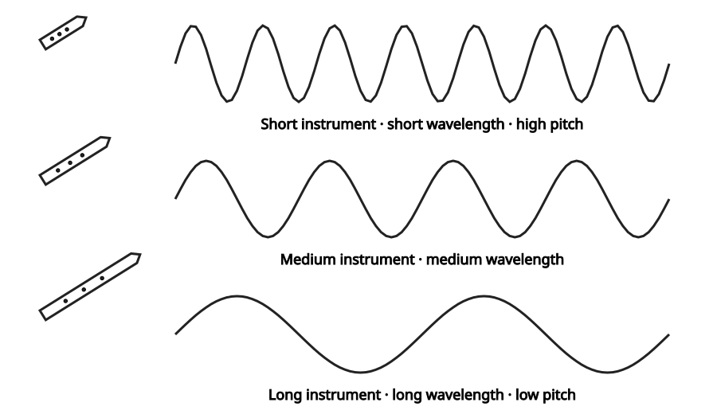
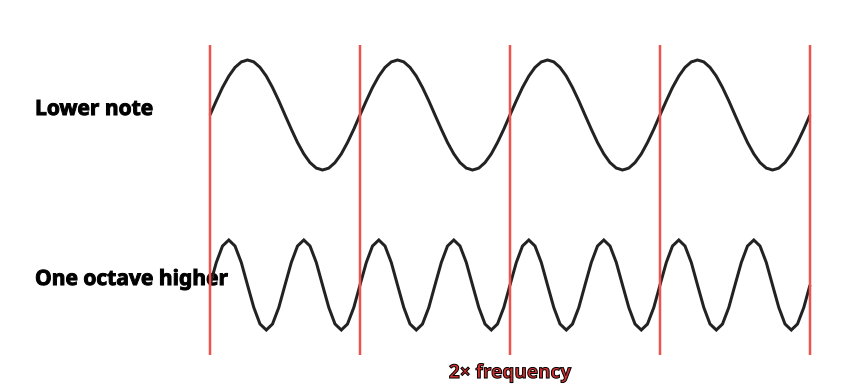
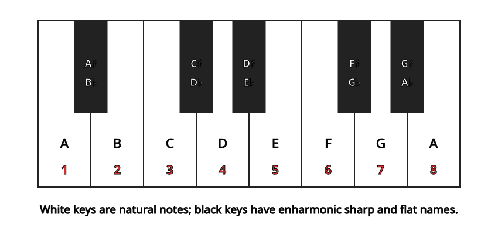

*Introduces the relationship between frequency, octaves, major, minor, and chromatic scales, and tonal music.*

## Where Octaves Come From

Musical notes, like all sounds, are made of sound waves. The sound waves that make musical notes are very evenly-spaced waves, and the qualities of these regular waves - for example how big they are or how far apart they are - affect the sound of the note. A note can be high or low, depending on how often (how frequently) one of its waves arrives at your ear. When scientists and engineers talk about how high or low a sound is, they talk about its [frequency](https://cnx.org/content/m11060#p1e). The higher the *frequency* of a note, the higher it sounds. They can measure the frequency of notes, and like most measurements, these will be numbers, like \"440 vibrations per second.\"

A sound that has a shorter wavelength has a higher frequency and a higher pitch.

But people have been making music and talking about music since long before we knew that sounds were waves with frequencies. So when musicians talk about how high or low a note sounds, they usually don\'t talk about frequency; they talk about the note\'s [pitch](ch-03-pitch-sharp-flat-and-natural-notes.md). And instead of numbers, they give the notes names, like \"C\". (For example, musicians call the note with frequency \"440 vibrations per second\" an \"A\".)

But to see where octaves come from, let\'s talk about frequencies a little more. Imagine a few men are singing a song together. Nobody is singing harmony; they are all singing the same pitch - the same frequency - for each note.

Now some women join in the song. They can\'t sing where the men are singing; that\'s too low for their voices. Instead they sing notes that are exactly double the frequency that the men are singing. That means their note has exactly two waves for each one wave that the men\'s note has. These two frequencies fit so well together that it sounds like the women are singing the same notes as the men, in the same [key](ch-30-major-keys-and-scales.md). They are just singing them one octave higher. **Any note that is twice the frequency of another note is one *octave* higher.**

Notes that are one octave apart are so closely related to each other that musicians give them the same name. A note that is an octave higher or lower than a note named \"C natural\" will also be named \"C natural\". A note that is one (or more) octaves higher or lower than an \"F sharp\" will also be an \"F sharp\". (For more discussion of how notes are related because of their frequencies, see [The Harmonic Series](https://cnx.org/content/m11118), [Standing Waves and Musical Instruments](ch-26-standing-waves-and-musical-instruments.md), and [Standing Waves and Wind Instruments](https://cnx.org/content/m12589).)

When two notes are one octave apart, one has a frequency exactly two times higher than the other - it has twice as many waves. These waves fit together so well, in the instrument, and in the air, and in your ears, that they sound almost like different versions of the same note.

## Naming Octaves

The notes in different octaves are so closely related that when musicians talk about a note, a \"G\" for example, it often doesn\'t matter which G they are talking about. We can talk about the \"F sharp\" in a G [major scale](ch-30-major-keys-and-scales.md) without mentioning which octave the scale or the F sharp are in, because the scale is the same in every octave. Because of this, many discussions of music theory don\'t bother naming octaves. Informally, musicians often speak of \"the B on the staff\" or the \"A above the staff\", if it\'s clear which [staff](ch-01-the-staff.md) they\'re talking about.

But there are also two formal systems for naming the notes in a particular octave. Many musicians use *Helmholtz* notation. Others prefer *scientific pitch notation*, which simply labels the octaves with numbers, starting with C1 for the lowest C on a full-sized keyboard. Figure 3 shows the names of the octaves most commonly used in music.

The octaves are named from one C to the next higher C. For example, all the notes in between "one line c" and "two line c" are "one line" notes.

The octave below contra can be labelled CCC or Co; higher octaves can be labelled with higher numbers or more lines. Octaves are named from one C to the next higher C. For example, all the notes between \"great C\" and \"small C\" are \"great\". **One-line c is also often called \"middle C\". No other notes are called \"middle\", only the C.**

> **Example**
>
> 
>
> Each note is considered to be in the same octave as the C below it.
>

> **Practice**
>
> > **Question**
> >
> > Give the correct octave name for each note.
> >
> > 
> >
>
> > **Solution**
> >
> > 
> >

## Dividing the Octave into Scales

The word \"octave\" comes from a Latin root meaning \"eight\". It seems an odd name for a frequency that is two times, not eight times, higher. The octave was named by musicians who were more interested in how octaves are divided into scales, than in how their frequencies are related. Octaves aren\'t the only notes that sound good together. The people in different musical traditions have different ideas about what notes they think sound best together. In the [Western](ch-24-classifying-music.md) musical tradition - which includes most familiar music from Europe and the Americas - the octave is divided up into twelve equally spaced notes. If you play all twelve of these notes within one octave you are playing a [chromatic scale](ch-29-half-steps-and-whole-steps.md). Other musical traditions - traditional Chinese music for example - have divided the octave differently and so they use different scales. (Please see [Major Keys and Scales](ch-30-major-keys-and-scales.md), [Minor Keys and Scales](ch-31-minor-keys-and-scales.md), and [Scales that aren't Major or Minor](ch-35-scales-that-are-not-major-or-minor.md) for more about this.)

You may be thinking \"OK, that\'s twelve notes; that still has nothing to do with the number eight\", but out of those twelve notes, only seven are used in any particular [major](ch-30-major-keys-and-scales.md) or [minor](ch-31-minor-keys-and-scales.md) scale. Add the first note of the next octave, so that you have that a \"complete\"-sounding scale (\"do-re-mi-fa-so-la-ti\" and then \"do\" again), and you have the eight notes of the *octave*. These are the *diatonic* scales, and they are the basis of most [Western](ch-24-classifying-music.md) music.

Now take a look at the piano keyboard. Only seven letter names are used to name notes: A, B, C, D, E, F, and G. The eighth note would, of course, be the next A, beginning the next octave. To name the other notes, the notes on the black piano keys, you have to use a [sharp or flat](ch-03-pitch-sharp-flat-and-natural-notes.md) sign.

The white keys are the natural notes. Black keys can only be named using sharps or flats. The pattern repeats at the eighth tone of a scale, the octave.

Whether it is a popular song, a classical symphony, or an old folk tune, most of the music that feels comfortable and familiar (to Western listeners) is based on either a major or minor scale. It is *tonal* music that mostly uses only seven of the notes within an octave: only one of the possible A\'s (A sharp, A natural, or A flat), one of the possible B\'s (B sharp, B natural, or B flat), and so on. The other notes in the chromatic scale are (usually) used sparingly to add interest or to (temporarily) change the key in the middle of the music. For more on the keys and scales that are the basis of tonal music, see [Major Keys and Scales](ch-30-major-keys-and-scales.md) and [Minor Keys and Scales](ch-31-minor-keys-and-scales.md).
