*The pitch of a note is how high or low it sounds. The distance between two pitches can be measured in half steps and whole steps.*

The *pitch* of a note is how high or low it sounds. Musicians often find it useful to talk about how much higher or lower one note is than another. This distance between two pitches is called the *interval* between them. In [Western music](ch-24-classifying-music.md), the small interval from one note to the next closest note higher or lower is called a *half step* or *semi-tone*.

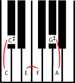

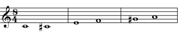

Three half-step intervals: between C and C sharp (or D flat); between E and F; and between G sharp (or A flat) and A.

[Listen](../images/cnx/de74e9f359e5af39e96c975b0435c623003626e3.midi) to the half steps in the referenced item.

The intervals in the referenced item look different on a [staff](ch-01-the-staff.md); sometimes they are on the same line, sometimes not. But it is clear at the keyboard that in each case there is no note in between them.

So a [scale](ch-30-major-keys-and-scales.md) that goes up or down by half steps, a *chromatic scale*, plays all the notes on both the white and black keys of a piano. It also plays all the notes easily available on most [Western](ch-24-classifying-music.md) instruments. (A few instruments, like [trombone](https://cnx.org/content/m12602) and [violin](https://cnx.org/content/m13437), can easily play pitches that aren\'t in the chromatic scale, but even they usually don\'t.)

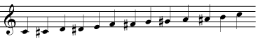

All intervals in a <strong>chromatic scale</strong> are half steps. The result is a scale that plays all the notes easily available on most instruments.

[Listen](../images/cnx/160ab41b656c4f6a0dcd8b7e9c2ad25504c2926b.midi) to a chromatic scale.

If you go up or down two half steps from one note to another, then those notes are a *whole step*, or *whole tone* apart.

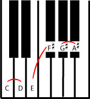

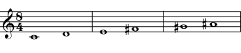

Three whole step intervals: between C and D; between E and F sharp; and between G sharp and A sharp (or A flat and B flat).

A *whole tone scale*, a scale made only of whole steps, sounds very different from a chromatic scale.

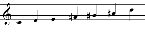

All intervals in a <strong>whole tone scale</strong> are whole steps.

[Listen](../images/cnx/052920335df3a1bcaca4f80b86bbc41a01190e26.midi) to a whole tone scale.

You can count any number of whole steps or half steps between notes; just remember to count all sharp or flat notes (the black keys on a keyboard) as well as all the natural notes (the white keys) that are in between.

::: {#m10866-exam0a .example}
**Example**

The interval between C and the F above it is 5 half steps, or two and a half steps.

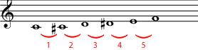

Going from C up to F takes five half steps.

:::

::: {#m10866-exer0a .exercise}
**Practice**

::: {#m10866-id4883301 .problem}
**Question**

Identify the intervals below in terms of half steps and whole steps. If you have trouble keeping track of the notes, use a piano keyboard, a written chromatic scale, or the chromatic fingerings for your instrument to count half steps.

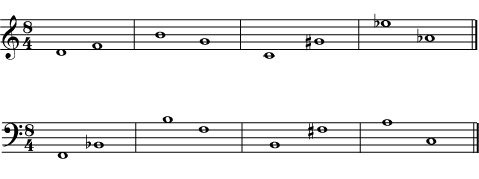

:::

::: {#m10866-id7432785 .solution}
**Solution**

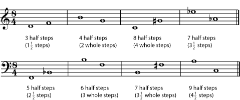

:::
:::

::: {#m10866-exer0b .exercise}
**Practice**

::: {#m10866-id11899534 .problem}
**Question**

Fill in the second note of the interval indicated in each measure. If you need staff paper for this exercise, you can print out this [staff paper](../images/cnx/e5b6335c0813bd7797983b645d24962d8ad96e93.pdf) PDF file.

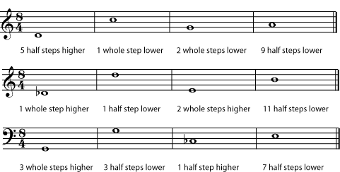

:::

::: {#m10866-id7385063 .solution}
**Solution**

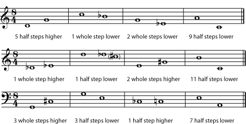

If your answer is different, check to see if you have written a different <a href="ch-05-enharmonic-spelling.md">enharmonic spelling</a> of the note in the answer. For example, the B flat could be written as an A sharp.

:::
:::
