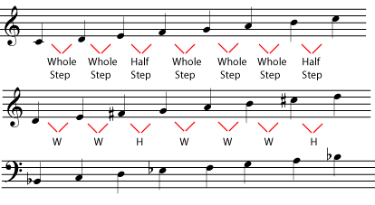
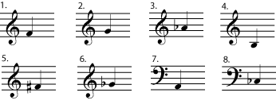
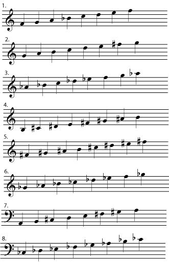
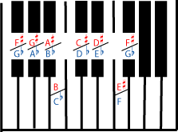
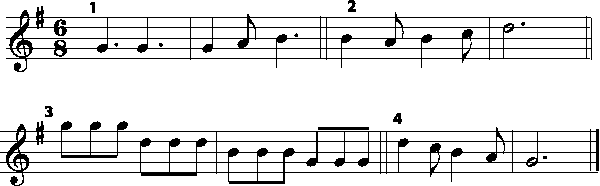
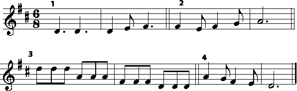

*A scale is a list of all the notes in a key. Major scales all follow the same interval pattern.*

The simple, sing-along, nursery rhymes and folk songs we learn as children; the \"catchy\" tunes used in advertising jingles; the cheerful, toe-tapping pop and rock we dance to; the uplifting sounds of a symphony: most music in a major key has a bright sound that people often describe as cheerful, inspiring, exciting, or just plain fun.

How are these moods produced? Music in a particular *key* tends to use only some of the many possible notes available; these notes are listed in the *scale* associated with that key. In major keys, the notes of the scale are often used to build \"bright\"-sounding [major chords](ch-37-naming-triads.md). They also give a strong feeling of having a tonal center, a note or chord that feels like \"home\", or \"the resting place\", in that key. The \"bright\"-sounding major chords and the strong feeling of tonality are what give major keys their happy, pleasant moods. This contrasts with the moods usually suggested by music that uses [minor](ch-31-minor-keys-and-scales.md) keys, scales, and chords. Although it also has a strong tonal center (the [Western](ch-24-classifying-music.md) tradition of tonal [harmony](ch-21-harmony.md) is based on major and minor keys and scales), music in a minor key is more likely to sound sad, ominous, or mysterious. In fact, most musicians, and even many non-musicians, can distinguish major and minor keys just by listening to the music.

::: {#m10851-exer0a .exercise}
**Practice**

::: {#m10851-id1167962581572 .problem}
**Question**

Listen to these excerpts. Three are in a major key and two in a minor key. Can you tell which is which simply by listening?

- [1.](../images/cnx/ea3b81eec11c04f186d968efddc160ba2ffc4ae9.mp3)
- [2.](../images/cnx/bdc7783f8aec5f5fbc5de64f33713233447f3e08.mp3)
- [3.](../images/cnx/0f5d439427028a69aa958155eef42032048bf623.mp3)
- [4.](../images/cnx/ae21b6f6350d2c7675e1a7991841379f5a3f17af.mp3)
- [5.](../images/cnx/52451aaca88619c8192b24d0834c0c45e0b55b0c.mp3)
:::

::: {#m10851-id3265437 .solution}
**Solution**

1.  Major
2.  Major
3.  Minor
4.  Major
5.  Minor
:::
:::

::: {#m10851-id1167964253655 .note}
**Note**

If you must determine whether a piece of music is major or minor, and cannot tell just by listening, you may have to do some simple [harmonic analysis](ch-40-beginning-harmonic-analysis.md) in order to decide.
:::

::: {#m10851-s1 .section}
## Tonal Center

A scale starts with the note that names the key. This note is the *tonal center* of that key, the note where music in that key feels \"at rest\". It is also called the *tonic*, and it\'s the \"do\" in \"do-re-mi\". For example, music in the key of A major almost always ends on an A major chord, the [chord](ch-21-harmony.md) built on the note A. It often also begins on that chord, returns to that chord often, and features a melody and a bass line that also return to the note A often enough that listeners will know where the tonal center of the music is, even if they don\'t realize that they know it. (For more information about the tonic chord and its relationship to other chords in a key, please see [Beginning Harmonic Analysis](ch-40-beginning-harmonic-analysis.md).)

::: {#m10851-e1a .example}
**Example**

Listen to these examples. Can you hear that they do not feel \"done\" until the final tonic is played?

- [Example A](../images/cnx/7a5e062429d324e73c4d07f2ba15b1a852a22a52.midi)
- [Example B](../images/cnx/d41860be91e0981361e02280313d23753c37ebdd.midi)
:::
:::

::: {#m10851-s2 .section}
## Major Scales

To find the rest of the notes in a major key, start at the tonic and go up following this pattern: **whole step, whole step, half step, whole step, whole step, whole step, half step**. This will take you to the tonic one octave higher than where you began, and includes all the notes in the key in that octave.

::: {#m10851-e2a .example}
**Example**

These major scales all follow the same pattern of whole steps and half steps. They have different sets of notes because the pattern starts on different notes.

All major scales have the same pattern of half steps and whole steps, beginning on the note that names the scale - the tonic.

Listen to the difference between the [C major](../images/cnx/43f0013b00e93bbc49501f936c785c58b195feab.mpg), [D major](../images/cnx/0ff9a8638058aba261682740098c5809edf8ca25.mpg), and [B flat major](../images/cnx/ae444a3d18926a85a91168350eb873daaff00635.mpg) scales.
:::

::: {#m10851-ex2a .exercise}
**Practice**

::: {#m10851-id1167961891667 .problem}
**Question**

For each note below, write a major scale, one octave, ascending (going up), beginning on that note. If you\'re not sure whether a note should be written as a flat, sharp, or natural, remember that you won\'t ever skip a line or space, or write two notes of the scale on the same line or space. If you need help keeping track of half steps, use a keyboard, a [picture of a keyboard](ch-28-octaves-and-the-major-minor-tonal-system.md), a written [chromatic scale](ch-29-half-steps-and-whole-steps.md), or the chromatic scale fingerings for your instrument. If you need more information about half steps and whole steps, see [Half Steps and Whole Steps](ch-29-half-steps-and-whole-steps.md).

If you need staff paper for this exercise, you can print out this [staff paper](../images/cnx/e5b6335c0813bd7797983b645d24962d8ad96e93.pdf) PDF file.

:::

::: {#m10851-id6522328 .solution}
**Solution**

Notice that although they look completely different, the scales of F sharp major and G flat major (numbers 5 and 6) sound exactly the same when played, on a piano as shown in the referenced item, or on any other instrument using [equal temperament](ch-44-tuning-systems.md) tuning. If this surprises you, please read more about [enharmonic](ch-05-enharmonic-spelling.md) scales.

Using this figure of a keyboard, or the fingerings from your own instrument, notice that the notes for the F sharp major scale and the G flat major scale in [link], although spelled differently, will sound the same.

:::
:::

In the examples above, the sharps and flats are written next to the notes. In common notation, the sharps and flats **that belong in the key** will be written at the beginning of each staff, in the *key signature*. For more practice identifying keys and writing key signatures, please see [Key Signature](ch-04-key-signature.md). For more information about how keys are related to each other, please see [The Circle of Fifths](ch-34-the-circle-of-fifths.md).

::: {#m10851-eip-id1164403056828 .note}
**Note**

Do key signatures make music more complicated than it needs to be? Is there an easier way? Join the discussion at [Opening Measures](http://openingmeasures.com/music/22/why-cant-we-use-something-simpler-than-key-signatures/).
:::
:::

::: {#m10851-s3 .section}
## Music in Different Major Keys

What difference does key make? Since the major scales all follow the same pattern, they all sound very much alike. Here is the tune \"Row, Row, Row Your Boat\", written in G major and also in D major.

In G Major

In D Major

The same tune looks very different when written in two different major keys.

Listen to this tune [in G major](../images/cnx/510b6d4f4fd6e24e54380ef67ada421d26ec5b65.midi) and [in D major](../images/cnx/e8654ffea4a7a2cb528ace078e9496c3bec09d7c.midi). The music may look quite different, but the only difference when you listen is that one sounds higher than the other. So why bother with different keys at all? Before [equal temperament](ch-44-tuning-systems.md) became the standard tuning system, major keys sounded more different from each other than they do now. Even now, there are subtle differences between the sound of a piece in one key or another, mostly because of differences in the [timbre](ch-18-timbre.md) of various notes on the instruments or voices involved. But today the most common reason to choose a particular key is simply that the music is easiest to sing or play in that key. (Please see [Transposition](ch-46-transposition-changing-keys.md) for more about choosing keys.)
:::
