*The interval pattern for minor scales is different from that of major scales. Every minor key shares a key signature with its relative major. There are three common types of minor scales: natural minor, melodic minor, and harmonic minor. Jazz also commonly uses a "dorian minor".*

## Music in a Minor Key

Each [major key](ch-30-major-keys-and-scales.md) uses a different set of [notes](ch-06-duration-note-lengths-in-written-music.md) (its [major scale](ch-30-major-keys-and-scales.md)). In each major scale, however, the notes are arranged in the same major scale pattern and build the same types of chords that have the same relationships with each other. (See [Beginning Harmonic Analysis](ch-40-beginning-harmonic-analysis.md) for more on this.) So music that is in, for example, C major, will not sound significantly different from music that is in, say, D major. But music that is in D minor will have a different quality, because the notes in the minor scale follow a different pattern and so have different relationships with each other. Music in minor keys has a different sound and emotional feel, and develops differently harmonically. So you can\'t, for example, [transpose](ch-46-transposition-changing-keys.md) a piece from C major to D minor (or even to C minor) without changing it a great deal. Music that is in a minor key is sometimes described as sounding more solemn, sad, mysterious, or ominous than music that is in a major key. To hear some simple examples in both major and minor keys, see [Major Keys and Scales](ch-30-major-keys-and-scales.md).

## Minor Scales

Minor scales sound different from major scales because they are based on a different pattern of [intervals](ch-32-interval.md). Just as it did in major scales, starting the minor scale pattern on a different note will give you a different [key signature](ch-04-key-signature.md), a different set of sharps or flats. The scale that is created by playing all the notes in a minor key signature is a *natural minor scale*. To create a natural minor scale, start on the [tonic note](ch-30-major-keys-and-scales.md) and go up the scale using the interval pattern: **whole step, half step, whole step, whole step, half step, whole step, whole step**.

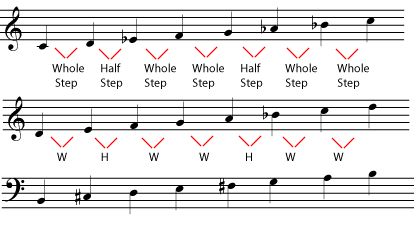

[Listen](../images/cnx/6faeb0239bfa900fbc32fc2eb77c0783bc9f26b7.midi) to these minor scales.

> **Practice**
>
> > **Question**
> >
> > For each note below, write a natural minor scale, one octave, ascending (going up) beginning on that note. If you need staff paper, you may print the [staff paper](../images/cnx/e5b6335c0813bd7797983b645d24962d8ad96e93.pdf) PDF file.
> >
> > 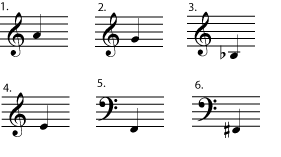
> >
>
> > **Solution**
> >
> > 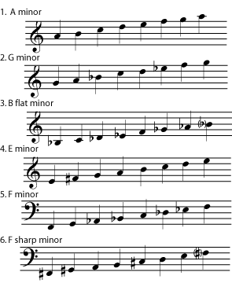
> >

## Relative Minor and Major Keys

Each minor key shares a [key signature](ch-04-key-signature.md) with a major key. A minor key is called the *relative minor* of the major key that has the same key signature. Even though they have the same key signature, a minor key and its *relative major* sound very different. They have different [tonal centers](ch-30-major-keys-and-scales.md), and each will feature melodies, harmonies, and [chord progressions](ch-21-harmony.md) built around their (different) tonal centers. In fact, certain strategic [accidentals](ch-03-pitch-sharp-flat-and-natural-notes.md) are very useful in helping establish a strong tonal center in a minor key. These useful accidentals are featured in the melodic minor and harmonic minor scales.

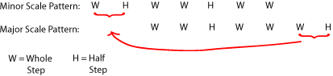

The interval patterns for major and natural minor scales are basically the same pattern starting at different points.

It is easy to predict where the relative minor of a major key can be found. Notice that the pattern for minor scales overlaps the pattern for major scales. In other words, they are the same pattern starting in a different place. (If the patterns were very different, minor key signatures would not be the same as major key signatures.) The pattern for the minor scale starts a half step plus a whole step lower than the major scale pattern, so **a relative minor is always three half steps lower than its relative major**. For example, C minor has the same key signature as E flat major, since E flat is a minor third higher than C.

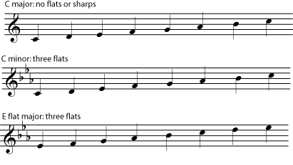

The C major and C minor scales start on the same note, but have different key signatures. C minor and E flat major start on different notes, but have the same key signature. C minor is the <em>relative minor</em> of E flat major.

> **Practice**
>
> > **Question**
> >
> > What are the relative majors of the minor keys in the referenced item?
>
> > **Solution**
> >
> > 1.  A minor: C major
> > 2.  G minor: B flat major
> > 3.  B flat minor: D flat major
> > 4.  E minor: G major
> > 5.  F minor: A flat major
> > 6.  F sharp minor: A major

## Harmonic and Melodic Minor Scales

> **Note**
>
> Do key signatures make music more complicated than it needs to be? Is there an easier way? Join the discussion at [Opening Measures](http://openingmeasures.com/music/22/why-cant-we-use-something-simpler-than-key-signatures/).

All of the scales above are *natural minor scales*. They contain only the notes in the minor key signature. There are two other kinds of minor scales that are commonly used, both of which include notes that are not in the key signature. The *harmonic minor scale* **raises the seventh note of the scale by one half step, whether you are going up or down the scale**. Harmonies in minor keys often use this raised seventh tone in order to make the music feel more strongly centered on the [tonic](ch-30-major-keys-and-scales.md). (Please see [Beginning Harmonic Analysis](ch-40-beginning-harmonic-analysis.md) for more about this.) In the *melodic minor scale*, **the sixth and seventh notes of the scale are each raised by one half step when going up the scale, but return to the natural minor when going down the scale**. Melodies in minor keys often use this particular pattern of [accidentals](ch-03-pitch-sharp-flat-and-natural-notes.md), so instrumentalists find it useful to practice melodic minor scales.

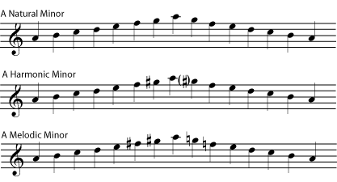

Listen to the differences between the [natural minor](../images/cnx/71cb0db1d939e0afc6c11b722cd388098d12bc63.mpg), [harmonic minor](../images/cnx/b2828f951ab2eec060f24540ef35f43a2fd7edca.mpg), and [melodic minor](../images/cnx/8251716ef091f30bb48c7d4cbeb29d5054dbac30.mpg) scales.

> **Practice**
>
> > **Question**
> >
> > Rewrite each scale from the referenced item as an ascending harmonic minor scale.
>
> > **Solution**
> >
> > 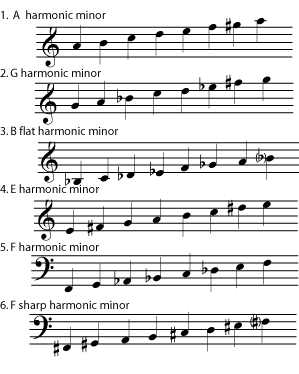
> >

> **Practice**
>
> > **Question**
> >
> > Rewrite each scale from the referenced item as an ascending and descending melodic minor scale.
>
> > **Solution**
> >
> > 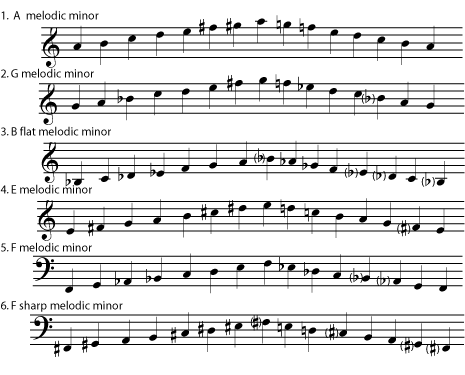
> >

## Jazz and \"Dorian Minor\"

Major and minor scales are traditionally the basis for [Western Music](ch-24-classifying-music.md), but jazz theory also recognizes other scales, based on the medieval [church modes](ch-45-modes-and-ragas.md), which are very useful for improvisation. One of the most useful of these is the scale based on the dorian mode, which is often called the *dorian minor*, since it has a basically minor sound. Like any minor scale, dorian minor may start on any note, but like dorian mode, it is often illustrated as natural notes beginning on d.

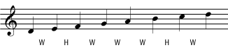

The "dorian minor" can be written as a scale of natural notes starting on d. Any scale with this interval pattern can be called a "dorian minor scale".

Comparing this scale to the natural minor scale makes it easy to see why the dorian mode sounds minor; only one note is different.

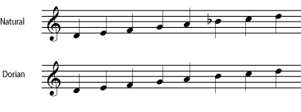

You may find it helpful to notice that the \"relative major\" of the Dorian begins one whole step lower. (So, for example, D Dorian has the same key signature as C major.) In fact, the reason that Dorian is so useful in jazz is that it is the scale used for improvising while a [ii chord](ch-40-beginning-harmonic-analysis.md) is being played (for example, while a d minor chord is played in the key of C major), a chord which is very common in jazz. (See [Beginning Harmonic Analysis](ch-40-beginning-harmonic-analysis.md) for more about how chords are classified within a key.) The student who is interested in modal jazz will eventually become acquainted with all of the *modal scales*. Each of these is named for the medieval [church mode](ch-45-modes-and-ragas.md) which has the same interval pattern, and each can be used with a different chord within the key. Dorian is included here only to explain the common jazz reference to the \"dorian minor\" and to give notice to students that the jazz approach to scales can be quite different from the traditional classical approach.

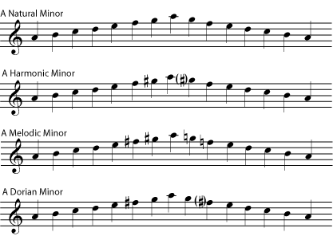

You may also find it useful to compare the dorian with the minor scales from [link]. Notice in particular the relationship of the altered notes in the harmonic, melodic, and dorian minors.
