*The distance between two pitches is the interval between them. The name of an interval depends both on how the notes are written and the actual distance between the notes as measured in half steps.*

## The Distance Between Pitches

The *interval* between two notes is the distance between the two [pitches](ch-03-pitch-sharp-flat-and-natural-notes.md) - in other words, how much higher or lower one note is than the other. This concept is so important that it is almost impossible to talk about [scales](ch-30-major-keys-and-scales.md), [chords](ch-21-harmony.md), [harmonic progression](ch-21-harmony.md), [cadence](ch-41-cadence.md), or [dissonance](ch-38-consonance-and-dissonance.md) without referring to intervals. So if you want to learn music theory, it would be a good idea to spend some time getting comfortable with the concepts below and practicing identifying intervals.

Scientists usually describe the distance between two pitches in terms of the difference between their [frequencies](https://cnx.org/content/m11060). Musicians find it more useful to talk about interval. Intervals can be described using [half steps and whole steps](ch-29-half-steps-and-whole-steps.md). For example, you can say \"B natural is a half step below C natural\", or \"E flat is a step and a half above C natural\". But when we talk about larger intervals in the [major/minor system](ch-28-octaves-and-the-major-minor-tonal-system.md), there is a more convenient and descriptive way to name them.

## Naming Intervals

The first step in naming the interval is to find the distance between the notes **as they are written on the staff**. Count every line and every space in between the notes, as well as the lines or spaces that the notes are on. This gives you the number for the interval.

> **Example**
>
> 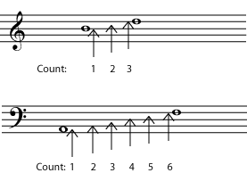
>
> To find the interval, count the lines or spaces that the two notes are on as well as all the lines or spaces in between. The interval between B and D is a third. The interval between A and F is a sixth. Note that, at this stage, [key signature](ch-04-key-signature.md), [clef](ch-02-clef.md), and [accidentals](ch-03-pitch-sharp-flat-and-natural-notes.md) do not matter at all.

The *simple intervals* are one octave or smaller.

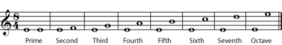

If you like you can listen to each interval as written in the referenced item: [prime](../images/cnx/3b2373bdd65ba188732288dd3c8948d54e6b249b.midi), [second](../images/cnx/6276e3b2a8a52b86fd74a156bdfcc93b1b37f43e.midi), [third](../images/cnx/66c60ddddb5896b3475f74571d8cb6f5905d648e.midi), [fourth](../images/cnx/6c0dbeadb9377bb4919fe21f50606d7191674cc5.midi), [perfect fifth](../images/cnx/fifth.mid), [sixth](../images/cnx/5d0848e30fefd1d5a3e16077fbe1125fa4367032.midi), [seventh](../images/cnx/cec379ba0754fef82252f066afd837e272929486.midi), [octave](../images/cnx/octave.mid)

*Compound intervals* are larger than an octave.

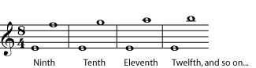

Listen to the compound intervals in the referenced item: [ninth](../images/cnx/5805bd8e4413799bf8a7519d63279259ceb9d67d.midi), [tenth](../images/cnx/b38c3b8407676b1c514800c5229b6153b0689895.midi), [eleventh](../images/cnx/8ef8a32fda8d4feb41fd2249584bf5c1681524d7.midi).

> **Practice**
>
> > **Question**
> >
> > Name the intervals.
> >
> > 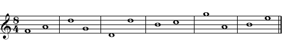
> >
>
> > **Solution**
> >
> > 
> >

> **Practice**
>
> > **Question**
> >
> > Write a note that will give the named interval.
> >
> > 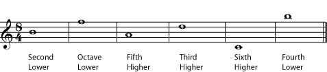
> >
>
> > **Solution**
> >
> > 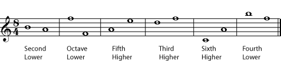
> >

## Classifying Intervals

So far, the actual distance, in half-steps, between the two notes has not mattered. But a third made up of three half-steps sounds different from a third made up of four half-steps. And a fifth made up of seven half-steps sounds very different from one of only six half-steps. So in the second step of identifying an interval, [clef](ch-02-clef.md), [key signature](ch-04-key-signature.md), and [accidentals](ch-03-pitch-sharp-flat-and-natural-notes.md) become important.

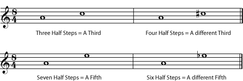

A to C natural and A to C sharp are both thirds, but A to C sharp is a larger interval, with a different sound. The difference between the intervals A to E natural and A to E flat is even more noticeable.

Listen to the differences in the [thirds](../images/cnx/3547ed03fee784145f80cdec0638c0c8f2bd3a47.midi) and the [fifths](../images/cnx/56e612be118923f7860b4eea1ccb61df7dab6ba9.midi) in the referenced item.

So the second step to naming an interval is to classify it based on the number of [half steps](ch-29-half-steps-and-whole-steps.md) in the interval. Familiarity with the [chromatic scale](ch-29-half-steps-and-whole-steps.md) is necessary to do this accurately.

### Perfect Intervals

Primes, octaves, fourths, and fifths can be *perfect* intervals.

> **Note**
>
> These intervals **are never classified as major or minor**, although they can be augmented or diminished (see below).

What makes these particular intervals perfect? The physics of sound waves (*acoustics*) shows us that the notes of a perfect interval are very closely related to each other. (For more information on this, see [Frequency, Wavelength, and Pitch](https://cnx.org/content/m11060) and [Harmonic Series](https://cnx.org/content/m11118).) Because they are so closely related, they sound particularly good together, a fact that has been noticed since at least the times of classical Greece, and probably even longer. (Both the octave and the perfect fifth have prominent positions in most of the world\'s musical traditions.) Because they sound so closely related to each other, they have been given the name \"perfect\" intervals.

> **Note**
>
> Actually, modern [equal temperament](ch-44-tuning-systems.md) tuning does not give the harmonic-series-based [pure](ch-44-tuning-systems.md) perfect fourths and fifths. For the music-theory purpose of identifying intervals, this does not matter. To learn more about how tuning affects intervals as they are actually played, see [Tuning Systems](ch-44-tuning-systems.md).

A perfect prime is also called a *unison*. It is two notes that are the same [pitch](ch-03-pitch-sharp-flat-and-natural-notes.md). A perfect octave is the \"same\" note an [octave](ch-28-octaves-and-the-major-minor-tonal-system.md) - 12 half-steps - higher or lower. A *perfect 5th* is 7 half-steps. A *perfect fourth* is 5 half-steps.

> **Example**
>
> 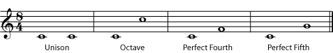
>
> Listen to the [octave](../images/cnx/66640adc67987eeaf877f6d4f75dfaf172c9cb24.mpg), [perfect fourth](../images/cnx/7b06bfee6bd8570e77b929852fa2634a9d011c92.mpg), and [perfect fifth](../images/cnx/40e6c3bbe9781ca82eefa3db78a37ae036485aef.mpg).

### Major and Minor Intervals

Seconds, thirds, sixths, and sevenths can be *major intervals* or *minor intervals*. The minor interval is always a half-step smaller than the major interval.

- 1 half-step = minor second (m2)
- 2 half-steps = major second (M2)
- 3 half-steps = minor third (m3)
- 4 half-steps = major third (M3)
- 8 half-steps = minor sixth (m6)
- 9 half-steps = major sixth (M6)
- 10 half-steps = minor seventh (m7)
- 11 half-steps = major seventh (M7)

> **Example**
>
> 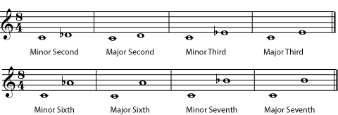
>
> Listen to the [minor second](../images/cnx/d81edd0f270fd8fac497367b43cd5963765cedd7.mpg), [major second](../images/cnx/f1140351c272498d34263ac3634176b6c1d99320.mpg), [minor third](../images/cnx/22f9603abd37ffd64628f3f8453ff626dc79f498.mpg), [major third](../images/cnx/ed9240d244152b3d8564a900964b1ca85e0939b2.mpg), [minor sixth](../images/cnx/f372f2a558d8f3ef3ae2da54685417330845d8ac.mpg), [major sixth](../images/cnx/a93fcd0c92c0ada81b828c5b71c0754855312c0a.mpg), [minor seventh](../images/cnx/35b334f7d9af69b2c91bee273030b53c8a86a8e6.mpg), and [major seventh](../images/cnx/aff1b1538f19cf001d8195a56873b3268068184c.mpg).

> **Practice**
>
> > **Question**
> >
> > Give the complete name for each interval.
> >
> > 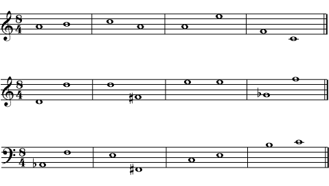
> >
>
> > **Solution**
> >
> > 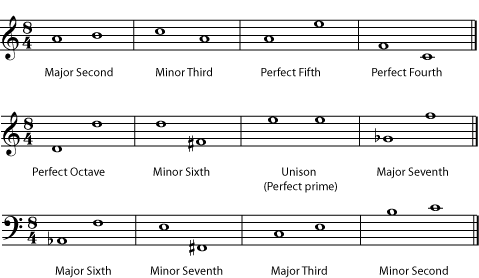
> >

> **Practice**
>
> > **Question**
> >
> > Fill in the second note of the interval given.
> >
> > 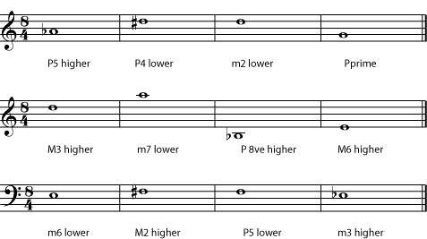
> >
>
> > **Solution**
> >
> > 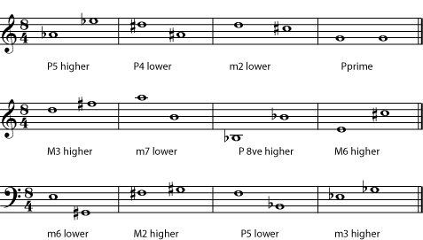
> >

### Augmented and Diminished Intervals

If an interval is a half-step larger than a perfect or a major interval, it is called *augmented*. An interval that is a half-step smaller than a perfect or a minor interval is called *diminished*. A [double sharp](ch-03-pitch-sharp-flat-and-natural-notes.md) or [double flat](ch-03-pitch-sharp-flat-and-natural-notes.md) is sometimes needed to write an augmented or diminished interval correctly. Always remember, though, that it is the actual distance in half steps between the notes that determines the type of interval, not whether the notes are written as natural, sharp, or double-sharp.

> **Example**
>
> 
>
> Listen to the [augmented prime](../images/cnx/2c36d5f2b6ab75a4d322c93225198b0ea14348ba.midi), [diminished second](../images/cnx/e51b0d96d78b3c64cc62c27774f6f748677b31cc.midi), [augmented third](../images/cnx/a0865ce4b4109f49e5ea365b69946e714c751bcc.midi), [diminished sixth](../images/cnx/74ed0e29e2782bff8cb2dc1acdb8295d6f6fe9a1.midi), [augmented seventh](../images/cnx/1ac3e814e3b35954013624ae03edacaefda1f658.midi), [diminished octave](../images/cnx/4d827f92b6395bde89f5c254822c088f2251631a.midi), [augmented fourth](../images/cnx/e963b3fc61fe066e94ab84de2ce07b4ab78d47d9.midi), and [diminished fifth](../images/cnx/e963b3fc61fe066e94ab84de2ce07b4ab78d47d9.midi). Are you surprised that the augmented fourth and diminished fifth sound the same?

> **Practice**
>
> > **Question**
> >
> > Write a note that will give the named interval.
> >
> > 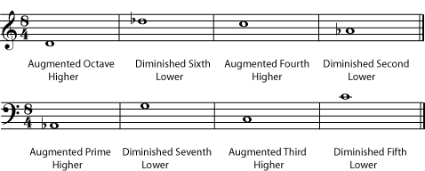
> >
>
> > **Solution**
> >
> > 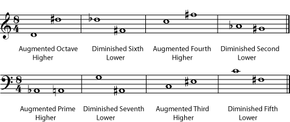
> >

As mentioned above, the diminished fifth and augmented fourth sound the same. Both are six half-steps, or **three whole tones**, so another term for this interval is a *tritone*. In [Western Music](ch-24-classifying-music.md), this unique interval, which cannot be spelled as a major, minor, or perfect interval, is considered unusually [dissonant](ch-38-consonance-and-dissonance.md) and unstable (tending to want to [resolve](ch-38-consonance-and-dissonance.md) to another interval).

You have probably noticed by now that the tritone is not the only interval that can be \"spelled\" in more than one way. In fact, because of [enharmonic spellings](ch-05-enharmonic-spelling.md), the interval for any two pitches can be written in various ways. A major third could be written as a diminished fourth, for example, or a minor second as an augmented prime. **Always classify the interval as it is written; the composer had a reason for writing it that way.** That reason sometimes has to do with subtle differences in the way different written notes will be interpreted by performers, but it is mostly a matter of placing the notes correctly in the context of the [key](ch-30-major-keys-and-scales.md), the [chord](ch-21-harmony.md), and the evolving [harmony](ch-21-harmony.md). (Please see [Beginning Harmonic Analysis](ch-40-beginning-harmonic-analysis.md) for more on that subject.)

Any interval can be written in a variety of ways using <a href="ch-05-enharmonic-spelling.md">enharmonic</a> spelling. Always classify the interval as it is written.

## Inverting Intervals

To *invert* any interval, simply imagine that one of the notes has moved one octave, so that the higher note has become the lower and vice-versa. Because inverting an interval only involves moving one note by an octave (it is still essentially the \"same\" note in the tonal system), intervals that are *inversions* of each other have a very close relationship in the [tonal](ch-28-octaves-and-the-major-minor-tonal-system.md) system.

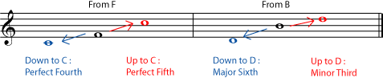

1.  To name the new interval, subtract the name of the old interval from 9.
2.  The inversion of a perfect interval is still perfect.
3.  The inversion of a major interval is minor, and of a minor interval is major.
4.  The inversion of an augmented interval is diminished and of a diminished interval is augmented.

> **Example**
>
> 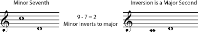
>

> **Practice**
>
> > **Question**
> >
> > What are the inversions of the following intervals?
> >
> > 1.  Augmented third
> > 2.  Perfect fifth
> > 3.  Diminished fifth
> > 4.  Major seventh
> > 5.  Minor sixth
>
> > **Solution**
> >
> > 1.  Diminished sixth
> > 2.  Perfect fourth
> > 3.  Augmented fourth
> > 4.  Minor second
> > 5.  Major third

## Summary

Here is a quick summary of the above information, for reference.

|                          |                     |                     |                                      |                     |                     |
|--------------------------|---------------------|---------------------|--------------------------------------|---------------------|---------------------|
| **Number of half steps** | **Common Spelling** | **Example, from C** | **Alternate Spelling**               | **Example, from C** | **Inversion**       |
| 0                        | Perfect Unison (P1) | C                   | Diminished Second                    | D double flat       | Octave (P8)         |
| 1                        | Minor Second (m2)   | D flat              | Augmented Unison                     | C sharp             | Major Seventh (M7)  |
| 2                        | Major Second (M2)   | D                   | Diminished Third                     | E double flat       | Minor Seventh (m7)  |
| 3                        | Minor Third (m3)    | E flat              | Augmented Second                     | D sharp             | Major Sixth (M6)    |
| 4                        | Major Third (M3)    | E                   | Diminished Fourth                    | F flat              | Minor Sixth (m6)    |
| 5                        | Perfect Fourth (P4) | F                   | Augmented Third                      | E sharp             | Perfect Fifth (P5)  |
| 6                        | Tritone (TT)        | F sharp or G flat   | Augmented Fourth or Diminished Fifth | F sharp or G flat   | Tritone (TT)        |
| 7                        | Perfect Fifth (P5)  | G                   | Diminished Sixth                     | A double flat       | Perfect Fourth (P4) |
| 8                        | Minor Sixth (m6)    | A flat              | Augmented Fifth                      | G sharp             | Major Third (M3)    |
| 9                        | Major Sixth (M6)    | A                   | Diminished Seventh                   | B double flat       | Minor Third (m3)    |
| 10                       | Minor Seventh (m7)  | B flat              | Augmented Sixth                      | A sharp             | Major Second (M2)   |
| 11                       | Major Seventh (M7)  | B                   | Diminished Octave                    | C\' flat            | Minor Second (m2)   |
| 12                       | Perfect Octave (P8) | C\'                 | Augmented Seventh                    | B sharp             | Perfect Unison (P1) |

The examples given name the note reached if one starts on C, and goes up the named interval.

- A perfect prime is often called a unison. It is two notes of the same pitch.
- A perfect octave is often simply called an octave. It is the next \"note with the same name\".
- Perfect intervals - unison, fourth, fifth, and octave - are never called major or minor

- An augmented interval is one half step larger than the perfect or major interval.
- A diminished interval is one half step smaller than the perfect or minor interval.

- To find the inversion\'s number name, subtract the interval number name from 9.
- Inversions of perfect intervals are perfect.
- Inversions of major intervals are minor, and inversions of minor intervals are major.
- Inversions of augmented intervals are diminished, and inversions of diminished intervals are augmented.
