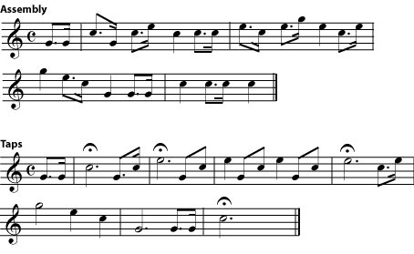
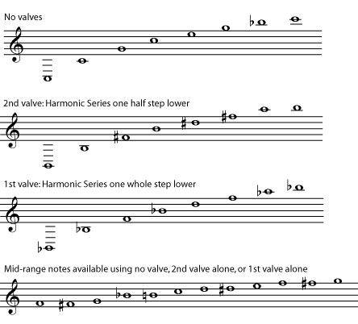
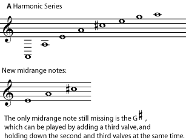
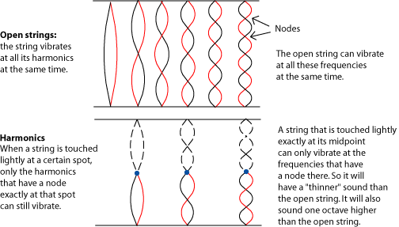

*The interval between two notes is related to the ratio of the frequencies of the two pitches. A notated harmonic series can show the relationship between frequency and interval. The timbre of an instrument is determined by the relative strengths of the harmonics in each note.*

## Frequency and Interval

The names of the various intervals, and the way they are written on the staff, are mostly the result of a long history of evolving musical notation and theory. But the actual intervals - the way the notes sound - are not arbitrary accidents of history. Like octaves, the other intervals are also produced by the harmonic series. Recall that the frequencies of any two pitches that are one [octave](ch-28-octaves-and-the-major-minor-tonal-system.md) apart have a 2:1 ratio. (See [Harmonic Series I](ch-27-harmonic-series-i-timbre-and-octaves.md) to review this.) Every other [interval](ch-32-interval.md) that musicians talk about can also be described as having a particular frequency ratio. To find those ratios, look at a harmonic series written in [common notation](ch-01-the-staff.md).

Look at the third harmonic in the referenced item. Its frequency is three times the frequency of the first harmonic (ratio 3:1). Remember, the frequency of the second harmonic is two times that of the first harmonic (ratio 2:1). In other words, there are two waves of the higher C for every one wave of the lower C, and three waves of the third-harmonic G for every one wave of the fundamental. So the [ratio](https://cnx.org/content/m11808) of the frequencies of the second to the third harmonics is 2:3. (In other words, two waves of the C for every three of the G.) From the harmonic series shown above, you can see that the [interval](ch-32-interval.md) between these two notes is a [perfect fifth](ch-32-interval.md). The ratio of the frequencies of all perfect fifths is 2:3.

> **Practice**
>
> > **Question**
> >
> > 1.  The interval between the fourth and sixth harmonics (frequency ratio 4:6) is also a fifth. Can you explain this?
> > 2.  What other harmonics have an interval of a fifth?
> > 3.  Which harmonics have an interval of a fourth?
> > 4.  What is the frequency ratio for the interval of a fourth?
>
> > **Solution**
> >
> > 1.  The ratio 4:6 reduced to lowest terms is 2:3. (In other words, they are two ways of writing the same mathematical relationship. If you are more comfortable with fractions than with ratios, think of all the ratios as fractions instead. 2:3 is just two-thirds, and 4:6 is four-sixths. Four-sixths reduces to two-thirds.)
> > 2.  Six and nine (6:9 also reduces to 2:3); eight and twelve; ten and fifteen; and any other combination that can be reduced to 2:3 (12:18, 14:21 and so on).
> > 3.  Harmonics three and four; six and eight; nine and twelve; twelve and sixteen; and so on.
> > 4.  3:4

> **Note**
>
> If you have been looking at the harmonic series above closely, you may have noticed that some notes that are written to give the same interval have different frequency ratios. For example, the interval between the seventh and eighth harmonics is a major second, but so are the intervals between 8 and 9, between 9 and 10, and between 10 and 11. But 7:8, 8:9, 9:10, and 10:11, although they are pretty close, are not exactly the same. In fact, modern [Western](ch-24-classifying-music.md) music uses the [equal temperament](ch-44-tuning-systems.md) tuning system, which divides the octave into twelve notes that are equally far apart. (They do have the same frequency ratios, unlike the [half steps](ch-29-half-steps-and-whole-steps.md) in the harmonic series.) The positive aspect of equal temperament (and the reason it is used) is that an instrument will be equally in tune in all keys. The negative aspect is that it means that all intervals except for octaves are slightly out of tune with regard to the actual harmonic series. For more about equal temperament, see [Tuning Systems](ch-44-tuning-systems.md). Interestingly, musicians have a tendency to revert to true harmonics when they can (in other words, when it is easy to fine-tune each note). For example, an a capella choral group, or a brass ensemble, may find themselves singing or playing perfect fourths and fifths, \"contracted\" major thirds and \"expanded\" minor thirds, and half and whole steps of slightly varying sizes.

## Brass Instruments

The harmonic series is particularly important for brass instruments. A pianist or xylophone player only gets one note from each key. A string player who wants a different note from a string holds the string tightly in a different place. This basically makes a vibrating string of a new length, with a new fundamental.

But a brass player, without changing the length of the instrument, gets different notes by actually playing the harmonics of the instrument. Woodwinds also do this, although not as much. Most woodwinds can get two different octaves with essentially the same fingering; the lower octave is the fundamental of the column of air inside the instrument at that fingering. The upper octave is the first harmonic.

> **Note**
>
> In some woodwinds, such as the [clarinet](https://cnx.org/content/m12604), the upper \"octave\" may actually be the third harmonic rather than the second, which complicates the fingering patterns of these instruments. Please see [Standing Waves and Wind Instruments](https://cnx.org/content/m12589) for an explanation of this phenomenon.

It is the brass instruments that excel in getting different notes from the same length of tubing. The sound of a brass instruments starts with vibrations of the player\'s lips. By vibrating the lips at different speeds, the player can cause a harmonic of the air column to sound instead of the fundamental. Thus a bugle player can play any note in the harmonic series of the instrument that falls within the player\'s range. Compare these well-known bugle calls to the harmonic series above.

Although limited by the fact that it can only play one harmonic series, the bugle can still play many well-known tunes.

For centuries, all brass instruments were valveless. A brass instrument could play only the notes of one harmonic series. (An important exception was the [trombone](https://cnx.org/content/m12602) and its relatives, which can easily change their length and harmonic series using a slide.) The upper octaves of the series, where the notes are close enough together to play an interesting melody, were often difficult to play, and some of the harmonics sound quite out of tune to ears that expect equal temperament. The solution to these problems, once brass valves were perfected, was to add a few valves to the instrument; three is usually enough. Each valve opens an extra length of tube, making the instrument a little longer, and making available a whole new harmonic series. Usually one valve gives the harmonic series one half step lower than the valveless intrument; another, one whole step lower; and the third, one and a half steps lower. The valves can be used in combination, too, making even more harmonic series available. So a valved brass instrument can find, in the comfortable middle of its [range](ch-23-range.md) (its *middle register*), a valve combination that will give a reasonably in-tune version for every note of the [chromatic scale](ch-29-half-steps-and-whole-steps.md). (For more on the history of valved brass, see [History of the French Horn](https://cnx.org/content/m11617#s2). For more on how and why harmonics are produced in wind instruments, please see [Standing Waves and Wind Instruments](https://cnx.org/content/m12589))

> **Note**
>
> [Trombones](https://cnx.org/content/m12602) still use a slide instead of valves to make their instrument longer. But the basic principle is still the same. At each slide \"position\", the instrument gets a new harmonic series. The notes in between the positions aren\'t part of the chromatic scale, so they are usually only used for special effects like *glissandos* (sliding notes).

These harmonic series are for a brass instrument that has a "C" fundamental when no valves are being used - for example, a C trumpet. Remember, there is an entire harmonic series for every fundamental, and any note can be a fundamental. You just have to find the brass tube with the right length. So a trumpet or tuba can get one harmonic series using no valves, another one a half step lower using one valve, another one a whole step lower using another valve, and so on. By the time all the combinations of valves are used, there is some way to get an in-tune version of every note they need.

> **Practice**
>
> > **Question**
> >
> > Write the harmonic series for the instrument above when both the first and second valves are open. (You can use this [PDF file](../images/cnx/e5b6335c0813bd7797983b645d24962d8ad96e93.pdf) if you need staff paper.) What new notes are added in the instrument\'s middle range? Are any notes still missing?
>
> > **Solution**
> >
> > Opening both first and second valves gives the harmonic series one-and-a-half steps lower than \"no valves\".
> >
> > 
> >

> **Note**
>
> The [French horn](https://cnx.org/content/m11617) has a reputation for being a \"difficult\" instrument to play. This is also because of the harmonic series. Most brass instruments play in the first few octaves of the harmonic series, where the notes are farther apart and it takes a pretty big difference in the mouth and lips (the [embouchure](https://cnx.org/content/m12364#p2a), pronounced AHM-buh-sher) to get a different note. The range of the French horn is higher in the harmonic series, where the notes are closer together. So very small differences in the mouth and lips can mean the wrong harmonic comes out.

## Playing Harmonics on Strings

String players also use harmonics, although not as much as brass players. Harmonics on strings have a very different [timbre](ch-18-timbre.md) from ordinary string sounds. They give a quieter, thinner, more bell-like tone, and are usually used as a kind of ear-catching special-effect.

Normally a string player holds a string down very tightly. This shortens the length of the vibrating part of the string, in effect making a (temporarily) shorter vibrating string, which has its own full set of harmonics.

To \"play a harmonic\", the string is touched very, very lightly instead. The length of the string does not change. Instead, the light touch interferes with all of the vibrations that don\'t have a [node](ch-26-standing-waves-and-musical-instruments.md) at that spot.

The thinner, quieter sound of \"playing harmonics\" is caused by the fact that much of the harmonic series is missing from the sound, which will of course affect the [timbre](ch-18-timbre.md). Lightly touching the string in most places will result in no sound at all. This technique only works well at places on the string where a main harmonic (one of the longer, louder lower-numbered harmonics) has a node. Some string players can get more harmonics by both holding the string down in one spot and touching it lightly in another spot, but this is an advanced technique.
