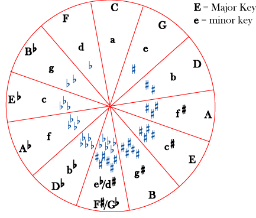
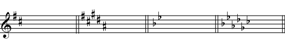
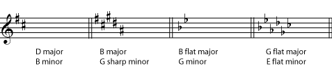
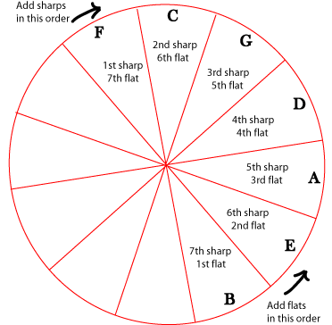
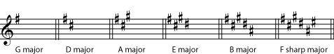
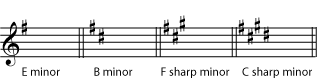
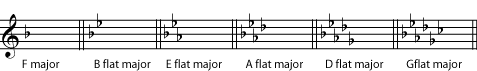

*Picturing a circle of fifths can help you identify key signatures, find related keys, and remember the order of sharps and flats in key signatures.*

## Related Keys

The circle of fifths is a way to arrange keys to show how closely they are related to each other.

The major key for each key signature is shown as a capital letter; the minor key as a small letter. In theory, one could continue around the circle adding flats or sharps (so that B major is also C flat major, with seven flats, E major is also F flat major, with 6 flats and a double flat, and so on), but in practice such key signatures are very rare.

Keys are not considered closely related to each other if they are near each other in the [chromatic scale](ch-29-half-steps-and-whole-steps.md) (or on a keyboard). What makes two keys \"closely related\" is having similar [key signatures](ch-04-key-signature.md). So the most closely related key to C major, for example, is A minor, since they have the same key signature (no sharps and no flats). This puts them in the same \"slice\" of the circle. The next most closely related keys to C major would be G major (or E minor), with one sharp, and F major (or D minor), with only one flat. The keys that are most distant from C major, with six sharps or six flats, are on the opposite side of the circle.

The circle of fifths gets its name from the fact that as you go from one section of the circle to the next, you are going up or down by an [interval](ch-32-interval.md) of a [perfect fifth](ch-32-interval.md). If you go up a perfect fifth (clockwise in the circle), you get the key that has one more sharp or one less flat; if you go down a perfect fifth (counterclockwise), you get the key that has one more flat or one less sharp. Since going down by a perfect fifth is the same as going up by a [perfect fourth](ch-32-interval.md), the counterclockwise direction is sometimes referred to as a \"circle of fourths\". (Please review [inverted intervals](ch-32-interval.md) if this is confusing.)

> **Example**
>
> The key of D major has two sharps. Using the circle of fifths, we find that the most closely related major keys (one in each direction) are G major, with only one sharp, and A major, with three sharps. The relative minors of all of these keys (B minor, E minor, and F sharp minor) are also closely related to D major.

> **Practice**
>
> > **Question**
> >
> > What are the keys most closely related to E flat major? To A minor?
>
> > **Solution**
> >
> > - B flat major (2 flats)
> > - A flat major (4 flats)
> > - C minor (3 flats)
> > - G minor (2 flats)
> > - F minor (4 flats)
> >
> > - E minor (1 sharp)
> > - D minor (1 flat)
> > - C major (no sharps or flats)
> > - G major (1 sharp)
> > - F major (1 flat)

> **Practice**
>
> > **Question**
> >
> > Name the major and minor keys for each key signature.
> >
> > 
> >
>
> > **Solution**
> >
> > 
> >

## Key Signatures

If you do not know the order of the sharps and flats, you can also use the circle of fifths to find these. The first sharp in a key signature is always F sharp; the second sharp in a key signature is always (a perfect fifth away) C sharp; the third is always G sharp, and so on, all the way to B sharp.

The first flat in a key signature is always B flat (the same as the last sharp); the second is always E flat, and so on, all the way to F flat. Notice that, just as with the key signatures, you add sharps or subtract flats as you go clockwise around the circle, and add flats or subtract sharps as you go counterclockwise.

Each sharp and flat that is added to a key signature is also a perfect fifth away from the last sharp or flat that was added.

> **Practice**
>
> > **Question**
> >
> > the referenced item shows that D major has 2 sharps; the referenced item shows that they are F sharp and C sharp. After D major, name the next four sharp keys, and name the sharp that is added with each key.
>
> > **Solution**
> >
> > - A major adds G sharp
> > - E major adds D sharp
> > - B major adds A sharp
> > - F sharp major adds E sharp
> >
> > 
> >

> **Practice**
>
> > **Question**
> >
> > E minor is the first sharp minor key; the first sharp added in both major and minor keys is always F sharp. Name the next three sharp minor keys, and the sharp that is added in each key.
>
> > **Solution**
> >
> > - B minor adds C sharp
> > - F sharp minor adds G sharp
> > - C sharp minor adds D sharp
> >
> > 
> >

> **Practice**
>
> > **Question**
> >
> > After B flat major, name the next four flat keys, and name the flat that is added with each key.
>
> > **Solution**
> >
> > - E flat major adds A flat
> > - A flat major adds D flat
> > - D flat major adds G flat
> > - G flat major adds C flat
> >
> > 
> >
