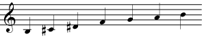
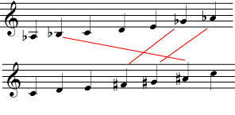
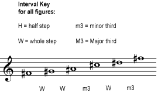
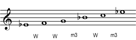
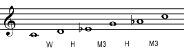
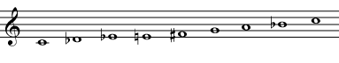
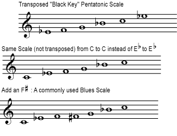
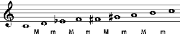
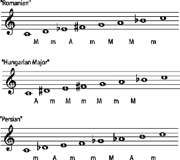
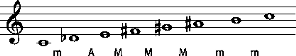

*There are many musical scales that cannot be classified as major or minor, including chromatic, whole-tone, pentatonic, blues, and various scales common to Non-Western music.*

::: {#m11636-s0 .section}
## Introduction

[]{#m11636-p0a}

Sounds - ordinary, everyday \"noises\" - come in every conceivable [pitch](ch-03-pitch-sharp-flat-and-natural-notes.md) and groups of pitches. In fact, the essence of noise, \"white noise\", is basically every pitch at once, so that no particular pitch is heard.

[]{#m11636-p0b}

One of the things that makes music pleasant to hear and easy to \"understand\" is that only a few of all the possible pitches are used. But not all pieces of music use the same set of pitches. In order to be familiar with the particular notes that a piece of music is likely to use, musicians study scales.

[]{#m11636-p0bb}

The set of expected pitches for a piece of music can be arranged into a *scale*. In a scale, the pitches are usually arranged from lowest to highest (or highest to lowest), in a pattern that usually repeats within every [octave](ch-28-octaves-and-the-major-minor-tonal-system.md).

::: {#m11636-id4606593 .note}
**Note**

In some kinds of music, the notes of a particular scale are the only notes allowed in a given piece of music. In other music traditions, notes from outside the scale ([accidentals](ch-03-pitch-sharp-flat-and-natural-notes.md)) are allowed, but are usually much less common than the scale notes.
:::

[]{#m11636-p0c}

The set of pitches, or notes, that are used, and their relationships to each other, makes a big impact on how the music sounds. For example, for centuries, most [Western music](ch-24-classifying-music.md) has been based on [major](ch-30-major-keys-and-scales.md) and [minor scales](ch-31-minor-keys-and-scales.md). That is one of the things that makes it instantly recognizable as Western music. Much (though not all) of the music of eastern Asia, on the other hand, was for many centuries based on pentatonic scales, giving it a much different flavor that is also easy to recognize.

[]{#m11636-p0d}

Some of the more commonly used scales that are not major or minor are introduced here. Pentatonic scales are often associated with eastern Asia, but many other music traditions also use them. Blues scales, used in blues, jazz, and other African-American traditions, grew out of a compromise between European and African scales. Some of the scales that sound \"exotic\" to the Western ear are taken from the musical traditions of eastern Europe, the Middle East, and western Asia. Microtones can be found in some traditional musics (for example, [Indian classical music](https://cnx.org/content/m12459)) and in some modern [art](ch-24-classifying-music.md) music.

::: {#m11636-id3589916 .note}
**Note**

Some music traditions, such as Indian and medieval European, use modes or ragas, which are not quite the same as scales. Please see [Modes and Ragas.](ch-45-modes-and-ragas.md)
:::
:::

::: {#m11636-s5 .section}
## Scales and Western Music

[]{#m11636-p5a}

The [Western](ch-24-classifying-music.md) musical tradition that developed in Europe after the middle ages is based on major and minor scales, but there are other scales that are a part of this tradition.

[]{#m11636-p5b}

In the *chromatic scale*, every [interval](ch-32-interval.md) is a [half step](ch-29-half-steps-and-whole-steps.md). This scale gives all the [sharp, flat, and natural](ch-03-pitch-sharp-flat-and-natural-notes.md) notes commonly used in all Western music. It is also the *twelve-tone scale* used by twentieth-century composers to create their [atonal music](ch-24-classifying-music.md). Young instrumentalists are encouraged to practice playing the chromatic scale in order to ensure that they know the fingerings for all the notes. Listen to a [chromatic scale](../images/cnx/7b3ed2ffb1df2da8af1c3a61ab531a5b892bb82a.midi).

[]{#m11636-fig5a}
<figure>

<figcaption>The chromatic scale includes all the pitches normally found in Western music. Note that, because of <a href="ch-05-enharmonic-spelling.md">enharmonic</a> spelling, many of these pitches could be written in a different way (for example, using flats instead of sharps).</figcaption>
</figure>

[]{#m11636-p5c}

In a *whole tone scale*, every interval is a [whole step](ch-29-half-steps-and-whole-steps.md). In both the chromatic and the whole tone scales, all the intervals are the same. This results in scales that have no [tonal center](ch-30-major-keys-and-scales.md); no note feels more or less important than the others. Because of this, most traditional and popular Western music uses major or minor scales rather than the chromatic or whole tone scales. But composers who don\'t want their music to have a tonal center (for example, many composers of \"modern classical\" music) often use these scales. Listen to a [whole tone scale](../images/cnx/5d3f73f105368468fcb0c83cf05c2ab6db284a33.midi).

[]{#m11636-fig5b}
<figure>

<figcaption>Because all the intervals are the same, it doesn't matter much where you begin a chromatic or whole tone scale. For example, this scale would contain the same notes whether you start it on C or E.</figcaption>
</figure>

::: {#m11636-element-339 .exercise}
**Practice**

::: {#m11636-id3387074 .problem}
**Question**

[]{#m11636-element-147}

There is basically only one chromatic scale; you can start it on any note, but the pitches will end up being the same as the pitches in any other chromatic scale. There are basically two possible whole tone scales. Beginning on a b, write a whole tone scale that uses a different pitches than the one in the referenced item. If you need staff paper, you can download this [PDF file](../images/cnx/e5b6335c0813bd7797983b645d24962d8ad96e93.pdf).
:::

::: {#m11636-id7643267 .solution}
**Solution**

[]{#m11636-element-772}
<figure>

<figcaption>This whole tone scale contains the notes that are not in the whole tone scale in [link].</figcaption>
</figure>
:::
:::

::: {#m11636-element-868 .exercise}
**Practice**

::: {#m11636-id4241553 .problem}
**Question**

[]{#m11636-element-28}

Now write a whole tone scale beginning on an a flat. Is this scale essentially the same as the one in the referenced item or the one in the referenced item?
:::

::: {#m11636-id3955711 .solution}
**Solution**

[]{#m11636-element-798}
<figure>

<figcaption>The flats in one scale are the <a href="ch-05-enharmonic-spelling.md">enharmonic</a> equivalents of the sharps in the other scale.</figcaption>
</figure>

[]{#m11636-element-769}

Assuming that octaves don\'t matter - as they usually don\'t in [Western](ch-24-classifying-music.md) music theory, this scale shares all of its possible pitches with the scale in the referenced item.
:::
:::
:::

::: {#m11636-s1 .section}
## Pentatonic Scales

[]{#m11636-p1a}

In Western music, there are twelve pitches within each [octave](ch-28-octaves-and-the-major-minor-tonal-system.md). (The thirteenth note starts the next octave.) But in a [tonal](ch-24-classifying-music.md) piece of music only seven of these notes, the seven notes of a major or minor scale, are used often.

[]{#m11636-p1b}

In a *pentatonic scale*, only five of the possible pitches within an octave are used. (So the scale will repeat starting at the sixth tone.) The most familiar pentatonic scales are used in much of the music of eastern Asia. You may be familiar with the scale in the referenced item as the scale that is produced when you play all the \"black keys\" on a piano keyboard.

[]{#m11636-fig1a}
<figure>

<figcaption>This is the pentatonic scale you get when you play the "black keys" on a piano.</figcaption>
</figure>

[]{#m11636-p1c}

Listen to the [black key pentatonic scale](../images/cnx/7f58ecd24331e8a3366296cd060efe132617834a.midi). Like other scales, this pentatonic scale is [transposable](ch-46-transposition-changing-keys.md); you can move the entire scale up or down by a half step or a major third or any [interval](ch-32-interval.md) you like. The scale will sound higher or lower, but other than that it will sound the same, because the pattern of intervals between the notes (half steps, whole steps, and minor thirds) is the same. (For more on intervals, see [Half Steps and Whole Steps](ch-29-half-steps-and-whole-steps.md) and [Interval](ch-32-interval.md). For more on patterns of intervals within scales, see [Major Scales](ch-30-major-keys-and-scales.md) and [Minor Scales](ch-31-minor-keys-and-scales.md).) Now listen to a [transposed pentatonic scale](../images/cnx/3b794c3d74c6a85709a619c50dc23fbcd0d5358e.midi).

[]{#m11636-fig1b}
<figure>

<figcaption>This is simply a transposition of the scale in [link]</figcaption>
</figure>

[]{#m11636-p1d}

But this is not the only possible type of pentatonic scale. Any scale that uses only five notes within one octave is a pentatonic scale. The following pentatonic scale, for example, is not simply another transposition of the \"black key\" pentatonic scale; the pattern of intervals between the notes is different. Listen to this [different pentatonic scale](../images/cnx/3ccca4e91fc802a69238014fd4c00a54a0c3016a.midi).

[]{#m11636-fig1c}
<figure>

<figcaption>This pentatonic scale is not a transposed version of [link].It has a different set of intervals.</figcaption>
</figure>

[]{#m11636-p1e}

The point here is that music based on the pentatonic scale in the referenced item will sound very different from music based on the pentatonic scale in the referenced item, because the relationships between the notes are different, much as music in a minor key is noticeably different from music in a major key. So there are quite a few different possible pentatonic scales that will produce a recognizably \"unique sound\", and many of these possible five-note scales have been named and used in various music traditions around the world.

::: {#m11636-element-796 .exercise}
**Practice**

::: {#m11636-id4914956 .problem}
**Question**

[]{#m11636-element-148}

To get a feeling for the concepts in this section, try composing some short pieces using the pentatonic scales given in the referenced item and in the referenced item. You may use more than one octave of each scale, but use only one scale for each piece. As you are composing, listen for how the constraints of using only those five notes, with those pitch relationships, affect your music. See if you can play your the referenced item composition in a different key, for example, using the scale in the referenced item.
:::

::: {#m11636-id4901647 .solution}
**Solution**

[]{#m11636-element-218}

If you can, have your teacher listen to your compositions.
:::
:::
:::

::: {#m11636-s6 .section}
## Dividing the Octave, More or Less

[]{#m11636-p6a}

Any scale will list a certain number of notes within an octave. For major and minor scales, there are seven notes; for pentatonic, five; for a chromatic scale, twelve. Although some divisions are more common than others, any division can be imagined, and many are used in different musical traditions around the world. For example, the classical music of India recognizes twenty-two different possible pitches within an octave; each raga uses five, six, or seven of these possible pitches. (Please see [Indian Classical Music: Tuning and Ragas](https://cnx.org/content/m12459) for more on this.) And there are some traditions in Africa that use six or eight notes within an octave. Listen to one possible eight-tone, or [octatonic scale](../images/cnx/9a5069e36459ad74027924ff66ccdc100fc1e3b6.midi).

[]{#m11636-fig6a}
<figure>

</figure>

[]{#m11636-p6b}

Many Non-Western traditions, besides using different scales, also use different [tuning systems](ch-44-tuning-systems.md); the intervals in the scales may involve *quarter tones* (a half of a half step), for example, or other intervals we don\'t use. Even trying to write them in common notation can be a bit misleading.

[]{#m11636-p6c}

*Microtones* are intervals smaller than a half step. Besides being necessary to describe the scales and tuning systems of many Non-Western traditions, they have also been used in modern Western classical music, and are also used in African-American traditions such as jazz and blues. As of this writing, the [Huygens-Fokker Foundation](http://www.xs4all.nl/~huygensf/english/index.html) was a good place to start looking for information on microtonal music.
:::

::: {#m11636-s2 .section}
## Constructing a Blues Scale

[]{#m11636-p2a}

Blues scales are closely related to pentatonic scales. (Some versions are pentatonic.) Rearrange the pentatonic scale in the referenced item above so that it begins on the C, and add an F sharp in between the F and G, and you have a commonly used version of the blues scale. Listen to this [blues scale](../images/cnx/2f1710f0db1493fcbf31ba185c645a84f2ac4b98.midi).

[]{#m11636-fig2a}
<figure>

<figcaption>Blues scales are closely related to pentatonic scales.</figcaption>
</figure>
:::

::: {#m11636-s3 .section}
## Modes and Ragas

[]{#m11636-p3a}

Many music traditions do not use scales. The most familiar of these to the [Western](ch-24-classifying-music.md) listener are medieval chant and the classical music of India. In these and other modal traditions, the rules for constructing a piece of music are quite different than the rules for music that is based on a scale. Please see [Modes and Ragas](ch-45-modes-and-ragas.md) for more information.
:::

::: {#m11636-s4 .section}
## Other Scales

[]{#m11636-p4a}

There are many, many other possible scales that are not part of the major-minor system. Some, like pentatonic and octatonic scales, have fewer or more notes per octave, but many have seven tones, just as a major scale does. A scale may be chosen or constructed by a composer for certain intriguing characteristics, for the types of melodies or harmonies that the scale enables, or just for the interesting or pleasant sound of music created using the scale.

[]{#m11636-p4d}

For example, one class of scales that intrigues some composers is *symmetrical scales*. The [chromatic scale](ch-29-half-steps-and-whole-steps.md) and whole tone scales fall into this category, but other symmetrical scales can also be constructed. A *diminished* scale, for example, not only has the \"symmetrical\" quality; it is also a very useful scale if, for example, you are improvising a jazz solo over [diminished chords](ch-37-naming-triads.md).

[]{#m11636-fig4b}
<figure>

<figcaption>Like chromatic and whole tone scales, a diminished scale is "symmetrical".</figcaption>
</figure>

[]{#m11636-p4c}

Some scales are loosely based on the music of other cultures, and are used when the composer wants to evoke the music of another place or time. These scales are often borrowed from Non-western traditions, but are then used in ways typical of Western music. Since they usually ignore the tuning, melodic forms, and other aesthetic principles of the traditions that they are borrowed from, such uses of \"exotic\" scales should not be considered accurate representations of those traditions. There are examples in [world music](ch-24-classifying-music.md), however, in which the Non-western scale or [mode](ch-45-modes-and-ragas.md) is used in an authentic way. Although there is general agreement about the names of some commonly used \"exotic\" scales, they are not at all standardized. Often the name of a scale simply reflects what it sounds like to the person using it, and the same name may be applied to different scales, or different names to the same scale.

[]{#m11636-fig4a}
<figure>

</figure>

[]{#m11636-p4b}

You may want to experiment with some of the many scales possible. Listen to one version each of: [\"diminished\" scale](../images/cnx/cbc1e22db9e80f0fae8731633f7995d47ce2474d.midi), [\"enigmatic\" scale](../images/cnx/0e9da78349e5cc716466642436fff15e0869e708.midi), [\"Romanian\" Scale](../images/cnx/752150898babbb3fbf230b222865ff60c8d7533c.midi), [\"Persian\" scale](../images/cnx/71f77c9244fe93a36530bcddea0cfd0f9e332e33.midi) and [\"Hungarian Major\" Scale](../images/cnx/230f369a5338a8fed980099fd5adcef5fe77401a.midi). For even more possibilities, try a web search for \"exotic scales\"; or try inventing your own scales and using them in compositions and improvisations.

[]{#m11636-fig4d}
<figure>

</figure>
:::
