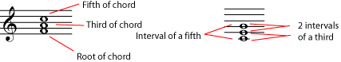
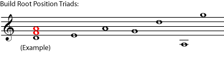
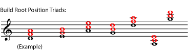
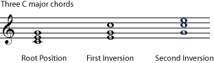
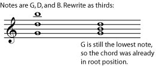
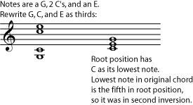
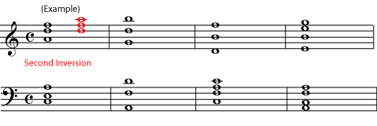
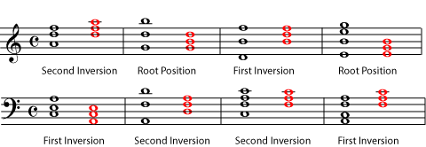

*Triads are basic three-note chords built of thirds. They can be in root position, first inversion, or second inversion.*

[Harmony](ch-21-harmony.md) in [Western music](ch-24-classifying-music.md) is based on triads. *Triads* are simple three-note [chords](ch-21-harmony.md) built of [thirds](ch-32-interval.md).

::: {#m10877-s1 .section}
## Triads in Root Position

The chords in the referenced item are written in root position, which is the most basic way to write a triad. In *root position*, the *root*, which is the note that names the chord, is the lowest note. The *third of the chord* is written a [third](ch-32-interval.md) higher than the root, and the *fifth of the chord* is written a [fifth](ch-32-interval.md) higher than the root (which is also a third higher than the third of the chord). So the simplest way to write a triad is as a stack of thirds, in root position.

::: {#m10877-id24979780 .note}
**Note**

The type of interval or chord - major, minor, diminished, etc., is not important when you are determining the position of the chord. To simplify things, all notes in the examples and exercises below are natural, but it would not change their position at all if some notes were sharp or flat. It would, however, change the name of the triad - see [Naming Triads](ch-37-naming-triads.md).
:::

::: {#m10877-exer1a .exercise}
**Practice**

::: {#m10877-id13069736 .problem}
**Question**

Write a triad in root position using each root given. If you need some staff paper for exercises you can print this [PDF file](../images/cnx/e5b6335c0813bd7797983b645d24962d8ad96e93.pdf).

:::

::: {#m10877-id24984722 .solution}
**Solution**

:::
:::
:::

::: {#m10877-s2 .section}
## First and Second Inversions

Any other chord that has the same-named notes as a root position chord is considered to be essentially the same chord in a different *position*. In other words, all chords that have only D naturals, F sharps, and A naturals, are considered D major chords.

::: {#m10877-id12874294 .note}
**Note**

**But** if you change the [pitch](ch-03-pitch-sharp-flat-and-natural-notes.md) or [spelling](ch-05-enharmonic-spelling.md) of any note in the triad, you have changed the chord (see [Naming Triads](ch-37-naming-triads.md)). For example, if the F sharps are written as G flats, or if the A\'s are sharp instead of natural, you have a different chord, not an inversion of the same chord. If you add notes, you have also changed the name of the chord (see [Beyond Triads](ch-39-beyond-triads-naming-other-chords.md)). **You cannot call one chord the inversion of another if either one of them has a note that does not share a name (for example \"F sharp\" or \"B natural\") with a note in the other chord.**
:::

If the third of the chord is the lowest note, the chord is in *first inversion*. If the fifth of the chord is the lowest note, the chord is in *second inversion*. A chord in second inversion may also be called a *six-four chord*, because the [intervals](ch-32-interval.md) in it are a sixth and a fourth.

It does not matter how far the higher notes are from the lowest note, or how many of each note there are (at different octaves or on different instruments); all that matters is which note is lowest. (In fact, one of the notes may not even be written, only implied by the context of the chord in a piece of music. A practiced ear will tell you what the missing note is; we won\'t worry about that here.) To decide what position a chord is in, move the notes to make a stack of thirds and identify the root.

::: {#m10877-examp2a .example}
**Example**

:::

::: {#m10877-examp2b .example}
**Example**

:::

::: {#m10877-exer2a .exercise}
**Practice**

::: {#m10877-id15852961 .problem}
**Question**

Rewrite each chord in root position, and name the original position of the chord.

:::

::: {#m10877-id16050706 .solution}
**Solution**

:::
:::
:::
