*The name of a chord depends on the intervals between its notes when the chord is in root position.*

The [position](ch-36-triads.md) that a chord is in does make a difference in how it sounds, but it is a fairly small difference. [Listen](../images/cnx/734a1d6340d86d53f191ebc1ff4bb448e9ce8d2f.midi) to a G major chord in three different positions.

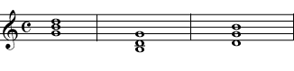

G major chord in three different positions.

A much bigger difference in the chord\'s sound comes from the [intervals](ch-32-interval.md) between the root-position notes of the chord. For example, if the B in one of the chords above was changed to a B flat, you would still have a G [triad](ch-36-triads.md), but the chord would now sound very different. So chords are named according to the intervals between the notes when the chord is in [root position](ch-36-triads.md). [Listen](../images/cnx/017eb6e00650f449f346b203a2147acbba61e369.midi) to four different G chords.

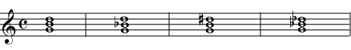

These are also all G chords, but they are four different G chords. The intervals between the notes are different, so the chords sound very different.

## Major and Minor Chords

The most commonly used [triads](ch-36-triads.md) form [major](ch-30-major-keys-and-scales.md) chords and [minor](ch-31-minor-keys-and-scales.md) chords. All major chords and minor chords have an [interval](ch-32-interval.md) of a [perfect fifth](ch-32-interval.md) between the [root and the fifth of the chord](ch-36-triads.md). A perfect fifth (7 half-steps) can be divided into a [major third](ch-32-interval.md) (4 half-steps) plus a [minor third](ch-32-interval.md) (3 half-steps). If the interval between the root and the third of the chord is the major third (with the minor third between the third and the fifth of the chord), the triad is a *major chord*. If the interval between the root and the third of the chord is the minor third (and the major third is between the third and fifth of the chord), then the triad is a *minor chord*. Listen closely to a [major triad](../images/cnx/8c9985062a2297f41f3a7fb632ecc5060a4b695b.mpg) and a [minor triad](../images/cnx/dfd922963c2c2a8a3f3eda6d33c23a6b7a731961.mpg).

:::{admonition} Example
:name: m10890-examp1a
:class: example

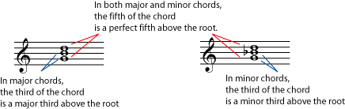

:::

:::{admonition} Example
:name: m10890-element-705
:class: example

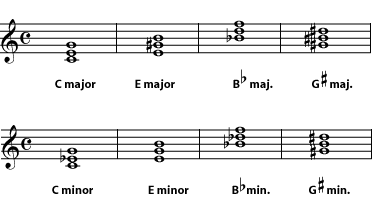

:::

:::{admonition} Practice
:name: m10890-exer1a
:class: exercise

::::{admonition} Question
:name: m10890-id1170485995157
:class: problem

Write the major chord for each root given.

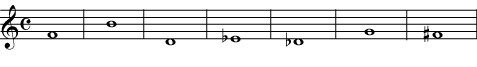

::::

::::{admonition} Solution
:name: m10890-id1170485995191
:class: solution

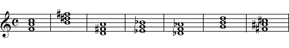

::::
:::

:::{admonition} Practice
:name: m10890-exer1b
:class: exercise

::::{admonition} Question
:name: m10890-id1170486222786
:class: problem

Write the minor chord for each root given.

::::

::::{admonition} Solution
:name: m10890-id1170486222824
:class: solution

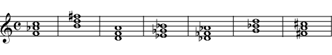

::::
:::

## Augmented and Diminished Chords

Because they don\'t contain a perfect fifth, augmented and diminished chords have an unsettled feeling and are normally used sparingly. An *augmented chord* is built from two major thirds, which adds up to an augmented fifth. A *diminished chord* is built from two minor thirds, which add up to a diminished fifth. Listen closely to an [augmented triad](../images/cnx/ec26f3dcf7dad247e1e2aea395349a54a6ecb6c9.mpg) and a [diminished triad](../images/cnx/8ea3b48efd216fff25f77e16f592802c26967171.mpg).

:::{admonition} Example
:name: m10890-examp2a
:class: example

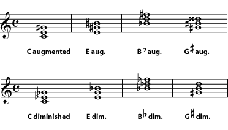

:::

:::{admonition} Practice
:name: m10890-exer2a
:class: exercise

::::{admonition} Question
:name: m10890-id1170486222950
:class: problem

Write the augmented triad for each root given.

::::

::::{admonition} Solution
:name: m10890-id1170486222988
:class: solution

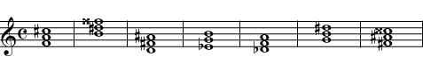

::::
:::

:::{admonition} Practice
:name: m10890-exer2b
:class: exercise

::::{admonition} Question
:name: m10890-id1170485999766
:class: problem

Write the diminished triad for each root given.

::::

::::{admonition} Solution
:name: m10890-id1170485999813
:class: solution

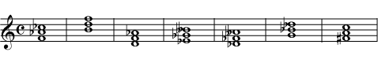

::::
:::

Notice that you can\'t avoid double sharps or double flats by writing the note on a different space or line. **If you change the [spelling](ch-05-enharmonic-spelling.md) of a chord\'s notes, you have also changed the chord\'s name.** For example, if, in an augmented G sharp major chord, you rewrite the D double sharp as an E natural, the triad becomes an E augmented chord.

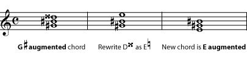

Changing the spelling of any note in a chord also changes the chord's name.

You can put the chord in a different [position](ch-36-triads.md) or add more of the same-named notes at other octaves without changing the name of the chord. But changing the note names or adding different-named notes, will change the name of the chord. Here is a summary of the intervals in triads in root position.

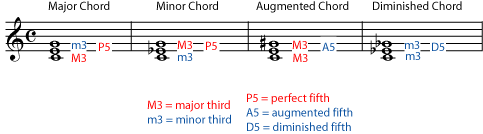

:::{admonition} Practice
:name: m10890-exer2c
:class: exercise

::::{admonition} Question
:name: m10890-id1170485999977
:class: problem

Now see if you can identify these chords that are not necessarily in root position. Rewrite them in root position first if that helps.

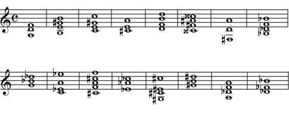

::::

::::{admonition} Solution
:name: m10890-id1170486233119
:class: solution

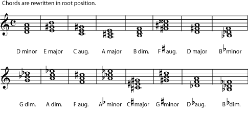

::::
:::
