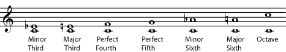
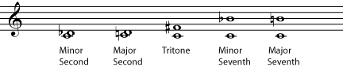
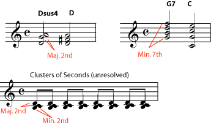

*Consonance and dissonance are musical terms describing whether combinations of notes sound good together or not.*

[]{#m11953-p0a}

Notes that sound good together when played at the same time are called *consonant*. Chords built only of consonances sound pleasant and \"stable\"; you can listen to one for a long time without feeling that the music needs to change to a different chord. Notes that are *dissonant* can sound harsh or unpleasant when played at the same time. Or they may simply feel \"unstable\"; if you hear a chord with a dissonance in it, you may feel that the music is pulling you towards the chord that *resolves* the dissonance. Obviously, what seems pleasant or unpleasant is partly a matter of opinion. This discussion only covers consonance and dissonance in [Western](ch-24-classifying-music.md) music.

::: {#m11953-id1167618911430 .note}
**Note**

For activities that introduce these concepts to young students, please see [Consonance and Dissonance Activities](https://cnx.org/content/m11999).
:::

[]{#m11953-p0b}

Of course, if there are problems with tuning, the notes will not sound good together, but this is not what consonance and dissonance are about. (Please note, though, that the choice of tuning system can greatly affect which intervals sound consonant and which sound dissonant! Please see [Tuning Systems](ch-44-tuning-systems.md) for more about this.)

[]{#m11953-p0c}

Consonance and dissonance refer to [intervals](ch-32-interval.md) and [chords](ch-21-harmony.md). The *interval* between two notes is the number of [half steps](ch-29-half-steps-and-whole-steps.md) between them, and all intervals have a name that musicians commonly use, like [major third](ch-32-interval.md) (which is 4 half steps), [perfect fifth](ch-32-interval.md) (7 half steps), or [octave](ch-28-octaves-and-the-major-minor-tonal-system.md). (See [Interval](ch-32-interval.md) to learn how to determine and name the interval between any two notes.)

[]{#m11953-p0d}

An interval is measured between two notes. When there are more than two notes sounding at the same time, that\'s a *chord*. (See [Triads](ch-36-triads.md), [Naming Triads](ch-37-naming-triads.md), and [Beyond Triads](ch-39-beyond-triads-naming-other-chords.md) for some basics on chords.) Of course, you can still talk about the interval between any two of the notes in a chord.

[]{#m11953-p0e}

The [simple intervals](ch-32-interval.md) that are considered to be consonant are the [minor third](../images/cnx/299f0a5edde864114a5169ff968fcc6d3af4046a.midi), [major third](../images/cnx/a61e03576b9f4df58d77264b5e1972afeeb04db3.midi), [perfect fourth](../images/cnx/2df6a789b825be3befd40115c95a611e4c9b0c1a.midi), [perfect fifth](../images/cnx/fifth.mid), [minor sixth](../images/cnx/26e4b386a9cdf2bf6d11d63de3186f9079bd9a90.midi), [major sixth](../images/cnx/759b8c20dc9b722db0c90bda11ddd4b775202d51.midi), and the [octave](../images/cnx/octave.mid)

[]{#m11953-fig0a}
<figure>

</figure>

[]{#m11953-p0f}

In modern [Western Music](ch-24-classifying-music.md), all of these intervals are considered to be pleasing to the ear. Chords that contain only these intervals are considered to be \"stable\", restful chords that don\'t need to be resolved. When we hear them, we don\'t feel a need for them to go to other chords.

[]{#m11953-p0g}

The intervals that are considered to be dissonant are the [minor second](../images/cnx/553556af2f1b5871b4ae03ad50537c11e70351cc.midi), the [major second](../images/cnx/2dce002de4c1aedffe342684006aa9a65cfbc0a2.midi), the [minor seventh](../images/cnx/283efd27c422f4b32d075b15a51da2d0b6b8fb9f.midi), the [major seventh](../images/cnx/c6caf28826dc655669d10f0998d0ee2adc20e597.midi), and particularly the [tritone](../images/cnx/8956af503b1c5769b1436adb75f3d1ba05c70c31.midi), which is the interval in between the perfect fourth and perfect fifth.

[]{#m11953-fig0b}
<figure>

</figure>

[]{#m11953-p0h}

These intervals are all considered to be somewhat unpleasant or tension-producing. In [tonal music](ch-24-classifying-music.md), chords containing dissonances are considered \"unstable\"; when we hear them, we expect them to move on to a more stable chord. Moving from a dissonance to the consonance that is expected to follow it is called *resolution*, or *resolving* the dissonance. The pattern of tension and release created by resolved dissonances is part of what makes a piece of music exciting and interesting. Music that contains no dissonances can tend to seem simplistic or boring. On the other hand, music that contains a lot of dissonances that are never resolved (for example, much of twentieth-century \"classical\" or \"art\" music) can be difficult for some people to listen to, because of the unreleased tension.

[]{#m11953-fig0c}
<figure>

<figcaption>In most music a dissonance will resolve; it will be followed by a consonant chord that it naturally leads to, for example a <a href="../images/cnx/25b15fdd6ee68ed6bcee0cb3dabfc0233a5de173.midi">G seventh chord resolves to a C major chord</a>, and a <a href="../images/cnx/be05287213a05b3bcf139d737c0538167f73701b.midi">D suspended fourth resolves to a D major chord</a>. A series of <a href="../images/cnx/12cef85c23a6c64c13f9c95d90dde819c4daf4d4.midi">unresolved dissonances</a>, on the other hand, can produce a sense of unresolved tension.</figcaption>
</figure>

[]{#m11953-p0i}

Why are some note combinations consonant and some dissonant? Preferences for certain sounds is partly cultural; that\'s one of the reasons why the traditional musics of various cultures can sound so different from each other. Even within the tradition of [Western music](ch-24-classifying-music.md), opinions about what is unpleasantly dissonant have changed a great deal over the centuries. But consonance and dissonance do also have a strong physical basis in nature.

[]{#m11953-p0j}

In simplest terms, the sound waves of consonant notes \"fit\" together much better than the sound waves of dissonant notes. For example, if two notes are an octave apart, there will be exactly two waves of one note for every one wave of the other note. If there are two and a tenth waves or eleven twelfths of a wave of one note for every wave of another note, they don\'t fit together as well. For much more about the physical basis of consonance and dissonance, see [Acoustics for Music Theory](ch-25-acoustics-for-music-theory.md), [Harmonic Series](https://cnx.org/content/m11118), and [Tuning Systems](ch-44-tuning-systems.md).
