*The name of a chord is determined by the relationship to the tonic of every note in the chord.*

## Introduction

Once you know how to name triads (please see [Triads](ch-36-triads.md) and [Naming Triads](ch-37-naming-triads.md)), you need only a few more rules to be able to name all of the most common chords.

This skill is necessary for those studying music theory. It\'s also very useful at a \"practical\" level for composers, arrangers, and performers (especially people playing chords, like pianists and guitarists), who need to be able to talk to each other about the chords that they are reading, writing, and playing.

Chord manuals, fingering charts, chord diagrams, and notes written out on a staff are all very useful, especially if the composer wants a very particular sound on a chord. But all you really need to know are the name of the chord, your [major scales](ch-30-major-keys-and-scales.md) and [minor scales](ch-31-minor-keys-and-scales.md), and a few rules, and you can figure out the notes in any chord for yourself.

1.  You must know your major, minor, augmented and diminished triads. Either have them all memorized, or be able to figure them out following the rules for triads. (See [Triads](ch-36-triads.md) and [Naming Triads](ch-37-naming-triads.md).)
2.  You must be able to find intervals from the [root](ch-36-triads.md) of the chord. One way to do this is by using the rules for intervals. (See [Interval](ch-32-interval.md).) **Or** if you know your scales and don\'t want to learn about intervals, you can use the method in \#3 instead.
3.  If you know all your scales (always a good thing to know, for so many reasons), you can find all the intervals from the root using scales. For example, the \"4\" in Csus4 is the 4th note in a C (major or minor) scale, and the \"minor 7th\" in Dm7 is the 7th note in a D (natural) minor scale. If you would prefer this method, but need to brush up on your scales, please see [Major Keys and Scales](ch-30-major-keys-and-scales.md) and [Minor Keys and Scales](ch-31-minor-keys-and-scales.md).
4.  You need to know the rules for the common seventh chords, for extending and altering chords, for adding notes, and for naming bass notes. The basic rules for these are all found below.

:::{admonition} Note
:name: m11995-id14476237
:class: note

Please note that the modern system of chord symbols, discussed below, is very different from the *figured bass* shorthand popular in the seventeenth century (which is not discussed here). For example, the \"6\" in figured bass notation implies the first [inversion](ch-36-triads.md) chord, not an added 6. (As of this writing, there was a very straightforward summary of figured bass at [Ars Nova Software](http://www.ars-nova.com/cpmanual/realizeharmony.htm).)
:::

## Chord Symbols

Some instrumentalists, such as guitarists and pianists, are sometimes expected to be able to play a named chord, or an [accompaniment](ch-21-harmony.md) based on that chord, without seeing the notes written out in [common notation](ch-01-the-staff.md). In such cases, a *chord symbol* above the [staff](ch-01-the-staff.md) tells the performer what chord should be used as accompaniment to the music until the next symbol appears.

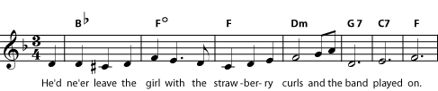

A chord symbol above the staff is sometimes the only indication of which notes should be used in the <a href="ch-21-harmony.md">accompaniment</a>. Chord symbols also may be used even when an accompaniment is written out, so that performers can read either the chord symbol or the notated music, as they prefer.

There is widespread agreement on how to name chords, but there are several different systems for writing chord symbols. Unfortunately, this can be a little confusing, particularly when different systems use the same symbol to refer to different chords. If you\'re not certain what chord is wanted, you can get useful clues both from the notes in the music and from the other chord symbols used. (For example, if the \"minus\" chord symbol is used, check to see if you can spot any chords that are clearly labelled as either minor or diminished.)

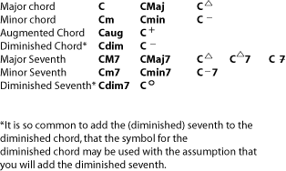

There is unfortunately a wide variation in the use of chord symbols. In particular, notice that some symbols, such as the "minus" sign and the triangle, can refer to different chords, depending on the assumptions of the person who wrote the symbol.

## Seventh Chords

If you take a basic [triad](ch-36-triads.md) and add a note that is a [seventh](ch-32-interval.md) above the [root](ch-36-triads.md), you have a *seventh chord*. There are several different types of seventh chords, distinguished by both the type of triad and the type of seventh used. Here are the most common.

- Seventh (or \"dominant seventh\") chord = major triad + minor seventh
- Major Seventh chord = major triad + major seventh
- Minor Seventh chord = minor triad + minor seventh
- Diminished Seventh chord = diminished triad + diminished seventh (half step lower than a minor seventh)
- Half-diminished Seventh chord = diminished triad + minor seventh

- The **major seventh** is one half step below the [octave](ch-28-octaves-and-the-major-minor-tonal-system.md).
- The **minor seventh** is one half step below the major seventh.
- The **diminished seventh** is one half step below the minor seventh.

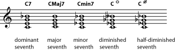

Listen to the differences between the [C seventh](../images/cnx/392a19e22ab714ac36f4cbddfbd4282a1481edea.mpg), [C major seventh](../images/cnx/6291362856e5792cb4f0ba9ec1236fa36dbf3450.mpg), [C minor seventh](../images/cnx/1aa5adbf0ccb241a170c40f3d19995a00145aa3c.mpg), [C diminished seventh](../images/cnx/ffd6f430f30f9a38f081d2a8502109e7caa46e8c.mpg), and [C half-diminished seventh](../images/cnx/be0fd4983577bfbd6684afeb68fd4dc6921a130f.mpg).

:::{admonition} Practice
:name: m11995-element-367
:class: exercise

::::{admonition} Question
:name: m11995-id4891710
:class: problem

Write the following seventh chords. If you need staff paper, you can print this [PDF file](../images/cnx/e5b6335c0813bd7797983b645d24962d8ad96e93.pdf)

1.  G minor seventh
2.  E (dominant) seventh
3.  B flat major seventh
4.  D diminished seventh
5.  F (dominant) seventh
6.  F sharp minor seventh
7.  G major seventh
8.  B half-diminished seventh
::::

::::{admonition} Solution
:name: m11995-id4378059
:class: solution

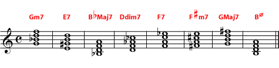

::::
:::

:::{admonition} Practice
:name: m11995-exer4d
:class: exercise

::::{admonition} Question
:name: m11995-id3594203
:class: problem

Write a Ddim7, Fdim7, G#dim7, and Bdim7. Look closely at the chords you have written and see if you can notice something surprising about them. (Hint: try rewriting the chords [enharmonically](ch-05-enharmonic-spelling.md) so that all the notes are either natural or (single) flat.
::::

::::{admonition} Solution
:name: m11995-id4706538
:class: solution

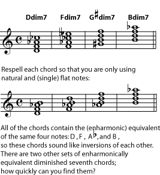

::::
:::

## Added Notes, Suspensions, and Extensions

The seventh is not the only note you can add to a basic triad to get a new chord. You can continue to **extend** the chord by adding to the [stack of thirds](ch-36-triads.md), or you can **add** any note you want. The most common additions and extensions add notes that are in the scale named by the chord.

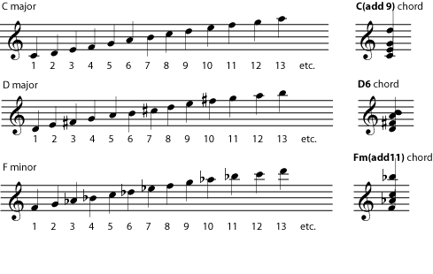

To find out what to call a note added to a chord, count the notes of the scale named by the chord.

The first, third, and fifth (1, 3, and 5) notes of the scale are part of the basic triad. So are any other notes in other octaves that have the same name as 1, 3, or 5. In a C major chord, for example, that would be any C naturals, E naturals, and G naturals. If you want to add a note with a different name, just list its number (its *scale degree*) after the name of the chord.

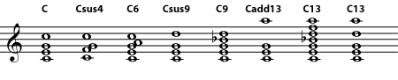

Labelling a number as "sus" (suspended) implies that it replaces the chord tone immediately below it. Labelling it "add" implies that only that note is added. In many other situations, the performer is left to decide how to play the chord most effectively. Chord tones may or may not be left out. In an extended chord, all or some of the notes in the "stack of thirds" below the named note may also be added.

Many of the higher added notes are considered *extensions* of the \"stack of thirds\" begun in the triad. In other words, a C13 can include (it\'s sometimes the performer\'s decision which notes will actually be played) the seventh, ninth, and eleventh as well as the thirteenth. Such a chord can be dominant, major, or minor; the performer must take care to play the correct third and seventh. If a chord symbol says to \"add13\", on the other hand, this usually means that only the thirteenth is added.

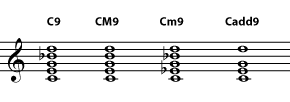

Take care to use the correct third and seventh - dominant, major, or minor - with extended chords. If the higher note is labelled "add", don't include the chord extensions that aren't named.

:::{admonition} Note
:name: m11995-id4965657
:class: note

All added notes and extensions, including sevenths, introduce [dissonance](ch-38-consonance-and-dissonance.md) into the chord. In some modern music, many of these dissonances are heard as pleasant or interesting or jazzy and don\'t need to be resolved. However, in other styles of music, dissonances need to be [resolved](ch-38-consonance-and-dissonance.md), and some chords may be altered to make the dissonance sound less harsh (for example, by leaving out the 3 in a chord with a 4).
:::

You may have noticed that, once you pass the octave (8), you are repeating the scale. In other words, C2 and C9 both add a D, and C4 and C11 both add an F. It may seem that C4 and C11 should therefore be the same chords, but in practice these chords usually do sound different; for example, performers given a C4 chord will put the added note near the bass note and often use it as a temporary replacement for the third (the \"3\") of the chord. On the other hand, they will put the added note of a C11 at the top of the chord, far away from the bass note and piled up on top of all the other notes of the chord (including the third), which may include the 7 and 9 as well as the 11. The result is that the C11 - an *extension* - has a more diffuse, jazzy, or impressionistic sound. The C4, on the other hand, has a more intense, needs-to-be-resolved, classic *suspension* sound. In fact, 2, 4, and 9 chords are often labelled *suspended* (sus), and follow the same rules for [resolution](ch-38-consonance-and-dissonance.md) in popular music as they do in classical.

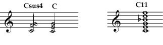

Low-number added notes and high-number added notes are treated differently. So even though they both add an F, a <a href="../images/cnx/feb9a7dbe2e2fe49bb09b410da09a4fe9e5e434f.midi">C4 suspension</a> will sound quite different from a <a href="../images/cnx/e15a86d1a913eb1d1117a3476e9402ff9d3ec6ba.midi">C11</a> extended chord.

## Bass Notes

The [bass line](ch-21-harmony.md) of a piece of music is very important, and the composer/arranger often will want to specify what note should be the lowest-sounding in the chord. At the end of the chord name will be a slash followed by a note name, for example C/E. The note following the slash should be the bass note.

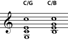

The note following the slash is the bass note of the chord. It can be a note that is already in the chord - making the chord a first or second <a href="ch-36-triads.md">inversion</a> - or it can be an added note, following the same basic rules as other added notes (including using it to replace other notes in the chord).

The note named as the bass note can be a note normally found in the chord - for example, C/E or C/G - or it can be an added note - for example C/B or C/A. If the bass note is not named, it is best to use the [tonic](ch-30-major-keys-and-scales.md) as the primary bass note.

:::{admonition} Practice
:name: m11995-exer4a
:class: exercise

::::{admonition} Question
:name: m11995-id13168015
:class: problem

Name the chords. (Hint: Look for suspensions, added notes, extensions, and basses that are not the root. Try to identify the main triad or root first.)

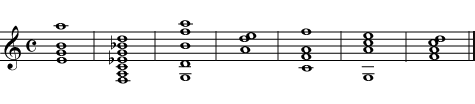

::::

::::{admonition} Solution
:name: m11995-id13624856
:class: solution

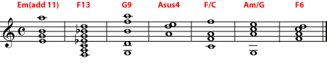

::::
:::

:::{admonition} Practice
:name: m11995-exer4c
:class: exercise

::::{admonition} Question
:name: m11995-id3570981
:class: problem

For guitarists, pianists, and other chord players: Get some practical practice. Name some chords you don\'t have memorized (maybe F6, Am/G, Fsus4, BM7, etc.). Chords with fingerings that you don\'t know but with a sound that you would recognize work best for this exercise. Decide what notes must be in those chords, find a practical fingering for them, play the notes and see what they sound like.
::::

::::{admonition} Solution
:name: m11995-id12231304
:class: solution

- listening to the chords to see if they sound correct
- playing your chords for your teacher or other trained musician
- checking your answers using a chord manual or chord diagrams
::::
:::

## Altering Notes and Chords

If a note in the chord is not in the major or minor scale of the [root](ch-36-triads.md) of the chord, it is an *altered note* and makes the chord an *altered chord*. The alteration - for example \"flat five\" or \"sharp nine\" - is listed in the chord symbol. Any number of alterations can be listed, making some chord symbols quite long. **Alterations are not the same as [accidentals](ch-03-pitch-sharp-flat-and-natural-notes.md).** Remember, a chord symbol always names notes in the scale of the chord [root](ch-36-triads.md), ignoring the [key signature](ch-04-key-signature.md) of the piece that the chord is in, so the alterations are from the scale of the chord, not from the key of the piece.

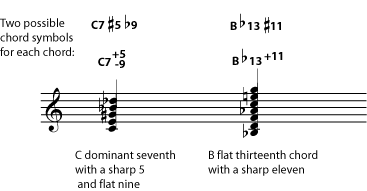

There is some variation in the chord symbols for altered chords. Plus/minus or sharp/flat symbols may appear before or after the note number. When sharps and flats are used, remember that the alteration is always from the scale of the chord root, not from the key signature.

:::{admonition} Practice
:name: m11995-exer4b
:class: exercise

::::{admonition} Question
:name: m11995-id14563769
:class: problem

On a treble clef staff, write the chords named. You can print this [PDF file](../images/cnx/e5b6335c0813bd7797983b645d24962d8ad96e93.pdf) if you need staff paper for this exercise.

1.  D (dominant) seventh with a flat nine
2.  A minor seventh with a flat five
3.  G minor with a sharp seven
4.  B flat (dominant) seventh with a sharp nine
5.  F nine sharp eleven
::::

::::{admonition} Solution
:name: m11995-id4720204
:class: solution

Notice that a half-diminished seventh can be (and sometimes is) written as it is here, as a minor seventh with flat five.

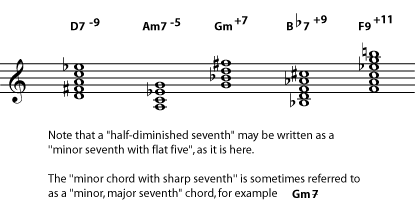

::::
:::
