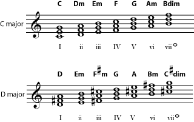
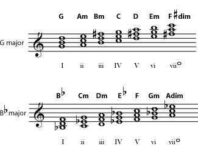
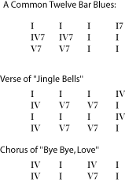
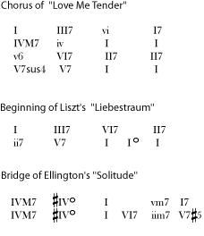
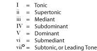
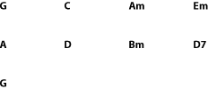
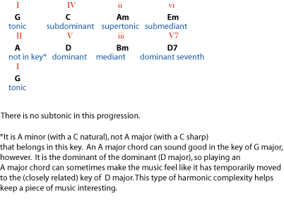
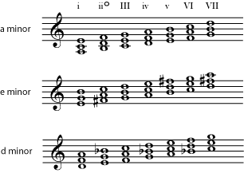
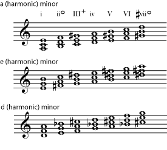

*An introduction to chord relationships within a particular key.*

## Introduction

It sounds like a very technical idea, but basic *harmonic analysis* just means understanding how a chord is related to the key and to the other chords in a piece of music. This can be such useful information that you will find many musicians who have not studied much music theory, and even some who don\'t read music, but who can tell you what the I (\"one\") or the V (\"five\") chord are in a certain key.

Why is it useful to know how chords are related?

- Many standard [forms](ch-42-form.md) (for example, a \"twelve bar blues\") follow very specific [chord progressions](ch-21-harmony.md), which are often discussed in terms of harmonic relationships.
- If you understand chord relationships, you can [transpose](ch-46-transposition-changing-keys.md) any chord progression you know to any [key](ch-30-major-keys-and-scales.md) you like.
- If you are searching for chords to go with a particular [melody](ch-19-melody.md) (in a particular key), it is very helpful to know what chords are most likely in that key, and how they might be likely to progress from one to another.
- Improvisation requires an understanding of the chord progression.
- Harmonic analysis is also necessary for anyone who wants to be able to compose reasonable chord progressions or to study and understand the music of the great composers.

## Basic Triads in Major Keys

Any chord might show up in any key, but some chords are much more likely than others. The most likely chords to show up in a key are the chords that use only the notes in that key (no [accidentals](ch-03-pitch-sharp-flat-and-natural-notes.md)). So these chords have both names and numbers that tell how they fit into the key. (We\'ll just discuss basic [triads](ch-36-triads.md) for the moment, not [seventh chords](ch-39-beyond-triads-naming-other-chords.md) or other [added-note](ch-39-beyond-triads-naming-other-chords.md) or [altered](ch-39-beyond-triads-naming-other-chords.md) chords.) The chords are numbered using Roman numerals from I to vii.

To find all the basic chords in a key, build a simple triad (in the key) on each note of the scale. You'll find that although the chords change from one key to the next, the <strong>pattern</strong> of major and minor chords is always the same.

:::{admonition} Practice
:name: m11643-exer1a
:class: exercise

::::{admonition} Question
:name: m11643-id4875905
:class: problem

Write and name the chords in G major and in B flat major. (Hint: Determine the [key signature](ch-04-key-signature.md) first. Make certain that each chord begins on a note in the [major scale](ch-30-major-keys-and-scales.md) and contains only notes in the key signature.) If you need some staff paper, you can print this [PDF file](../images/cnx/e5b6335c0813bd7797983b645d24962d8ad96e93.pdf)
::::

::::{admonition} Solution
:name: m11643-id1169990950498
:class: solution

::::
:::

You can find all the basic triads that are possible in a key by building one triad, in the key, on each note of the scale (each *scale degree*). One easy way to name all these chords is just to number them: the chord that starts on the first note of the scale is \"I\", the chord that starts on the next scale degree is \"ii\", and so on. Roman numerals are used to number the chords. Capital Roman numerals are used for [major chords](ch-37-naming-triads.md) and small Roman numerals for [minor chords](ch-37-naming-triads.md). The [diminished chord](ch-37-naming-triads.md) is in small Roman numerals followed by a small circle. Because major scales always follow the same pattern, the pattern of major and minor chords is also the same in any major key. The chords built on the first, fourth, and fifth degrees of the scale are always major chords (I, IV, and V). The chords built on the second, third, and sixth degrees of the scale are always minor chords (ii, iii, and vi). The chord built on the seventh degree of the scale is a diminished chord.

:::{admonition} Note
:name: m11643-id1169991630548
:class: note

Notice that IV in the key of B flat is an E flat major chord, not an E major chord, and vii in the key of G is F sharp diminished, not F diminished. If you can\'t name the scale notes in a key, you may find it difficult to predict whether a chord should be based on a sharp, flat, or natural note. This is only one reason (out of many) why it is a good idea to memorize all the scales. (See [Major Keys and Scales](ch-30-major-keys-and-scales.md).) However, if you don\'t plan on memorizing all the scales at this time, you\'ll find it useful to memorize at least the most important chords (start with I, IV, and V) in your favorite keys.
:::

## A Hierarchy of Chords

Even among the chords that naturally occur in a key signature, some are much more likely to be used than others. In most music, the most common chord is I. In [Western music](ch-24-classifying-music.md), I is the [tonal center](ch-30-major-keys-and-scales.md) of the music, the chord that feels like the \"home base\" of the music. As the other two major chords in the key, IV and V are also likely to be very common. In fact, the most common added-note chord in most types of Western music is a V chord (the dominant chord) with a [minor seventh](ch-32-interval.md) added (V7). It is so common that this particular flavor of [seventh](ch-39-beyond-triads-naming-other-chords.md) (a major chord with a minor seventh added) is often called a *dominant seventh*, regardless of whether the chord is being used as the V (the dominant) of the key. Whereas the I chord feels most strongly \"at home\", V7 gives the strongest feeling of \"time to head home now\". This is very useful for giving music a satisfying ending. Although it is much less common than the V7, the diminished vii chord (often with a [diminished seventh](ch-37-naming-triads.md) added), is considered to be a harmonically unstable chord that strongly wants to resolve to I. Listen to these very short progressions and see how strongly each suggests that you must be in the key of C: [C (major) chord(I)](../images/cnx/d66757edce40a55f555be1fd5e6484bd5396141e.midi); [F chord to C chord (IV - I)](../images/cnx/915228ee4d458d72c06e781f1b93f9d852d89151.midi); [G chord to C chord (V - I)](../images/cnx/cb979e897ce075bff068d206a7c8fddafb57822f.midi); [G seventh chord to C chord (V7 - I)](../images/cnx/052357324a454f1fdf0be5853182bbd1c45f65e2.midi); [B diminished seventh chord to C chord (viidim7 - I)](../images/cnx/fe1ec57469c5a8c9916f444a4674ce90e8d07c0f.midi) (Please see [Cadence](ch-41-cadence.md) for more on this subject.)

Many folk songs and other simple tunes can be accompanied using only the I, IV and V (or V7) chords of a key, a fact greatly appreciated by many beginning guitar players. Look at some chord progressions from real music.

Much Western music is harmonically pretty simple, so it can be very useful just to know I, IV, and V in your favorite keys. This figure shows progressions as a list of chords (read left to right as if reading a paragraph), one per measure.

Typically, folk, blues, rock, marches, and [Classical-era](https://cnx.org/content/m15294) music is based on relatively straightforward chord progressions, but of course there are plenty of exceptions. Jazz and some pop styles tend to include many chords with [added](ch-39-beyond-triads-naming-other-chords.md) or [altered](ch-39-beyond-triads-naming-other-chords.md) notes. [Romantic-era](https://cnx.org/content/m11606) music also tends to use more complex chords in greater variety, and is very likely to use chords that are not in the key.

Some music has more complex harmonies. This can include more unusual chords such as major sevenths, and chords with <a href="ch-39-beyond-triads-naming-other-chords.md">altered</a> notes such as sharp fives. It may also include more basic chords that aren't in the key, such as I diminished and II (major), or even chords based on notes that are not in the key such as a sharp IV chord. (Please see <a href="ch-39-beyond-triads-naming-other-chords.md">Beyond Triads</a> to review how to read chord symbols.)

Extensive study and practice are needed to be able to identify and understand these more complex progressions. It is not uncommon to find college-level music theory courses that are largely devoted to harmonic analysis and its relationship to musical forms. This course will go no further than to encourage you to develop a basic understanding of what harmonic analysis is about.

## Naming Chords Within a Key

So far we have concentrated on identifying chord relationships by number, because this system is commonly used by musicians to talk about every kind of music from classical to jazz to blues. There is another set of names that is commonly used, particularly in classical music, to talk about harmonic relationships. Because numbers are used in music to identify everything from beats to intervals to harmonics to what fingering to use, this naming system is sometimes less confusing.

:::{admonition} Practice
:name: m11643-exer3a
:class: exercise

::::{admonition} Question
:name: m11643-id1170000688973
:class: problem

::: {#m11643-prob3a}
1.  Dominant in C major
2.  Subdominant in E major
3.  Tonic in G sharp major
4.  Mediant in F major
5.  Supertonic in D major
6.  Submediant in C major
7.  Dominant seventh in A major
::::
:::

:::{admonition} Solution
:name: m11643-id1169998551566
:class: solution

1.  G major (G)
2.  A major (A)
3.  G sharp major (G#)
4.  A minor (Am)
5.  E minor (Em)
6.  A minor (Am)
7.  E seventh (E7)
:::

:::{admonition} Practice
:name: m11643-exer3b
:class: exercise

::::{admonition} Question
:name: m11643-id1169991829050
:class: problem

The following chord progression is in the key of G major. Identify the relationship of each chord to the key by both name and number. Which chord is not in the key? Which chord in the key has been left out of the progression?

::::

::::{admonition} Solution
:name: m11643-id1169991856132
:class: solution

::::
:::
:::

## Minor Keys

Since [minor scales](ch-31-minor-keys-and-scales.md) follow a different pattern of [intervals](ch-32-interval.md) than major scales, they will produce chord progressions with important differences from major key chord progressions.

:::{admonition} Practice
:name: m11643-minorexercise1
:class: exercise

::::{admonition} Question
:name: m11643-id1169992722515
:class: problem

Write (triad) chords that occur in the keys of A minor, E minor, and D minor. Remember to begin each triad on a note of the [natural minor](ch-31-minor-keys-and-scales.md) scale and to include only notes in the scale in each chord. Which chord relationships are major? Which minor? Which diminished? If you need staff paper, print this [PDF file](../images/cnx/e5b6335c0813bd7797983b645d24962d8ad96e93.pdf)
::::

::::{admonition} Solution
:name: m11643-id1170003907356
:class: solution

The tonic, subdominant, and dominant are minor (i, iv, and v). The mediant, submediant, and subtonic are major (III, VI, and VII). The supertonic (ii) is diminished.

::::
:::

Notice that the actual chords created using the major scale and its [relative minor](ch-31-minor-keys-and-scales.md) scale are the same. For example, compare the chords in A minor (the referenced item) to the chords in C major (the referenced item). The difference is in how the chords are used. As explained above, if the key is C major, the [chord progression](ch-21-harmony.md) will likely make it clear that C is the [tonal center](ch-30-major-keys-and-scales.md) of the piece, for example by featuring the bright-sounding (major) tonic, dominant, and subdominant chords (C major, G major or G7, and F major), particularly in strong [cadences](ch-41-cadence.md) that end on a C chord.

If the piece is in A minor, on the other hand, it will be more likely to feature (particularly in cadences) the tonic, dominant, and subdominant of A minor (the A minor, D minor, and E minor chords). These chords are also available in the key of C major, of course, but they typically are not given such a prominent place.

As mentioned above, the \"flavor\" of sound that is created by a major chord with a minor seventh added, gives a particularly dominant (wanting-to-go-to-the-home-chord) sound, which in turn gives a more strong feeling of tonality to a piece of music. Because of this, many minor pieces change the dominant chord so that it is a dominant seventh (a major chord with a minor seventh), even though that requires using a note that is not in the key.

:::{admonition} Practice
:name: m11643-minorexercise2
:class: exercise

::::{admonition} Question
:name: m11643-id1169996704973
:class: problem

Look at the chords in the referenced item. What note of each scale would have to be changed in order to make v major? Which other chords would be affected by this change? What would they become, and are these altered chords also likely to be used in the minor key?
::::

::::{admonition} Solution
:name: m11643-id1169993963497
:class: solution

The seventh degree of the scale must be raised by one half step to make the v chord major. If the seventh scale note is raised, the III chord becomes augmented, and and the vii chord becomes a diminished chord (based on the sharp vii rather than the vii). The augmented III chord would not be particularly useful in the key, but, as mentioned above, a diminished seventh chord based on the leading tone (here, the sharp vii) is sometimes used in [cadences](ch-41-cadence.md).

::::
:::

The point of the [harmonic minor](ch-31-minor-keys-and-scales.md) scale is to familiarize the musician with this common feature of harmony, so that the expected chords become easy to play in every minor key. There are also changes that can be made to the [melodic](ch-19-melody.md) lines of a minor-key piece that also make it more strongly tonal. This involves raising (by one [half step](ch-29-half-steps-and-whole-steps.md)) both the sixth and seventh scale notes, but only when the melody is ascending. So the musician who wants to become familiar with melodic patterns in every minor key will practice [melodic minor](ch-31-minor-keys-and-scales.md) scales, which use different notes for the ascending and descending scale.

You can begin practicing harmonic analysis by practicing identifying whether a piece is in the major key or in its relative minor. Pick any piece of music for which you have the written music, and use the following steps to determine whether the piece is major or minor:

::: {#m11643-element-634}
- Identify the chords used in the piece, particularly at the very end, and at other important [cadences](ch-41-cadence.md) (places where the music comes to a stopping or resting point). This is an important first step that may require practice before you become good at it. Try to start with simple music which either includes the names of the chords, or has simple chords in the accompaniment that will be relatively easy to find and name. If the chords are not named for you and you need to review how to name them just by looking at the written notes, see [Naming Triads](ch-37-naming-triads.md) and [Beyond Triads](ch-39-beyond-triads-naming-other-chords.md).
- Find the [key signature](ch-04-key-signature.md).
- Determine both the [major key](ch-30-major-keys-and-scales.md) represented by that key signature, and its [relative minor](ch-31-minor-keys-and-scales.md) (the minor key that has the same key signature).
- Look at the very end of the piece. Most pieces will end on the tonic chord. If the final chord is the tonic of either the major or minor key for that key signature, you have almost certainly identified the key.
- If the final chord is not the tonic of either the major or the minor key for that key signature, there are two possibilities. One is that the music is not in a major or minor key! Music from other cultures, as well as some jazz, folk, modern, and pre-[Baroque](https://cnx.org/content/m14737) European music are based on other modes or scales. (Please see [Modes and Ragas](ch-45-modes-and-ragas.md) and [Scales that aren't Major or Minor](ch-35-scales-that-are-not-major-or-minor.md) for more about this.) If the music sounds at all \"exotic\" or \"unusual\", you should suspect that this may be the case.
- If the final chord is not the tonic of either the major or the minor key for that key signature, but you still suspect that it is in a major or minor key (for example, perhaps it has a \"repeat and fade\" ending which avoids coming to rest on the tonic), you may have to study the rest of the music in order to discern the key. Look for important cadences before the end of the music (to identify I). You may be able to identify, just by listening, when the piece sounds as if it is approaching and landing on its \"resting place\". Also look for chords that have that \"dominant seventh\" flavor (to identify V). Look for the specific [accidentals](ch-03-pitch-sharp-flat-and-natural-notes.md) that you would expect if the [harmonic minor](ch-31-minor-keys-and-scales.md) or [melodic minor](ch-31-minor-keys-and-scales.md) scales were being used. Check to see whether the major or minor chords are emphasized overall. Put together the various clues to reach your final decision, and check it with your music teacher or a musician friend if possible.
:::

## Modulation

Sometimes a piece of music temporarily moves into a new key. This is called *modulation*. It is very common in traditional classical music; long symphony and concerto movements almost always spend at least some time in a different key (usually a closely [related key](ch-34-the-circle-of-fifths.md) such as the dominant or subdominant, or the [relative minor or relative major](ch-31-minor-keys-and-scales.md)), in order to keep things interesting. Shorter works, even in classical style, are less likely to have complete modulations. Abrupt changes of key can seem unpleasant and jarring. In most styles of music, modulation is accomplished gradually, using a progression of chords that seems to move naturally towards the new key. But implied modulations, in which the tonal center seems to suddenly shift for a short time, can be very common in some shorter works (jazz standards, for example). As in longer works, modulation, with its new set of chords, is a good way to keep a piece interesting. If you find that the chord progression in a piece of music suddenly contains many chords that you would not expect in that key, it may be that the piece has modulated. Lots of accidentals, or even an actual change of [key signature](ch-04-key-signature.md), are other clues that the music has modulated.

A new [key signature](ch-04-key-signature.md) may help you to identify the modulation key. If there is not a change of key signature, remember that the new key is likely to contain whatever [accidentals](ch-03-pitch-sharp-flat-and-natural-notes.md) are showing up. It is also likely that many of the chords in the progression will be chords that are common in the new key. Look particularly for tonic chords and dominant sevenths. The new key is likely to be [closely related](ch-34-the-circle-of-fifths.md) to the original key, but another favorite trick in popular music is to simply move the key up one [whole step](ch-29-half-steps-and-whole-steps.md), for example from C major to D major. Modulations can make harmonic analysis much more challenging, so try to become comfortable analyzing easier pieces before tackling pieces with modulations.

## Further Study

Although the concept of harmonic analysis is pretty basic, actually analyzing complex pieces can be a major challenge. This is one of the main fields of study for those who are interested in studying music theory at a more advanced level. One next step for those interested in the subject is to become familiar with all the ways notes may be added to basic triads. (Please see [Beyond Triads](ch-39-beyond-triads-naming-other-chords.md) for an introduction to that subject.) At that point, you may want to spend some time practicing analyzing some simple, familiar pieces. Depending on your interests, you may also want to spend time creating pleasing chord progressions by choosing chords from the correct key that will complement a melody that you know. As of this writing, the site [Music Theory for Songwriters](http://www.chordmaps.com) featured \"chord maps\" that help the student predict likely chord progressions.

For more advanced practice, look for music theory books that focus entirely on harmony or that spend plenty of time analyzing harmonies in real music. (Some music history textbooks are in this category.) You will progress more quickly if you can find books that focus on the music genre that you are most interested in (there are books specifically about jazz harmony, for example).
