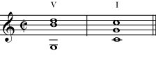
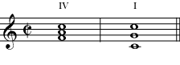
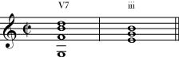
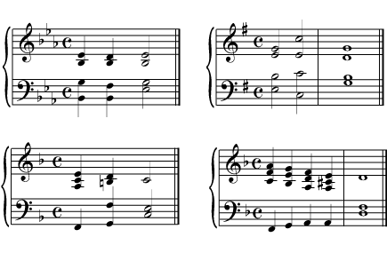
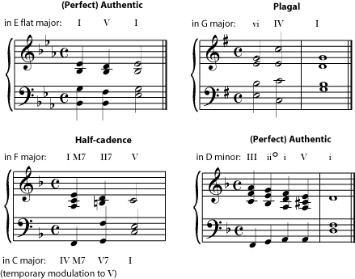

*A cadence is a place in a piece of music that feels like a stopping or resting point. In tonal music, cadences are classified by their chord progressions.*

[]{#m12402-p0a}

A *cadence* is any place in a piece of music that has the feel of an ending point. This can be either a strong, definite stopping point - the end of the piece, for example, or the end of a movement or a verse - but it also refers to the \"temporary-resting-place\" pauses that round off the ends of musical ideas within each larger section.

[]{#m12402-element-538}

A musical [phrase](ch-19-melody.md), like a sentence, usually contains an understandable idea, and then pauses before the next idea starts. Some of these musical pauses are simply take-a-breath-type pauses, and don\'t really give an \"ending\" feeling. In fact, like questions that need answers, many phrases leave the listener with a strong expectation of hearing the next, \"answering\", phrase. Other phrases, though, end with a more definite \"we\'ve arrived where we were going\" feeling. The composer\'s expert control over such feelings of expectation and arrival are one of the main sources of the listener\'s enjoyment of the music.

[]{#m12402-p0c}

Like a story, a piece of music can come to an end by simply stopping, but most listeners will react to such abruptness with dissatisfaction: the story or music simply \"stopped\" instead of \"ending\" properly. A more satisfying ending, in both stories and music, is usually provided by giving clues that an end is coming, and then ending in a commonly-accepted way. Stories are also divided into paragraphs, chapters, stanzas, scenes, or episodes, each with their own endings, to help us keep track of things and understand what is going on. Music also groups phrases and [motifs](ch-19-melody.md) into verses, choruses, sections, and movements, marked off by strong cadences to help us keep track of them. In good stories, there are clues in the plot and the pacing - in the [Western](ch-24-classifying-music.md) tradition, the chase gets more exciting, characters good and bad get what they deserve, the inevitable tragedy occurs, or misunderstandings get resolved - that signal that the end of the story is nearing. Similarly, in music there are clues that signal to the listener that the end is coming up. These clues may be in the [form](ch-42-form.md); in the development of the musical ideas; in the music\'s [tempo](ch-13-tempo.md), [texture](ch-20-texture.md), or [rhythmic](ch-17-rhythm.md) complexity; in the [chord progression](ch-21-harmony.md); even in the number and length of the [phrases](ch-19-melody.md) (Western listeners are fond of [powers of two](https://cnx.org/content/m11809)). Like the ending of a story, an ending in music is more satisfying if it follows certain customs that the listener expects to hear. If you have grown up listening to a particular musical tradition, you will automatically have these expectations for a piece of music, even if you are not aware of having them. And like the customs for storytelling, these expectations can be different in different musical traditions.

::: {#m12402-l0a}
- **Harmony** - In most [Western](ch-24-classifying-music.md) and Western-influenced music (including jazz and \"world\" musics), [harmony](ch-21-harmony.md) is by far the most important signal of cadence. One of the most fundamental \"rules\" of the major-minor harmony system is that music ends on the [tonic](ch-30-major-keys-and-scales.md). A [tonal](ch-24-classifying-music.md) piece of music will almost certainly end on the tonic chord, although individual phrases or sections may end on a different chord (the [dominant](ch-40-beginning-harmonic-analysis.md) is a popular choice). But a composer cannot just throw in a tonic chord and expect it to sound like an ending; the harmony must \"lead up to\" the ending and make it feel inevitable (just as a good story makes the ending feel inevitable, even if it\'s a surprise). So the term *cadence*, in tonal music, usually refers to the \"ending\" chord plus the short [chord progression](ch-21-harmony.md) that led up to it. There are many different terms in use for the most common tonal cadences; you will find the most common terms below. Some (but not all) [modal](ch-45-modes-and-ragas.md) musics also use harmony to indicate cadence, but the cadences used can be quite different from those in tonal harmony.
- **Melody** - In the major/minor tradition, the melody will normally end on some note of the tonic chord [triad](ch-36-triads.md), and a melody ending on the tonic will give a stronger (more final-sounding) cadence than one ending on the third or fifth of the chord. In some [modal](ch-45-modes-and-ragas.md) musics, the melody plays the most important role in the cadence. Like a scale, each mode also has a home note, where the melody is expected to end. A mode often also has a formula that the melody usually uses to arrive at the ending note. For example, it may be typical of one mode to go to the final note from the note one [whole tone](ch-29-half-steps-and-whole-steps.md) below it; whereas in another mode the penultimate note may be a [minor third](ch-32-interval.md) above the final note. (Or a mode may have more than one possible melodic cadence, or its typical cadence may be more complex.)
- **Rhythm** - Changes in the [rhythm](ch-17-rhythm.md), a break or pause in the rhythm, a change in the [tempo](ch-13-tempo.md), or a slowing of or pause in the [harmonic rhythm](ch-21-harmony.md) are also commonly found at a cadence.
- **Texture** - Changes in the [texture](ch-20-texture.md) of the music also often accompany a cadence. For example, the music may momentarily switch from [harmony](ch-21-harmony.md) to unison or from [counterpoint](ch-22-counterpoint.md) to a simpler block-chord [homophony](ch-20-texture.md).
- **Form** - Since cadences mark off phrases and sections, [form](ch-42-form.md) and cadence are very closely connected, and the overall architecture of a piece of music will often indicate where the next cadence is going to be - every eight measures for a certain type of dance, for example. (When you listen to a piece of music, you actually expect and listen for these regularly-spaced cadences, at least subconsciously. An accomplished composer may \"tease\" you by seeming to lead to a cadence in the expected place, but then doing something unexpected instead.)
:::

[]{#m12402-p0d}

[Harmonic analysis](ch-40-beginning-harmonic-analysis.md), [form](ch-42-form.md), and cadence in [Western](ch-24-classifying-music.md) music are closely interwoven into a complex subject that can take up an entire course at the college-music-major level. Complicating matters is the fact that there are several competing systems for naming cadences. This introductory course cannot go very deeply into this subject, and so will only touch on the common terms used when referring to cadences. Unfortunately, the various naming systems may use the same terms to mean different things, so even a list of basic terms is a bit confusing.

::: {#m12402-l0b}
- *Authentic* - A [dominant](ch-40-beginning-harmonic-analysis.md) chord followed by a [tonic](ch-30-major-keys-and-scales.md) chord (V-I, or often V7-I).
- *Complete Cadence* - same as authentic cadence.
- *Deceptive Cadence* - This refers to times that the music seems to lead up to a cadence, but then doesn\'t actually land on the expected tonic, and also often does not bring the expected pause in the music. A deceptive cadence is typically in a major key, and is the dominant followed by the [submediant](ch-40-beginning-harmonic-analysis.md) (V-vi). This means the substituted chord is the relative minor of the tonic chord.
- *False Cadence* - Same as deceptive cadence.
- *Full Close* - Same as authentic cadence.
- *Half-cadence* - May refer to a cadence that ends on the dominant chord (V). This type of cadence is more common at pause-type cadences than at full-stop ones. OR may have same meaning as plagal cadence.
- *Half close* - Same as plagal cadence.
- *Imperfect Cadence* - May refer to an authentic (V-I) cadence in which the chord is not in root position, or the melody does not end on the tonic. **OR** may mean a cadence that ends on the dominant chord (same as one meaning of half-cadence).
- *Interrupted Cadence* - Same as deceptive cadence.
- *Perfect Cadence* - Same as authentic cadence. As its name suggests, this is considered the strongest, most final-sounding cadence. Some do not consider a cadence to be completely perfect unless the melody ends on the tonic and both chords (V and I) are in [root position](ch-36-triads.md).
- *Plagal Cadence* - A [subdominant](ch-40-beginning-harmonic-analysis.md) chord followed by a tonic chord (IV-I). For many people, this cadence will be familiar as the \"Amen\" chords at the end of many traditional hymns.
- *Semi-cadence* - Same possible meanings as half cadence.
:::

[]{#m12402-p0e}

You can listen to a few simple cadences here: [Perfect Cadence](../images/cnx/9657494a64e22d76e66cdd5f2afaf0ade481db40.swf), [Plagal Cadence](../images/cnx/c4dc7b2cdfae4242d77c1fabe956fcf6a1f8a815.swf), [Half-cadence](../images/cnx/f71bf44c5cd57e1dd17eb64e0cdc7961e17cc6ba.swf), [Deceptive Cadence](../images/cnx/cd4ff15550f7774d466dda0db516d5d8308d7697.swf). The figure below also shows some very simple forms of some common cadences. The first step in becoming comfortable with cadences is to start identifying them in music that is very familiar to you. Find the pauses and stops in the music. Do a [harmonic analysis](ch-40-beginning-harmonic-analysis.md) of the last few chords before each stop, and identify what type of cadence it is. Then see if you can begin to recognize the type of cadence just by listening to the music.

[]{#m12402-fig1}
<figure data-orient="vertical">
[]{#m12402-fig1a}
<figure>

<figcaption>Perfect Cadence in C major</figcaption>
</figure>
[]{#m12402-fig1b}
<figure>

<figcaption>Plagal Cadence in C major</figcaption>
</figure>
[]{#m12402-fig1c}
<figure>

<figcaption>Deceptive Cadence in C major</figcaption>
</figure>
</figure>

::: {#m12402-exer1 .exercise}
**Practice**

::: {#m12402-id1168718046314 .problem}
**Question**

[]{#m12402-exerp}

Identify the type of cadence in each excerpt. (Hint: First identify the key and then do a [harmonic analysis](ch-40-beginning-harmonic-analysis.md) of the progression.

[]{#m12402-figprob1}
<figure>

</figure>
:::

::: {#m12402-id1168717725638 .solution}
**Solution**

[]{#m12402-figsolv1}
<figure>

</figure>

[]{#m12402-solvp}

Notice that the half cadence looks like (and in fact is) a [modulation](ch-40-beginning-harmonic-analysis.md) to the dominant. In this very common progression, the dominant seventh of the dominant (which requires an accidental) makes the dominant feel like a very strong resting point, and the piece will continue on in the dominant key for a while, before returning to the tonic key. Also notice the accidental required in the minor key to make the (major) dominant chord.
:::
:::
