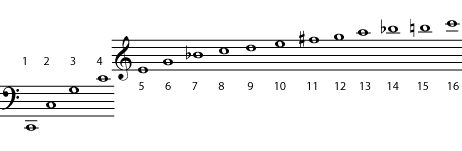
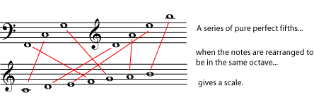
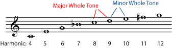
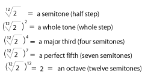
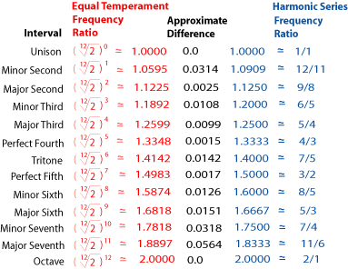
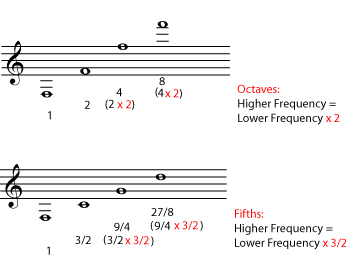

*An overview of music tuning systems*

::: {#m11639-s0 .section}
## Introduction

The first thing musicians must do before they can play together is \"tune\". For musicians in the standard [Western music](ch-24-classifying-music.md) tradition, this means agreeing on exactly what [pitch](ch-03-pitch-sharp-flat-and-natural-notes.md) (what [frequency](ch-25-acoustics-for-music-theory.md)) is an \"A\", what is a \"B flat\" and so on. Other cultures not only have different note names and different scales, they may even have different notes - different pitches - based on a different tuning system. In fact, the modern Western tuning system, which is called *equal temperament*, replaced (relatively recently) other tuning systems that were once popular in Europe. All tuning systems are based on the [physics of sound](ch-25-acoustics-for-music-theory.md). But they all are also affected by the history of their music traditions, as well as by the tuning peculiarities of the instruments used in those traditions. Pythagorean, mean-tone, just intonation, well temperaments, equal temperament, and wide tuning.

To understand all of the discussion below, you must be comfortable with both the musical concept of interval and the physics concept of frequency. If you wish to follow the whole thing but are a little hazy on the relationship between pitch and frequency, the following may be helpful: [Pitch](ch-03-pitch-sharp-flat-and-natural-notes.md); [Acoustics for Music Theory](ch-25-acoustics-for-music-theory.md); [Harmonic Series I: Timbre and Octaves](ch-27-harmonic-series-i-timbre-and-octaves.md); and [Octaves and the Major-Minor Tonal System](ch-28-octaves-and-the-major-minor-tonal-system.md). If you do not know what intervals are (for example, major thirds and perfect fourths), please see [Interval](ch-32-interval.md) and [Harmonic Series II: Harmonics, Intervals and Instruments](ch-33-harmonic-series-ii-harmonics-intervals-and-instruments.md). If you need to review the mathematical concepts, please see [Musical Intervals, Frequency, and Ratio](https://cnx.org/content/m11808) and [Powers, Roots, and Equal Temperament](https://cnx.org/content/m11809#s4). Meanwhile, here is a reasonably nontechnical summary of the information below: Modern Western music uses the equal temperament tuning system. In this system, an [octave](ch-28-octaves-and-the-major-minor-tonal-system.md) (say, from C to C) is divided into twelve equally-spaced notes. \"Equally-spaced\" to a musician basically means that each of these notes is one [half step](ch-29-half-steps-and-whole-steps.md) from the next, and that all half steps sound like the same size pitch change. (To a scientist or engineer, \"equally-spaced\" means that the ratio of the frequencies of the two notes in any half step is always the same.) This tuning system is very convenient for some instruments, such as the piano, and also makes it very easy to change [key](ch-30-major-keys-and-scales.md) without retuning instruments. But a careful hearing of the music, or a look at the physics of the sound waves involved, reveals that equal-temperament pitches are not based on the [harmonics](ch-27-harmonic-series-i-timbre-and-octaves.md) physically produced by any musical sound. The \"equal\" ratios of its half steps are the twelfth root of two, rather than reflecting the simpler ratios produced by the sounds themselves, and the important intervals that build harmonies can sound slightly out of tune. This often leads to some \"tweaking\" of the tuning in real performances, away from equal temperament. It also leads many other music traditions to prefer tunings other than equal temperament, particularly tunings in which some of the important intervals are based on the pure, simple-ratio intervals of physics. In order to feature these favored intervals, a tuning tradition may do one or more of the following: use scales in which the notes are not equally spaced; avoid any notes or intervals which don\'t work with a particular tuning; change the tuning of some notes when the [key](ch-30-major-keys-and-scales.md) or [mode](ch-45-modes-and-ragas.md) changes.
:::

::: {#m11639-s1 .section}
## Tuning based on the Harmonic Series

Almost all music traditions recognize the [octave](ch-28-octaves-and-the-major-minor-tonal-system.md). When note Y has a [frequency](ch-25-acoustics-for-music-theory.md) that is twice the frequency of note Z, then note Y is one octave higher than note Z. A simple mathematical way to say this is that the [ratio](https://cnx.org/content/m11808) of the frequencies is 2:1. Two notes that are exactly one octave apart sound good together because their frequencies are related in such a simple way. If a note had a frequency, for example, that was 2.11 times the frequency of another note (instead of exactly 2 times), the two notes would not sound so good together. In fact, most people would find the effect very unpleasant and would say that the notes are not \"in tune\" with each other.

To find other notes that sound \"in tune\" with each other, we look for other sets of pitches that have a \"simple\" frequency relationship. These sets of pitches with closely related frequencies are often written in [common notation](ch-01-the-staff.md) as a [harmonic series](ch-27-harmonic-series-i-timbre-and-octaves.md). The harmonic series is not just a useful idea constructed by music theory; it is often found in \"real life\", in the real-world physics of musical sounds. For example, a bugle can play only the notes of a specific harmonic series. And every musical note you hear is not a single pure frequency, but is actually a blend of the pitches of a particular harmonic series. The relative strengths of the harmonics are what gives the note its [timbre](ch-18-timbre.md). (See [Harmonic Series II: Harmonics, Intervals and Instruments](ch-33-harmonic-series-ii-harmonics-intervals-and-instruments.md); [Standing Waves and Musical Instruments](ch-26-standing-waves-and-musical-instruments.md); and [Standing Waves and Wind Instruments](https://cnx.org/content/m12589) for more about how and why musical sounds are built from harmonic series.)

Here are the first sixteen pitches in a harmonic series that starts on a C natural. The series goes on indefinitely, with the pitches getting closer and closer together. A harmonic series can start on any note, so there are many harmonic series, but <strong>every harmonic series has the same set of intervals and the same frequency ratios</strong>.

What does it mean to say that two pitches have a \"simple frequency relationship\"? It doesn\'t mean that their frequencies are almost the same. Two notes whose frequencies are almost the same - say, the frequency of one is 1.005 times the other - sound bad together. Again, anyone who is accustomed to precise tuning would say they are \"out of tune\". Notes with a close relationship have frequencies that can be written as a [ratio](https://cnx.org/content/m11808) of two small whole numbers; the smaller the numbers, the more closely related the notes are. Two notes that are exactly the same pitch, for example, have a frequency ratio of 1:1, and octaves, as we have already seen, are 2:1. Notice that when two pitches are related in this simple-ratio way, it means that they can be considered part of the same harmonic series, and in fact the actual harmonic series of the two notes may also overlap and reinforce each other. The fact that the two notes are complementing and reinforcing each other in this way, rather than presenting the human ear with two completely different harmonic series, may be a major reason why they sound [consonant](ch-38-consonance-and-dissonance.md) and \"in tune\".

::: {#m11639-id4532758 .note}
**Note**

Nobody has yet proven a physical basis for why simple-ratio combinations sound pleasant to us. For a readable introduction to the subject, I suggest Robert Jourdain\'s Music, the Brain, and Ecstasy
:::

Notice that the actual frequencies of the notes do not matter. What matters is how they compare to each other - basically, how many waves of one note go by for each wave of the other note. Although the actual frequencies of the notes will change for every harmonic series, the comparative distance between the notes, their [interval](ch-32-interval.md), will be the same.

For more examples, look at the harmonic series in the referenced item. The number beneath a note tells you the relationship of that note\'s frequency to the frequency of the first note in the series - the *fundamental*. For example, the frequency of the note numbered 3 in the referenced item is three times the frequency of the fundamental, and the frequency of the note numbered fifteen is fifteen times the frequency of the fundamental. In the example, the fundamental is a C. That note\'s frequency times 2 gives you another C; times 2 again (4) gives another C; times 2 again gives another C (8), and so on. Now look at the G\'s in this series. The first one is number 3 in the series. 3 times 2 is 6, and number 6 in the series is also a G. So is number 12 (6 times 2). Check for yourself the other notes in the series that are an octave apart. You will find that the ratio for one [octave](ch-28-octaves-and-the-major-minor-tonal-system.md) is always 2:1, just as the ratio for a unison is always 1:1. Notes with this small-number ratio of 2:1 are so closely related that we give them the same name, and most tuning systems are based on this octave relationship.

The next closest relationship is the one based on the 3:2 ratio, the [interval](ch-32-interval.md) of the [perfect fifth](ch-32-interval.md) (for example, the C and G in the example harmonic series). The next lowest ratio, 4:3, gives the interval of a [perfect fourth](ch-32-interval.md). Again, these pitches are so closely related and sound so good together that their intervals have been named \"perfect\". The perfect fifth figures prominently in many tuning systems. In [Western](ch-24-classifying-music.md) music, all major and minor chords contain, or at least strongly imply, a perfect fifth. (See [Triads](ch-36-triads.md) and [Naming Triads](ch-37-naming-triads.md) for more about the intervals in major and minor chords.)

::: {#m11639-s11 .section}
### Pythagorean Intonation

The Pythagorean system is so named because it was actually discussed by Pythagoras, the famous Greek mathematician and philosopher, who in the sixth century B.C. already recognized the simple arithmetical relationship involved in intervals of octaves, fifths, and fourths. He and his followers believed that numbers were the ruling principle of the universe, and that musical harmonies were a basic expression of the mathematical laws of the universe. Their model of the universe involved the \"celestial spheres\" creating a kind of harmony as they moved in circles dictated by the same arithmetical relationships as musical harmonies.

In the Pythagorean system, all tuning is based on the interval of the pure fifth. *Pure intervals* are the ones found in the harmonic series, with very simple frequency ratios. So a pure fifth will have a frequency ratio of exactly 3:2. Using a series of perfect fifths (and assuming perfect octaves, too, so that you are filling in every octave as you go), you can eventually fill in an entire [chromatic scale](ch-29-half-steps-and-whole-steps.md).

You can continue this series of perfect fifths to get the rest of the notes of a chromatic scale; the series would continue F sharp, C sharp, and so on.

The main weakness of the Pythagorean system is that a series of pure perfect fifths will never take you to a note that is a pure octave above the note you started on. To see why this is a problem, imagine beginning on a C. A series of perfect fifths would give: C, G, D, A, E, B, F sharp, C sharp, G sharp, D sharp, A sharp, E sharp, and B sharp. In equal temperament (which doesn\'t use pure fifths), that B sharp would be exactly the same pitch as the C seven octaves above where you started (so that the series can, in essence, be turned into a closed loop, the [Circle of Fifths](ch-34-the-circle-of-fifths.md)). Unfortunately, the B sharp that you arrive at after a series of pure fifths is a little higher than that C.

So in order to keep pure octaves, instruments that use Pythagorean tuning have to use eleven pure fifths and one smaller fifth. The smaller fifth has traditionally been called a *wolf* fifth because of its unpleasant sound. Keys that avoid the wolf fifth sound just fine on instruments that are tuned this way, but keys in which the wolf fifth is often heard become a problem. To avoid some of the harshness of the wolf intervals, some harpsichords and other keyboard instruments were built with split keys for D sharp/E flat and for G sharp/A flat. The front half of the key would play one note, and the back half the other (differently tuned) note.

Pythagorean tuning was widely used in medieval and Renaissance times. Major seconds and thirds are larger in Pythagorean intonation than in equal temperament, and minor seconds and thirds are smaller. Some people feel that using such intervals in medieval music is not only more authentic, but sounds better too, since the music was composed for this tuning system.

More modern Western music, on the other hand, does not sound pleasant using Pythagorean intonation. Although the fifths sound great, the [thirds](ch-32-interval.md) are simply too far away from the pure major and minor thirds of the harmonic series. In medieval music, the third was considered a dissonance and was used sparingly - and actually, when you\'re using Pythagorean tuning, it really is a dissonance - but most modern harmonies are built from thirds (see [Triads](ch-36-triads.md)). In fact, the common harmonic tradition that includes everything from [Baroque](https://cnx.org/content/m14737) counterpoint to modern rock is often called *triadic harmony*.

Some modern Non-Western music traditions, which have a very different approach to melody and harmony, still base their tuning on the perfect fifth. Wolf fifths and ugly thirds are not a problem in these traditions, which build each [mode](ch-45-modes-and-ragas.md) within the framework of the perfect fifth, retuning for different modes as necessary. To read a little about one such tradition, please see [Indian Classical Music: Tuning and Ragas](https://cnx.org/content/m12459).
:::

::: {#m11639-s13 .section}
### Mean-tone System

The mean-tone system, in order to have pleasant-sounding thirds, takes rather the opposite approach from the Pythagorean. It uses the pure [major third](ch-32-interval.md). In this system, the whole tone (or [whole step](ch-29-half-steps-and-whole-steps.md)) is considered to be exactly half of the pure major third. This is the *mean*, or average, of the two tones, that gives the system its name. A semitone (or [half step](ch-29-half-steps-and-whole-steps.md)) is exactly half (another mean) of a whole tone.

These smaller intervals all work out well in mean-tone tuning, but the result is a fifth that is noticeably smaller than a pure fifth. And a series of pure thirds will also eventually not line up with pure octaves, so an instrument tuned this way will also have a problem with wolf intervals.

As mentioned above, Pythagorean tuning made sense in medieval times, when music was dominated by fifths. Once the concept of harmony in thirds took hold, thirds became the most important [interval](ch-32-interval.md); simple perfect fifths were now heard as \"austere\" and, well, medieval-sounding. So mean-tone tuning was very popular in Europe in the 16th through 18th centuries.

But fifths can\'t be avoided entirely. A basic major or minor chord, for example, is built of two thirds, but it also has a perfect fifth between its outer two notes (see [Triads](ch-36-triads.md)). So even while mean-tone tuning was enjoying great popularity, some composers and musicians were searching for other solutions.
:::

::: {#m11639-s12 .section}
### Just Intonation

In just intonation, the fifth and the third are both based on the pure, harmonic series interval. Because chords are constructed of thirds and fifths (see [Triads](ch-36-triads.md)), this tuning makes typical Western harmonies particularly resonant and pleasing to the ear; so this tuning is often used (sometimes unconsciously) by musicians who can make small tuning adjustments quickly. This includes vocalists, most wind instruments, and many string instruments.

As explained above, using pure fifths and thirds will require some sort of adjustment somewhere. Just intonation makes two accommodations to allow its pure intervals. One is to allow inequality in the other intervals. Look again at the harmonic series.

Both the 9:8 ratio and the 10:9 ratio in the harmonic series are written as whole notes. 9:8 is considered a <em>major whole tone</em> and 10:9 a <em>minor whole tone</em>. The difference between them is less than a quarter of a semitone.

As the series goes on, the ratios get smaller and the notes closer together. [Common notation](ch-01-the-staff.md) writes all of these \"close together\" intervals as whole steps (whole tones) or half steps (semitones), but they are of course all slightly different from each other. For example, the notes with frequency ratios of 9:8 and 10:9 and 11:10 are all written as whole steps. To compare how close (or far) they actually are, turn the ratios into decimals.

::: {#m11639-l12a}
- 9/8 = 1.125
- 10/9 = 1.111
- 11/10 = 1.1
:::

These are fairly small differences, but they can still be heard easily by the human ear. Just intonation uses both the 9:8 whole tone, which is called a *major whole tone* and the 10:9 whole tone, which is called a *minor whole tone*, in order to construct both pure thirds and pure fifths.

::: {#m11639-id7409907 .note}
**Note**

In case you are curious, the size of the whole tone of the \"mean tone\" system is also the mean, or average, of the major and minor whole tones.
:::

The other accommodation with reality that just intonation must make is the fact that a single just-intonation tuning cannot be used to play in multiple keys. In constructing a just-intonation tuning, it matters which steps of the scale are major whole tones and which are minor whole tones, so an instrument tuned exactly to play with just intonation in the key of C major will have to retune to play in C sharp major or D major. For instruments that can tune almost instantly, like voices, violins, and trombones, this is not a problem; but it is unworkable for pianos, harps, and other other instruments that cannot make small tuning adjustments quickly.

As of this writing, there was useful information about various tuning systems at several different websites, including [The Development of Musical Tuning Systems](http://www.midicode.com/tunings/index.shtml), where one could hear what some intervals sound like in the different tuning systems, and Kyle Gann\'s [Just Intonation Explained](http://www.kylegann.com/tuning.html), which included some audio samples of works played using just intonation.
:::
:::

::: {#m11639-s2 .section}
## Temperament

There are times when tuning is not much of an issue. When a good choir sings in harmony without instruments, they will tune without even thinking about it. All chords will tend towards pure fifths and thirds, as well as seconds, fourths, sixths, and sevenths that reflect the harmonic series. Instruments that can bend most pitches enough to fine-tune them during a performance - and this includes most orchestral instruments - also tend to play the \"pure\" intervals. This can happen unconsciously, or it can be deliberate, as when a conductor asks for an interval to be \"expanded\" or \"contracted\".

But for many instruments, such as piano, organ, harp, bells, harpsichord, xylophone - any instrument that cannot be fine-tuned quickly - tuning is a big issue. A harpsichord that has been tuned using the Pythagorean system or just intonation may sound perfectly in tune in one key - C major, for example - and fairly well in tune in a [related key](ch-34-the-circle-of-fifths.md) - G major - but badly out of tune in a \"distant\" key like D flat major. Adding split keys or extra keys can help (this was a common solution for a time), but also makes the instrument more difficult to play. In [Western music](ch-24-classifying-music.md), the tuning systems that have been invented and widely used that directly address this problem are the various temperaments, in which the tuning of notes is \"tempered\" slightly from pure intervals. (Non-Western music traditions have their own tuning systems, which is too big a subject to address here. See [Listening to Balinese Gamelan](https://cnx.org/content/m15795) and [Indian Classical Music: Tuning and Ragas](https://cnx.org/content/m12459) for a taste of what\'s out there.)

::: {#m11639-s21 .section}
### Well Temperaments

As mentioned above, the various tuning systems based on pure intervals eventually have to include \"wolf\" intervals that make some keys unpleasant or even unusable. The various *well temperament* tunings that were very popular in the 18th and 19th centuries tried to strike a balance between staying close to pure intervals and avoiding wolf intervals. A well temperament might have several pure fifths, for example, and several fifths that are smaller than a pure fifth, but not so small that they are \"wolf\" fifths. In such systems, tuning would be noticeably different in each [key](ch-30-major-keys-and-scales.md), but every key would still be pleasant-sounding and usable. This made well temperaments particularly welcome for players of difficult-to-tune instruments like the harpsichord and piano.

::: {#m11639-id1170966738408 .note}
**Note**

Historically, there has been some confusion as to whether or not well temperament and equal temperament are the same thing, possibly because well temperaments were sometimes referred to at the time as \"equal temperament\". But these well temperaments made all keys equally useful, not equal-sounding as modern equal temperament does.
:::

As mentioned above, mean-tone tuning was still very popular in the eighteenth century. J. S. Bach wrote his famous \"Well-Tempered Klavier\" in part as a plea and advertisement to switch to a well temperament system. Various well temperaments did become very popular in the eighteenth and nineteenth centuries, and much of the keyboard-instrument music of those centuries may have been written to take advantage of the tuning characteristics of particular keys in particular well temperaments. Some modern musicians advocate performing such pieces using well temperaments, in order to better understand and appreciate them. It is interesting to note that the different keys in a well temperament tuning were sometimes considered to be aligned with specific colors and emotions. In this way they may have had more in common with various [modes and ragas](ch-45-modes-and-ragas.md) than do keys in equal temperament.
:::

::: {#m11639-s22 .section}
### Equal Temperament

In modern times, well temperaments have been replaced by equal temperament, so much so in [Western music](ch-24-classifying-music.md) that equal temperament is considered standard tuning even for voice and for instruments that are more likely to play using just intonation when they can (see above). In equal temperament, only [octaves](ch-28-octaves-and-the-major-minor-tonal-system.md) are pure intervals. The octave is divided into twelve equally spaced [half steps](ch-29-half-steps-and-whole-steps.md), and all other [intervals](ch-32-interval.md) are measured in half steps. This gives, for example, a [fifth](ch-32-interval.md) that is a bit smaller than a pure fifth, and a [major third](ch-32-interval.md) that is larger than the pure major third. The differences are smaller than the wolf tones found in other tuning systems, but they are still there.

Equal temperament is well suited to music that changes [key](ch-30-major-keys-and-scales.md) often, is very [chromatic](ch-24-classifying-music.md), or is [harmonically complex](ch-40-beginning-harmonic-analysis.md). It is also the obvious choice for [atonal](ch-24-classifying-music.md) music that steers away from identification with any key or tonality at all. Equal temperament has a clear scientific/mathematical basis, is very straightforward, does not require retuning for key changes, and is unquestioningly accepted by most people. However, because of the lack of pure intervals, some musicians do not find it satisfying. As mentioned above, just intonation is sometimes substituted for equal temperament when practical, and some musicians would also like to reintroduce well temperaments, at least for performances of music which was composed with well temperament in mind.
:::
:::

::: {#m11639-s3 .section}
## A Comparison of Equal Temperament with the Harmonic Series

In a way, equal temperament is also a compromise between the Pythagorean approach and the mean-tone approach. Neither the third nor the fifth is pure, but neither of them is terribly far off, either. Because equal temperament divides the octave into twelve equal semi-tones (half steps), the frequency ratio of each semi-tone is the twelfth root of 2. If you do not understand why it is the twelfth root of 2 rather than, say, one twelfth, please see the explanation below. (There is a review of powers and roots in [Powers, Roots, and Equal Temperament](https://cnx.org/content/m11809#s4) if you need it.)

In equal temperament, the ratio of frequencies in a semitone (half step) is the twelfth root of two. Every interval is then simply a certain number of semitones. Only the octave (the twelfth power of the twelfth root) is a pure interval.

In equal temperament, the only pure interval is the octave. (The twelfth power of the twelfth root of two is simply two.) All other intervals are given by irrational numbers based on the twelfth root of two, not nice numbers that can be written as a ratio of two small whole numbers. In spite of this, equal temperament works fairly well, because most of the intervals it gives actually fall quite close to the pure intervals. To see that this is so, look at the referenced item. Equal temperament and pure intervals are calculated as decimals and compared to each other. (You can find these decimals for yourself using a calculator.)

Look again at [link] to see where pure interval ratios come from. The ratios for equal temperament are all multiples of the twelfth root of two. Both sets of ratios are converted to decimals (to the nearest ten thousandth), so you can easily compare them.

Except for the unison and the octave, none of the ratios for equal temperament are exactly the same as for the pure interval. Many of them are reasonably close, though. In particular, perfect fourths and fifths and major thirds are not too far from the pure intervals. The intervals that are the furthest from the pure intervals are the major seventh, minor seventh, and minor second (intervals that are considered [dissonant](ch-38-consonance-and-dissonance.md) anyway).

Because equal temperament is now so widely accepted as standard tuning, musicians do not usually even speak of intervals in terms of ratios. Instead, tuning itself is now defined in terms of equal-temperament, with tunings and intervals measured in cents. A *cent* is 1/100 (the hundredth root) of an equal-temperament semitone. In this system, for example, the major whole tone discussed above measures 204 cents, the minor whole tone 182 cents, and a pure fifth is 702 cents.

Why is a cent the hundredth root of a semitone, and why is a semitone the twelfth root of an octave? If it bothers you that the ratios in equal temperament are roots, remember the pure octaves and fifths of the harmonic series.

Remember that, no matter what note you start on, the note one octave higher has 2 times its frequency. Also, no matter what note you start on, the note that is a perfect fifth higher has exactly one and a half times its frequency. Since each of these intervals is so many "times" in terms of frequencies, when you <strong>add</strong> intervals, you <strong>multiply</strong> their frequencies. For example, a series of two perfect fifths will give a frequency that is 3/2 x 3/2 (or 9/4) the beginning frequency.

Every octave has the same frequency ratio; the higher note will have 2 **times** the frequency of the lower note. So if you go up another octave from there (another 2 times), that note must have 2 x 2, or 4 times the frequency of the lowest note. The next octave takes you up 2 times higher than that, or 8 times the frequency of the first note, and so on.

In just the same way, in every perfect fifth, the higher note will have a frequency one and a half (3/2) times the lower note. So to find out how much higher the frequency is after a series of perfect fifths, you would have to multiply (not add) by one and a half (3/2) every time you went up another perfect fifth.

All intervals work in this same way. So, in order for twelve semitones (half steps) to equal one octave, the size of a half step has to be a number that gives the answer \"2\" (the size of an octave) when you multiply it twelve times: in other words, the twelfth root of two. And in order for a hundred cents to equal one semitone, the size of a cent must be the number that, when you multiply it 100 times, ends up being the same size as a semitone; in other words, the hundredth root of the twelfth root of two. This is one reason why most musicians prefer to talk in terms of cents and intervals instead of frequencies.
:::

::: {#m11639-s6 .section}
## Beats and Wide Tuning

One well-known result of tempered tunings is the aural phenomenon known as *beats*. As mentioned above, in a pure interval the sound waves have frequencies that are related to each other by very simple ratios. Physically speaking, this means that the two smooth waves line up together so well that the combined wave - the wave you hear when the two are played at the same time - is also a smooth and very steady wave. Tunings that are slightly off from the pure interval, however, will result in a combined wave that has an extra bumpiness in it. Because the two waves are each very even, the bump itself is very even and regular, and can be heard as a \"beat\" - a very regular change in the intensity of the sound. The beats are so regular, in fact, that they can be timed; for equal temperament they are on the order of a beat per second in the mid range of a piano. A piano tuner works by listening to and timing these beats, rather than by being able to \"hear\" equal temperament intervals precisely.

It should also be noted that some music traditions around the world do not use the type of precision tunings described above, not because they can\'t, but because of an aesthetic preference for *wide tuning*. In these traditions, the sound of many people playing precisely the same pitch is considered a thin, uninteresting sound; the sound of many people playing near the same pitch is heard as full, lively, and more interesting.

Some music traditions even use an extremely precise version of wide tuning. The [gamelan](https://cnx.org/content/m15796) orchestras of southeast Asia, for example, have an aesthetic preference for the \"lively and full\" sounds that come from instruments playing near, not on, the same pitch. In some types of gamelans, pairs of instruments are tuned very precisely so that each pair produces beats, and the rate of the beats is the same throughout the entire [range](ch-23-range.md) of that gamelan. Long-standing traditions allow gamelan craftsmen to reliably produce such impressive feats of tuning.
:::

::: {#m11639-s5 .section}
## Further Study

::: {#m11639-l5a}
- Kyle Gann\'s [An Introduction to Historical Tunings](http://www.kylegann.com/histune.html) is a good source about both the historical background and more technical information about various tunings. It also includes some audio examples.
- The Huygens-Fokker Foundation has a very large on-line [bibliography](http://www.huygens-fokker.org/docs/bibliography.html) of tuning and temperament.
- Alfredo Capurso, a researcher in Italy, has developed the Circular Harmonic System (c.ha.s), a tempered tuning system that solves the wolf fifth problem by adjusting the size of the octave as well as the fifth. It also provides an algorithm for generating microtonal scales. You can read about it at the [Circular Harmonic System website](http://www.chas.it/) or download a [paper](http://math.unipa.it/~grim/Quaderno19_Capurso_09_engl.pdf) on the subject. You can also listen to piano performances using this tuning by searching for \"CHAS tuning\" at YouTube.
- A number of YouTube videos provide comparisons that you can listen to, for example comparisons of just intonation and equal temperament, or comparisons of various temperaments.
:::
:::
