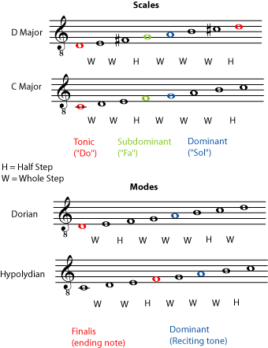
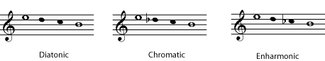
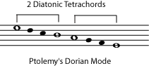
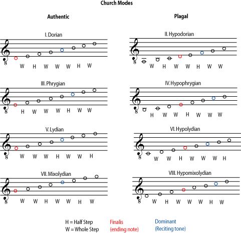
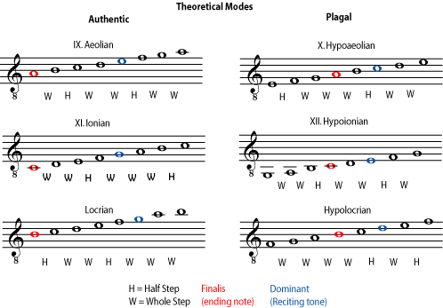
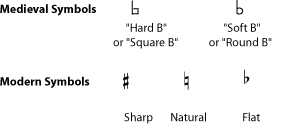
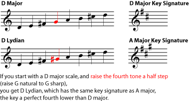
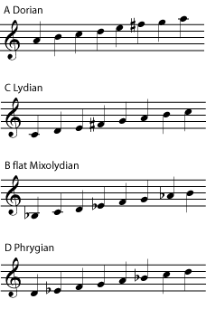

*Many musical traditions, in history as well as in the modern world, are based on modes or ragas rather than on major and minor scales.*

## Introduction

In many music traditions, including [Western music](ch-24-classifying-music.md), the list of all the notes that are expected or allowed in a particular piece of music is a [scale](ch-30-major-keys-and-scales.md). A long tradition of using scales in particular ways has trained listeners to expect certain things from a piece of music. If you hear a song in C major, for example, not only will your ear/brain expect to hear the notes from the C [major scale](ch-30-major-keys-and-scales.md), it will expect to hear them grouped into certain [chords](ch-21-harmony.md), and it will expect the chords to follow each other in certain patterns ([chord progressions](ch-21-harmony.md)) and to end in a certain way (a [cadence](ch-41-cadence.md)). You don\'t have to have any musical training at all to have these expectations; you only need to have grown up in a culture that listens to this kind of music.

The expectations for music in a minor key are a little different than for music in a major key. But it is important to notice that you can move that song in C major to E major, G flat major, or any other major key. It will sound basically the same, except that it will sound higher or lower. In the same way, all minor keys are so alike that music can easily be *transposed* from one minor key to another. (For more on this subject, see [Major Scales](ch-30-major-keys-and-scales.md), [Minor Scales](ch-31-minor-keys-and-scales.md), [Scales that aren\'t Major or Minor](ch-35-scales-that-are-not-major-or-minor.md), and [Transposition](ch-46-transposition-changing-keys.md).)

This sameness is not true for musical traditions that use modes instead of scales. In these traditions, **the *mode*, like a scale, lists the notes that are used in a piece of music. But each mode comes with a different set of expectations in how those notes will be used and arranged.** This module introduces several traditions that are very different from each other, but that are all based on modes or ragas rather than on scales:

- the classical Greek modes
- the medieval church modes
- modal jazz and folk music
- Indian classical music
- Other Nonwestern modal musics

Although very different from each other, one thing that these disparate traditions share is that the modes or ragas that they are based on are much more variable than the major and minor scales of the [tonal system](ch-28-octaves-and-the-major-minor-tonal-system.md). the referenced item shows one example for comparison. The two [major scales](ch-30-major-keys-and-scales.md) use different notes, but the relationship of the notes to each other is very similar. For example, the pattern of [half steps and whole steps](ch-29-half-steps-and-whole-steps.md) in each one is the same, and the [interval](ch-32-interval.md) (distance) between the [tonic](ch-30-major-keys-and-scales.md) and the [dominant](ch-40-beginning-harmonic-analysis.md) is the same. Compare this to the two church modes. The pattern of whole steps and half steps within the [octave](ch-28-octaves-and-the-major-minor-tonal-system.md) is different; this would have a major effect on a chant, which would generally stay within the one octave range. Also, the interval between the finalis and the dominant is different, and they are in different places within the [range](ch-23-range.md) of the mode. The result is that music in one mode would sound quite different than music in the other mode. You can\'t simply [transpose](ch-46-transposition-changing-keys.md) music from one mode to another as you do with scales and keys; modes are too different.

Compare the differences and similarities between the two major scales, and the differences and similarities between the two medieval church modes.

the referenced item shows two scales and two modes. The two [major scales](ch-30-major-keys-and-scales.md) use different notes, but the relationship of the notes to each other is very similar. For example, the pattern of [half steps and whole steps](ch-29-half-steps-and-whole-steps.md) in each one is the same, and the [interval](ch-32-interval.md) (distance) between the [tonic](ch-30-major-keys-and-scales.md) and the [dominant](ch-40-beginning-harmonic-analysis.md) is the same. Compare this to the two church modes. The pattern of whole steps and half steps within the [octave](ch-28-octaves-and-the-major-minor-tonal-system.md) is different; this would have a major effect on a chant, which would generally stay within the one octave range. Also, the interval between the finalis and the dominant is different, and they are in different places within the [range](ch-23-range.md) of the mode. The result is that music in one mode would sound quite different than music in the other mode. You can\'t simply [transpose](ch-46-transposition-changing-keys.md) music from one mode to another as you do with scales and keys; modes are too different.

## The Classical Greek Modes

We don\'t have any recordings of ancient music, so we do not know exactly what it sounded like. But we can make some educated guesses as to what music from ancient Greek and Roman times really sounded like, based on their writings. We know, for example, that they used modes based on *tetrachords*, mini-scales of four notes, in descending [pitch](ch-03-pitch-sharp-flat-and-natural-notes.md) order, all contained within a stretch of a [perfect fourth](ch-32-interval.md). We have very detailed descriptions of tetrachords and of Greek music theory (for example, Harmonics, written by Aristoxenus in the fourth century B.C.).

The perfect fourth is an interval that occurs naturally, for example in string and wind instrument harmonics (see [Standing Waves and Musical Instruments](ch-26-standing-waves-and-musical-instruments.md) for more on this), so we can be pretty certain that we understand that part of ancient Greek music theory. It is more difficult to be certain of the exact tuning of each note within a tetrachord. Enharmonic tetrachords are particularly confusing; it is clear that two of the notes were very close in pitch. As shown in the referenced item, they are often notated so that, using modern tuning, the two notes would sound the same. This sameness is a result of equal-tempered tuning, however; other tuning systems have been used which cause enharmonic notes to be tuned slightly differently. (See [Tuning Systems](ch-44-tuning-systems.md) for more about this.) It is not clear whether these ancient tetrachords actually had only three distinct pitches (it would not be the only time that something existed only to make a theory seem more consistent), or whether the two \"enharmonic\" notes were actually slightly different. References to \"shading\" in some of the ancient texts may have referred to differences in tuning.

Here are three possible Greek tetrachords, as nearly as they can be written in <a href="ch-01-the-staff.md">common notation</a>. It is clear that the outer notes were a perfect fourth apart, but the exact tuning of the inner notes is not certain.

Since a tetrachord fills the interval of a [perfect fourth](ch-32-interval.md), two tetrachords with a [whole step](ch-29-half-steps-and-whole-steps.md) between the end of one and the beginning of the other will fill an octave. Different Greek modes were built from different combinations of tetrachords.

Each Greek mode was built of two tetrachords in a row, filling an octave.

[Western](ch-24-classifying-music.md) composers often consistently choose [minor](ch-31-minor-keys-and-scales.md) keys over [major](ch-30-major-keys-and-scales.md) keys (or vice versa) to convey certain moods (minor for melancholy, for example, and major for serene). One interesting aspect of Greek modes is that different modes were considered to have very different effects, not only on a person\'s mood, but even on character and morality. This may also be another clue that ancient modes may have had more variety of tuning and pitch than modern keys do.

## The Medieval Church Modes

Sacred music in the middle ages in Western Europe - Gregorian chant, for example - was also modal, and the medieval *church modes* were also considered to have different effects on the listener. (As of this writing the site [Ricercares by Vincenzo Galilei](http://www.recorderhomepage.net/galilei.html) had a list of the \"ethos\" or mood associated with each medieval mode.) The names of the church modes were even borrowed from the names of the Greek modes, although the two systems don\'t really correspond to each other, or usemay have sounded more like some of the traditional raga-based Mediterranean and Middle Eastern musics (see below) than like medieval Western-European church music, and to avoid confusion some people prefer to name the church modes using Roman numerals.

The modes came in pairs which shared the same finalis.

A mode can be found by playing all the \"white key\" notes on a piano for one octave. From D to D, for example is Dorian; from F to F is Lydian. Notice that no church modes began on A, B, or C. This is because a B flat was allowed, and the modes beginning on D, E, and F, when they use a B flat, have the same note patterns and relationships as would modes beginning on A, B, and C. After the middle ages, modes beginning on A, B, and C were named, but they are still not considered church modes. Notice that the Aeolian (or the Dorian using a B flat) is the same as an A (or D) [natural minor](ch-31-minor-keys-and-scales.md) scale and the Ionian (or the Lydian using a B flat) is the same as a C (or F) major scale.

These modes are part of the same theoretical system as the church modes, but they were not used in the middle ages.

Each of these modes can easily be found by playing its one octave range, or *ambitus*, on the \"white key\" notes on a piano. But the Dorian mode, for example, didn\'t have to start on the pitch we call a D. The important thing was the pattern of half steps and whole steps within that octave, and their relationship to the notes that acted as the modal equivalent of [tonal centers](ch-30-major-keys-and-scales.md), the finalis and the dominant. Generally, the last note of the piece was the *finalis*, giving it the same \"resting place\" function as a modern [tonic note](ch-30-major-keys-and-scales.md). The *dominant*, also called the *reciting tone* or *tenor*, was the note most often used for long recitations on the same pitch.

:::{admonition} Note
:name: m11633-eip-id1168673833280
:class: note

The dominant in modal music did not have the harmonic function that the dominant has in tonal music. See [harmonic analysis](ch-40-beginning-harmonic-analysis.md) for a discussion of the dominant in modern music.
:::

In our modern tonal system, any note may be [sharp, flat, or natural](ch-03-pitch-sharp-flat-and-natural-notes.md), but in this modal system, only the B was allowed to vary. The symbols used to indicate whether the B was \"hard\" (our B natural) or \"soft\" (our B flat) eventually evolved into our symbols for sharps, flats, and naturals. All of this may seem very arbitrary, but it\'s important to remember that medieval mode theory, just like our modern music theory, was not trying to invent a logical system of music. It was trying to explain, describe, and systematize musical practices that were already flourishing because people liked the way they sounded.

The modern symbols for sharp, natural, and flat evolved from medieval notation indicating what type of B should be used.

The [tuning system](ch-44-tuning-systems.md) used in medieval Europe was also not our familiar [equal temperament](ch-44-tuning-systems.md) system. It was a [just intonation](ch-44-tuning-systems.md) system, based on a [pure](ch-44-tuning-systems.md) [perfect fifth](ch-32-interval.md). In this system, [half steps](ch-29-half-steps-and-whole-steps.md) are not all equal to each other. Slight adjustments are made in tuning and intervals to make them more pleasant to the ear; and the medieval ear had different preferences than our modern ears. This is another reason that modes sounded very different from each other, although that particular difference may be missing today when chant is sung using equal temperament.

## Modal Jazz and Folk Music

Some jazz and folk music is also considered modal and also uses the Greek/medieval mode names. In this case, the scales used are the same as the medieval church modes, but they do not have a reciting tone and are used much more like modern major and minor scales. Modal European (and American) folk music tends to be older tunes that have been around for hundreds of years. Modal jazz, on the other hand, is fairly new, having developed around 1960.

It is important to remember when discussing these types of music that it does not matter what specific note the modal scale starts on. What matters is the pattern of notes within the scale, and the relationship of the pattern to the [tonic](ch-30-major-keys-and-scales.md)/finalis. For example, note that the Dorian \"scale\" as written above starts on a D but basically has a C major key signature, resulting in the third and seventh notes of the scale being a [half step](ch-29-half-steps-and-whole-steps.md) lower than in a D major scale. (A jazz musician would call this *flatted* or *flat* thirds and sevenths.) So **any scale with a flatted third and seventh can be called a Dorian scale**.

:::{admonition} Practice
:name: m11633-ex6a
:class: exercise

::::{admonition} Question
:name: m11633-id7750639
:class: problem

You need to know your [major keys](ch-30-major-keys-and-scales.md) and [intervals](ch-32-interval.md) to do this problem. Use the list of \"white key\" modes in the referenced item to figure out the following information for each of the four modes below. Before looking at the solutions, check your own answers to make sure that the answers you get for step 2 and step 4 are in agreement with each other.

1.  List the flats and sharps you would use if this were a major scale rather than a mode.
2.  In this mode, which scale tones are raised or lowered from the major key?
3.  What is the interval between the mode and the major key with the same key signature?
4.  List the flats or sharps in this key signature.
5.  Write one octave of notes in this mode. You may print out this [PDF file](../images/cnx/e5b6335c0813bd7797983b645d24962d8ad96e93.pdf) if you need staff paper. Check to make sure that your \"modal scale\" agrees with all the things that you have written about it already.

::: {#m11633-element-783}
1.  D major has 2 sharps: F sharp and C sharp.
2.  Looking at the referenced item, you can see that the Lydian mode starts on an F. The key of F major would have a B flat, but in the mode this is raised one half step, to B natural. Therefore **the fourth degree of the Lydian mode is raised one half step**.
3.  F lydian has the same key signature as C major, which is a perfect fourth lower. So all Lydian modes have the same key signature as the major key a perfect fourth below them.
4.  We want D Lydian. The major scale beginning a perfect fourth below D major is A major. A major has three sharps: F sharp, C sharp and G sharp. Adding a G sharp does raise the fourth degree of the scale by one half step, just as predicted in step 2.
::::

1.  A Dorian
2.  C Lydian
3.  B flat Mixolydian
4.  D Phrygian
:::

:::{admonition} Solution
:name: m11633-id8644302
:class: solution

:::
:::

## The Ragas of Classical Indian Music

The [ragas](https://cnx.org/content/m12459) of classical India and other, similar traditions, are more like modes than they are like scales. Like modes, different ragas sound very different from each other, for several reasons. They may have different interval patterns between the \"scale\" notes, have different expectations for how each note of the raga is to be used, and may even use slightly different tunings. Like the modal musics discussed above, individual Indian ragas are associated with specific moods.

In fact, in practice, ragas are even more different from each other than the medieval European modes were. The raga dictates how each note should be used, more specifically than a modal or major-minor system does. Some pitches will get more emphasis than others; some will be used one way in an ascending melody and another way in a descending melody; some will be used in certain types of ornaments. And these rules differ from one raga to the next. The result is that each raga is a collection of melodic scales, phrases, motifs, and ornaments, that may be used together to construct music in that raga. The number of possible ragas is practically limitless, and there are hundreds in common use. A good performer will be familiar with dozens of ragas and can improvise music - traditional classical music in India is improvised - using the accepted format for each raga.

The raga even affects the tuning of the notes. Indian classical music is usually accompanied by a tanpura, which plays a drone background. The tanpura is usually tuned to a [pure](ch-44-tuning-systems.md) [perfect fifth](ch-32-interval.md), so, just as in medieval European music, the tuning system is a [just intonation](ch-44-tuning-systems.md) system. As in [Western](ch-24-classifying-music.md) just intonation, the octave is divided into twelve possible notes, only some of which are used in a particular raga (just as Westerners use only some of the twelve notes in each key). But as was true for the church modes, using the pure perfect fifth means that some \"half steps\" will be larger than others. (If you would like to understand why this is so, please see [Harmonic Series II](ch-33-harmonic-series-ii-harmonics-intervals-and-instruments.md) and [Tuning Systems](ch-44-tuning-systems.md).) Even though the variations between these different \"half steps\" are small, they strongly affect the sound of the music. So, the tuning of some of the notes (not the ones dictated by the tanpura) may be adjusted to better suit a particular raga. (Please see [Listening to Indian Classical Music](https://cnx.org/content/m12502) and [Indian Classical Music: Tuning and Ragas](https://cnx.org/content/m12459) for more information on this subject.)

## Other Non-Western Modal Musics

To the average Western listener, medieval European chant and classical Indian music are the two most familiar traditions that are not based on major and minor scales. But many other musical traditions around the world are not based on Western scales. Some of these have modes similar to the medieval Church modes; they also tend to be a list of notes (or a pattern of [intervals](ch-32-interval.md)) used with a specific finalis, which may encourage certain types of melodies. While the church mode/jazz mode tradition features [diatonic](ch-24-classifying-music.md) modes (which can be played using only the white keys of a piano), non-Western modes may use [other types of scales](ch-35-scales-that-are-not-major-or-minor.md).

In other music traditions, modes are much more like Indian ragas, featuring important variations in tuning and melodic expectations from one mode to the next, so that each mode may be seen as a collection of related melodic ideas, phrases, and ornamentations that are traditionally played with a certain set of notes tuned in a certain way. (Some non-Indian traditions even use the term raga.) All of these musics have long traditions that are very different from the familiar major-minor tonal system, and usually also have a different approach to harmony, rhythm, and performance practice.

## Bibliography

Donald Jay Grout\'s A History of Western Music introduces both Greek and medieval modes. Lee Evans\'s Modes and Their Use in Jazz is both comprehensive and accessible for any musician who wants to begin to study that subject. For Western musicians, an introduction to ragas, that is neither too vague nor too technical, does not seem to be available as of this writing.
