*Transposition, or changing the key of a piece of music, can be useful and is sometimes necessary to make music more singable or playable. Music is transposed by raising or lowering every note by the same interval.*

Changing the [key](ch-30-major-keys-and-scales.md) of a piece of music is called *transposing* the music. Music in a [major key](ch-30-major-keys-and-scales.md) can be transposed to any other major key; music in a [minor key](ch-31-minor-keys-and-scales.md) can be transposed to any other minor key. (Changing a piece from minor to major or vice-versa requires many more changes than simple transposition.) A piece will also sound higher or lower once it is transposed. There are some ways to avoid having to do the transposition yourself, but learning to transpose can be very useful for performers, composers, and arrangers.

## Why Transpose?

Here are the most common situations that may require you to change the key of a piece of music:

- To put it in the right key for your **vocalists**. If your singer or singers are struggling with notes that are too high or low, changing the key to put the music in their [range](ch-23-range.md) will result in a much better performance.
- Instrumentalists may also find that a piece is **easier to play** if it is in a different key. Players of both bowed and plucked strings generally find fingerings and tuning to be easier in sharp keys, while woodwind and brass players often find flat keys more comfortable and in tune.
- Instrumentalists with **transposing instruments** will usually need any part they play to be properly transposed before they can play it. [Clarinet](https://cnx.org/content/m12604), [French horn](https://cnx.org/content/m11617), [saxophone](https://cnx.org/content/m12611), [trumpet, and cornet](https://cnx.org/content/m12606) are the most common [transposing instruments](https://cnx.org/content/m10672).

## Avoiding Transposition

In some situations, you can avoid transposition, or at least avoid doing the work yourself. Some stringed instruments - guitar for example - can use a [capo](https://cnx.org/content/m12745#p9c) to play in higher keys. A good electronic keyboard will transpose for you. If your music is already stored as a computer file, there are programs that will transpose it for you and display and print it in the new key. However, if you only have the music on paper, it may be easier to transpose it yourself than to enter it into a music program to have it transposed. So if none of these situations apply to you, it\'s time to learn to transpose.

:::{admonition} Note
:name: m10668-id13477534
:class: note

If you play a chordal instrument (guitar, for example), you may not need to write down the transposed music. There are instructions below for transposing just the names of the chords.
:::

## How to Transpose Music

There are four steps to transposition:

1.  Choose your transposition.
2.  Use the correct [key signature](ch-04-key-signature.md).
3.  Move all the notes the correct [interval](ch-32-interval.md).
4.  Take care with your [accidentals](ch-03-pitch-sharp-flat-and-natural-notes.md).

### Step 1: Choose Your Transposition

In many ways, this is the most important step, and the least straightforward. The transposition you choose will depend on why you are transposing. If you already know what transposition you need, you can go to step two. If not, please look at the relevant sections below first:

- Are you rewriting the music for a transposing instrument?
- Are you looking for a key that is in the range of your vocalist?
- Are you looking for a key that is more playable on your instrument?

### Step 2: Write the New Key Signature

If you have chosen the transposition because you want a particular key, then you should already know what key signature to use. (If you don\'t, see [Key Signature](ch-04-key-signature.md).) If you have chosen the transposition because you wanted a particular interval (say, a whole step lower or a perfect fifth higher), then the key changes by the same interval. For example, if you want to transpose a piece in D major up one [whole step](ch-29-half-steps-and-whole-steps.md), the key also moves up one whole step, to E major. Transposing a piece in B minor down a [major third](ch-32-interval.md) will move the key signature down a major third to G minor. For more information on and practice identifying intervals, see [Interval](ch-32-interval.md). For further information on how moving music up or down changes the key signature, see [The Circle of Fifths](ch-34-the-circle-of-fifths.md).

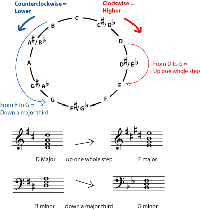

You must know the interval between the old and new keys, and you must know the new key signature. This step is very important; if you use the wrong key signature, the transposition will not work.

### Step 3: Transpose the Notes

Now rewrite the music, changing all the notes by the correct interval. You can do this for all the notes in the key signature simply by counting lines and spaces. As long as your key signature is correct, you do not have to worry about whether an interval is major, minor, or perfect.

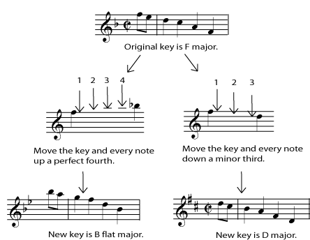

Did you move the key down a minor third? Simply move all the notes down a third in the new key; count down three lines-or-spaces to find the new spot for each note. Did you move the key up a perfect fourth? Then move all the notes up four lines-and-spaces. Remember to count every line and every space, including the ones the notes start on and end on. Once you get the hang of it, this step is very straightforward, but it may take a while if you have a lot of music.

### Step 4: Be Careful with Accidentals

Most notes can simply be moved the correct number of lines and spaces. Whether the interval is minor, major, or perfect will take care of itself if the correct key signature has been chosen. But some care must be taken to correctly transpose accidentals. Put the note on the line or space where it would fall if it were not an accidental, and then either lower or raise it from your new key signature. For example, an accidental B natural in the key of E flat major has been raised a half step from the note in the key (which is B flat). In transposing down to the key of D major, you need to raise the A natural in the key up a half step, to A sharp. If this is confusing, keep in mind that the interval between the old and new (transposed) notes (B natural and A sharp) must be one half step, just as it is for the notes in the key.

:::{admonition} Note
:name: m10668-id15529573
:class: note

If you need to raise a note which is already sharp in the key, or lower a note that is already flat, use [double sharps or double flats](ch-03-pitch-sharp-flat-and-natural-notes.md).
:::

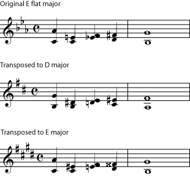

Flats don't necessarily transpose as flats, or sharps as sharps. For example, if the accidental originally raised the note one half step out of the key, by turning a flat note into a natural, the new accidental may raise the note one half step out of the key by turning a natural into a sharp.

:::{admonition} Practice
:name: m10668-exer4a
:class: exercise

::::{admonition} Question
:name: m10668-id6618048
:class: problem

The best practice for transposing is to transpose a piece you know well into a new key.
::::

::::{admonition} Solution
:name: m10668-id4449824
:class: solution

Play the part you have transposed; your own ears will tell you where you have made mistakes.
::::
:::

## Choosing Your New Key

Before you can begin transposing, you must decide what your new [key](ch-30-major-keys-and-scales.md) will be. This will depend on why you are transposing, and what kinds of vocalists and instrumentalists you are working with.

### Working with Vocalists

If you are trying to accomodate singers, your main concern in choosing a key is finding their [range](ch-23-range.md). Is the music you are working with too high or too low? Is it only a step too high, or does it need to be changed by a third or a fifth? Once you determine the [interval](ch-32-interval.md) needed, check to make certain this will be a comfortable key for your instrumentalists.

:::{admonition} Example
:name: m10668-vocal1
:class: example

A church choir director wants to encourage the congregation to join in on a particular hymn. It is written in four parts with the melody in the soprano part, in a range slightly too high for untrained singers. The hymn is written in the key of E flat. Lowering it by a minor third (one and a half steps) will allow the congregation to sing with gusto.

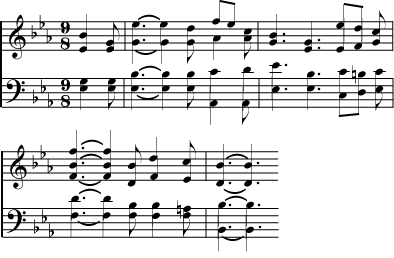

The hymn is originally in E flat. The melody that goes up to an F is too high for most untrained vocalists (male and female).

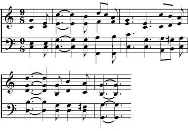

The same hymn in C is more easily singable by a congregation.

:::

:::{admonition} Example
:name: m10668-vocal2
:class: example

An alto vocalist would like to perform a blues standard originally sung by a soprano or tenor in B flat. She needs the song to be at least a [whole step](ch-29-half-steps-and-whole-steps.md) lower. Lowering it by a whole step would put it in the key of A flat. The guitar, bass, and harmonica players don\'t like to play in A flat, however, and the vocalist wouldn\'t mind singing even lower. So the best solution is to lower it by a [minor third](ch-32-interval.md), and play in the key of G.

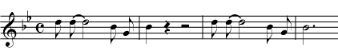

The key of this blues standard is comfortable for a soprano or tenor, as shown in this excerpt.

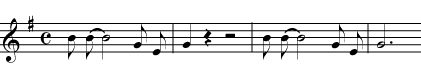

An alto or baritone can deliver a more powerful performance if the music is transposed down a minor third.

:::

:::{admonition} Practice
:name: m10668-exer3
:class: exercise

::::{admonition} Question
:name: m10668-id16799556
:class: problem

You\'re accompanying a soprano who feels that this folk tune in C minor is too low for her voice. The guitar player would prefer a key with no flats and not too many sharps.

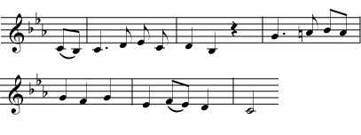

Tune in C minor too low for some sopranos voices.

::::

::::{admonition} Solution
:name: m10668-id8918373
:class: solution

Transposing up a [major third](ch-32-interval.md), to E minor, puts the song in a better range for a soprano, with a key signature that is easy for guitars.

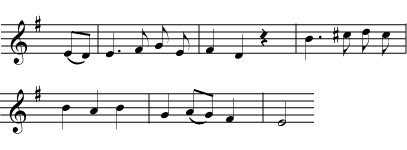

Moving tune up to E minor puts it in a better key for sopranos.

::::
:::

### Transposing Instruments

*Transposing instruments* are instruments for which standard parts are written higher or lower than they sound. A very accomplished player of one of these instruments may be able to transpose at sight, saving you the trouble of writing out a transposed part, but most players of these instruments will need a transposed part written out for them. Here is a short list of the most common transposing instruments. For a more complete list and more information, see [Transposing Instruments](https://cnx.org/content/m10672).

- [Clarinet](https://cnx.org/content/m12604) is usually (but not always) a B flat instrument. Transpose C parts up one whole step for B flat instruments. (In other words, write a B flat part one whole step higher than you want it to sound.)
- [Trumpet and Cornet](https://cnx.org/content/m12606) parts can be found in both B flat and C, but players with B flat instruments will probably want a B flat (transposed) part.
- [French Horn](https://cnx.org/content/m11617) parts are usually in F these days. However, because of the instrument\'s history, older orchestral parts may be in any conceivable transposition, even changing transpositions in the middle of the piece. Because of this, some horn players learn to transpose at sight. Transpose C parts up a perfect fifth to be read in F.
- [Alto and Baritone Saxophone](https://cnx.org/content/m12611) are E flat instruments. Transpose parts up a major sixth for alto sax, and up an octave plus a major sixth for bari sax.
- [Soprano and Tenor Saxophone](https://cnx.org/content/m12611) are B flat instruments. Tenor sax parts are written an octave plus one step higher.

:::{admonition} Note
:name: m10668-id9544707
:class: note

Why are there transposing instruments? Sometimes this makes things easier on instrumentalists; they may not have to learn different fingerings when they switch from one kind of saxophone to another, for example. Sometimes, as with piccolo, transposition centers the music in the staff (rather than above or below the staff). But often transposing instruments are a result of the history of the instrument. See the history of the [French horn](https://cnx.org/content/m11617#s2) to find out more.
:::

The transposition you will use for one of these instruments will depend on what type of part you have in hand, and what instrument you would like to play that part. As with any instrumental part, be aware of the [range](ch-23-range.md) of the instrument that you are writing for. If transposing the part up a perfect fifth results in a part that is too high to be comfortable, consider transposing the part down a perfect fourth instead.

1.  Ask: what type of part am I transposing and what type of part do I want? Do you have a C part and want to turn it into an F part? Do you want to turn a B flat part into a C part? **Non-transposing parts are considered to be C parts.** The written key signature has nothing to do with the type of part you have; only the part\'s transposition from concert pitch (C part) matters for this step.
2.  Find the interval between the two types of part. For example, the difference between a C and a B flat part is one whole step. The difference between an E flat part and a B flat part is a perfect fifth.
3.  Make sure you are transposing in the correct direction. If you have a C part and want it to become a B flat part, for example, you must transpose **up** one whole step. This may seem counterintuitive, but remember, **you are basically compensating for the transposition that is \"built into\" the instrument**. To compensate properly, always transpose by moving in the opposite direction from the change in the part names. To turn a B flat part into a C part (B flat to C = up one step), transpose the part down one whole step. To turn a B flat part into an E flat part (B flat to E flat = down a perfect fifth), transpose the part up a perfect fifth.
4.  Do the correct transposition by interval, including changing the written key by the correct interval.

:::{admonition} Example
:name: m10668-CtoEb
:class: example

Your garage band would like to feature a solo by a friend who plays the alto sax. Your songwriter has written the solo as it sounds on his keyboard, so you have a C part. Alto sax is an E flat instrument; in other words, when he sees a C, he plays an E flat, the note a [major sixth](ch-32-interval.md) lower. To compensate for this, you must write the part a major sixth higher than your C part.

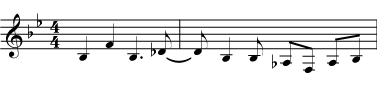

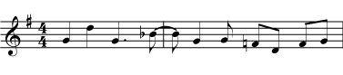

In the top line, the melody is written out in concert pitch; on the second line it has been transposed to be read by an alto saxophone. When the second line is played by an alto sax player, the result sounds like the first line.

:::

:::{admonition} Example
:name: m10668-btoc
:class: example

Your choral group is performing a piece that includes an optional instrumental solo for clarinet. You have no clarinet player, but one group member plays recorder, a C instrument. Since the part is written for a B flat instrument, it is written one whole step higher than it actually sounds. To write it for a C instrument, transpose it back down one whole step.

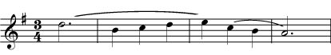

Melody for B flat clarinet

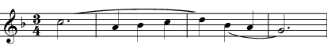

Melody transposed for C instruments

:::

:::{admonition} Practice
:name: m10668-ex2
:class: exercise

::::{admonition} Question
:name: m10668-id13971957
:class: problem

There\'s a march on your community orchestra\'s program, but the group doesn\'t have quite enough trombone players for a nice big march-type sound. You have extra French horn players, but they can\'t read bass clef C parts.

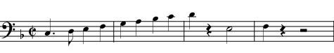

Trombone line from a march

::::

::::{admonition} Solution
:name: m10668-id3548422
:class: solution

The trombone part is in C in bass clef; the horn players are used to reading parts in F in treble clef. Transpose the notes up a perfect fifth and write the new part in treble clef.

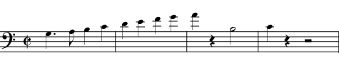

This is the same part transposed up a fifth so that it is in F

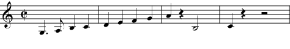

Now write it in treble clef to make it easy for horn players to read.

::::
:::

### Playable Keys

Transposition can also make music easier to play for instrumentalists, and ease of playing generally translates into more satisfying performances. For example, someone writing a transcription for band of an orchestral piece may move the entire piece from a sharp key (easier for strings) to a nearby flat key (easier for winds). A [guitar](https://cnx.org/content/m12745) player, given a piece written in A flat for keyboard, will often prefer to play it in A or G, since the fingerings for chords in those keys are easier. Also, instrumentalists, like vocalists, have [ranges](ch-23-range.md) that need to be considered.

:::{admonition} Example
:name: m10668-arrange
:class: example

Your eighth grade [bassoon](https://cnx.org/content/m12612) player would like to play a Mozart minuet at a school talent show with a flute-playing friend from band. The minuet is in C, but the melody is a little too low for a [flute](https://cnx.org/content/m12603), and the bassoonist would also be more comfortable playing higher. If you transpose the whole piece up a minor third to E flat major, both players can hit the lowest notes, and you may also find that fingerings and tunings are better in the flat key.

An excerpt from a Mozart Minuet in C. The upper part is too low for a flute player.

Both young instrumentalists would be more comfortable playing in this key.

:::

:::{admonition} Practice
:name: m10668-ex1
:class: exercise

::::{admonition} Question
:name: m10668-id4406688
:class: problem

You\'ve brought your guitar and your [capo](https://cnx.org/content/m12745#p9c) to the sing-along because you\'d like to play along, too. Going through the music beforehand, you notice that your favorite song is in A flat. The pianist isn\'t prepared to play it in any other key, but you really don\'t like those thin-sounding chords in A flat. You can use your capo to raise the sound of your instrument (basically turning it into a transposing instrument in C sharp, D, D sharp, or even higher), but the less you raise it the more likely you are to still sound in tune with the piano.

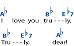

Chords in the key of A flat major are not ideal for guitarists.

::::

::::{admonition} Solution
:name: m10668-id7396982
:class: solution

Put the capo on the first fret to raise the sound by one half step. Then transpose the chords down one half step. You will be playing in G, a nice strong key for guitar, but sounding in A flat. For more on transposing chords, see Transposing Chord Names

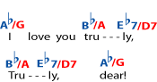

Giving guitarists the option of playing in G major (with a capo) can make things easier.

::::
:::

## Transposing at Sight

*Transposing at sight* means being able to read a part written in one key while playing it in another key. Like any other performance skill, it can be learned with practice, and it is a skill that will help you become an extremely versatile instrumentalist. (Vocalists transpose at sight without even thinking about it, since they don\'t have to worry about different fingerings.) To practice this skill, simply start playing familiar pieces in a different key. Since you know the piece, you will recognize when you make a mistake. Start with pieces written in C, and play them only a half step or whole step lower or higher than written. When this is easy, move on to more challenging keys and larger intervals. Practice playing in an unfamiliar [clef](ch-02-clef.md), for example bass clef if you are used to reading treble clef. Or, if you play a [transposing instrument](https://cnx.org/content/m10672), work on being able to play C parts on sight. You may find more opportunities to play (and earn the gratitude of your fellow musicians) if you can say, \"we can change keys if you like\", or \"I can cover that bass clef C part for you, no problem.\"

## Transposing Chord Names

If you are transposing entire chords, and you know the name of the chord, you may find it easier to simply transpose the name of the chord rather than transposing each individual note. In fact, transposing in this way is simple enough that even a musician who can\'t read music can do it.

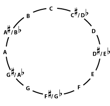

When transposing, you can use the <a href="ch-29-half-steps-and-whole-steps.md">chromatic</a> circle both to change the name of the key (as above) and to change chord names, because the basic idea is the same; the entire piece (chords, notes, and key) must move the same number of <a href="ch-29-half-steps-and-whole-steps.md">half steps</a> in the same direction. If you're using a chromatic circle to transpose the names of all the chords in a piece, just make sure that you move each chord name by the same amount and in the same direction.

### Step 1: Choose Your Transposition

Your choice of new key will depend on why you are transposing, but it may depend on other things, also.

- If you are transposing because the **music is too low or too high**, decide how much higher or lower you want the music to sound. If you want the music to sound higher, go around the chromatic circle in the clockwise direction. If you want it lower, go in the counterclockwise direction. The further you go, the more it will change. Notice that, since you\'re going in a circle, raising the music a lot eventually gives the same chords as lowering it a little (and vice-versa). If some keys are easier for you to play in than others, you may want to check to make sure the key you choose has \"nice\" chords. If not, try another key near it.
- If you are changing keys in order to **make the chords easy to play**, try changing the final chord so that it names an easy-to-play-in key. (Guitarists, for example, often find the keys G, D, A, E, C, Am, Em, and Dm easier to play in than other keys.) The last chord of most pieces will usually be the chord that names the key. If that doesn\'t seem to work for your piece, try a transposition that makes the most common chord an easy chord. Start changing the other chords by the same amount, and in the same direction, and see if you are getting mostly easy-to-play chords. While deciding on a new key, though, keep in mind that you are also making the piece higher or lower, and choose keys accordingly. A guitarist who wants to change chords without changing the [pitch](ch-03-pitch-sharp-flat-and-natural-notes.md) should lower the key (go counterclockwise on the circle) by as short a distance as possible to find a playable key. Then [capo](https://cnx.org/content/m12745#p9c) at the fret that marks the number of keys moved. For example, if you moved counterclockwise by three keys, put the capo at the third fret.
- If you are changing keys to **play with another instrumentalist** who is transposing or who is playing in a different key from you, you will need to figure out the correct transposition. For a transposing instrument, look up the correct transposition (the person playing the instrument may be able to tell you), and move all of your chords up or down by the correct number of half steps. (For example, someone playing a B flat trumpet will read parts one step - two half steps - lower than [concert pitch](https://cnx.org/content/m10672#intro). So to play from the same part as the trumpet player, move all the chords counterclockwise two places.) If the instrumental part is simply written in a different key, find out what key it is in (the person playing it should be able to tell you, based on the [key signature](ch-04-key-signature.md)) and what key you are playing in (you may have to make a guess based on the final chord of the piece or the most common chord). Use the chromatic circle to find the direction and number of half steps to get from your key to the other key.

### Step 2: Change the Names of All the Chords

Using the chromatic circle to count keys, change the note names in all of the chords by the same amount (the same number of half steps, or places in the chromatic circle) and in the same direction. Change only the note names (things like \"F\" and \"C sharp\" and \"B flat\"); don\'t change any other information about the chord (like major, minor, dim., 7, sus4, add11, etc.). If the bass note of the chord is written out as a note name, change that, also (using the same chromatic circle).

Check your transposition by playing it to see if it sounds right. If you don\'t like playing some of the chords in your new key, or if you have changed the key too much or not enough, try a different transposition.

:::{admonition} Example
:name: m10668-chexam1
:class: example

Say you have a song in the key of G, which is too low for your voice. If it\'s just a little too low, you can go up two keys to A. If this is still too low, you can go up even further (5 keys altogether) to the key of C. Maybe that\'s high enough for your voice, but you no longer like the chords. If that is the case, you can go up two more keys to D. Notice that, because the keys are arranged in a circle, going up seven keys like this is the same as going down five keys.

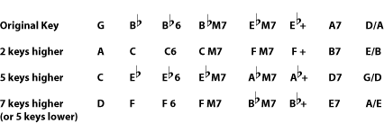

:::

:::{admonition} Example
:name: m10668-chexam2
:class: example

Now say you have a song in the key of E flat. It\'s not hard to sing in that key, so you don\'t want to go far, but you really don\'t like playing in E flat. You can move the song up one key to E, but you might like the chords even better if you move them down one key to D. Notice that if you are a guitar player, and everyone else really wants to stay in E flat, you can write the chords out in D and play them with a capo on the first fret; to everyone else it will sound as if you\'re playing in E flat.

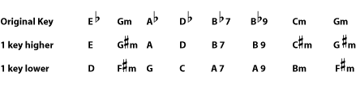

:::

:::{admonition} Practice
:name: m10668-exerchord
:class: exercise

::::{admonition} Question
:name: m10668-id7901984
:class: problem

Now say that you have a song that is in B flat, which is more than a little (more than one key) too high for you. Find a key a bit lower that still has nice, easy-to-play chords for guitar.

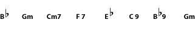

::::

::::{admonition} Solution
:name: m10668-id5733113
:class: solution

The best solution here is probably to put the song in the key of G. This is three keys lower, and has easy chords.

::::
:::
